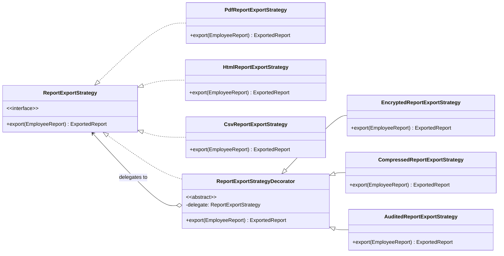

## 1. Why Decorator Pattern Exists (The Real Problem)

---

Decorator exists to solve a very specific—and very common—problem:

> **We want to add behavior to an operation dynamically, in different combinations, without modifying existing code.**

Not _sometimes_.  
Not _once_.  
But **repeatedly**, as requirements evolve.

If this sounds abstract, don’t worry.  
EMS will make it concrete.

---

## 2. The New Design Pressure in EMS

---

So far, EMS reporting works like this:

- Generate employee report
- Export it (PDF / HTML / CSV)
- Deliver it (email / download / link)

Now the business adds a new requirement:

> **Enterprise customers require optional post-processing on exported reports.**

Specifically:

- Some reports must be **encrypted**
- Some must be **compressed**
- Some must be **watermarked**
- Some must be **digitally signed**
- Some require **audit logging**

Important constraint (this is the pressure):

> These options can be **combined arbitrarily**, and **will grow over time**.

Examples:

- Encrypt + Compress
- Compress + Encrypt + Audit
- Watermark + Sign
- Audit + Encrypt + Compress + Watermark

No fixed combinations.
No single “best” variant.

---

## 3. Where This Pressure Hits First: Report Exporting

---

Let’s isolate the core operation:

```java
public interface ReportExportStrategy {
    ExportedReport export(EmployeeReport report);
}
```

Concrete exporters already exist:

```java
PdfReportExportStrategy
HtmlReportExportStrategy
CsvReportExportStrategy
```

Now the question is:

> **How do we add encryption, compression, logging, etc. without breaking this design?**

---

## 4. The First Wrong Solution: Inheritance Explosion

---

A very common first attempt:

```text
PdfExporter
EncryptedPdfExporter
CompressedPdfExporter
EncryptedCompressedPdfExporter
EncryptedCompressedSignedPdfExporter
AuditedEncryptedCompressedSignedPdfExporter
...
```

### Why this fails

- Combinatorial class explosion
- Impossible to reason about
- New feature = N new classes
- Violates Open/Closed Principle
- Maintenance nightmare

Inheritance encodes **combinations**, not **capabilities**.

---

## 5. The Second Wrong Solution: Flag-Based Logic

---

Next attempt:

```java
export(
  format = PDF,
  encrypt = true,
  compress = true,
  watermark = false,
  sign = true,
  audit = true
)
```

Inside:

```java
if (encrypt) encrypt(...)
if (compress) compress(...)
if (watermark) watermark(...)
if (sign) sign(...)
if (audit) audit(...)
```

### Why this also fails

- One method knows too much
- Every new feature modifies existing code
- Ordering becomes implicit and fragile
- Hard to test individual behaviors
- Violates OCP and SRP

This is **procedural thinking inside an OO system**.

---

## 6. The Missing Insight: Features Are Behaviors, Not Types

---

Let’s pause and reframe the problem.

Encryption is not a _type_ of exporter.  
Compression is not a _type_ of exporter.  
Audit logging is not a _type_ of exporter.

They are **behaviors applied to exporting**.

And crucially:

> Each behavior:
>
> - does **one thing**
> - can wrap another exporter
> - does not care what comes before or after

This is the mental shift that leads to **Decorator**.

---

## 7. Decorator Pattern: The Core Idea

---

> **Decorator allows you to wrap an object to add behavior, without changing the object itself.**

Instead of inheritance:

```text
ExporterWithEverything
```

We use composition:

```text
Exporter
  ↑ wrapped by
EncryptedExporter
  ↑ wrapped by
CompressedExporter
  ↑ wrapped by
AuditedExporter
```

Each decorator:

- implements the same interface
- delegates to the wrapped object
- adds exactly one responsibility

---

## 8. The Decorator Structure (Conceptual)

---

### 8.1 Type structure: Strategy + Decorator



### 8.2 Runtime structure: decoration pipeline


> “**Call order is outside-in**: the outermost decorator runs first, then delegates inward.”

### Key observation:

> Every decorator **is-a** ReportExportStrategy (polymorphism)  
> and **has-a** ReportExportStrategy (delegation).

That duality is the pattern.

---

## 9. Implementing Decorator in EMS

---

### 9.1 Base Decorator

```java
public abstract class ReportExportStrategyDecorator implements ReportExportStrategy {

    protected final ReportExportStrategy delegate;

    protected ReportExportStrategyDecorator(ReportExportStrategy delegate) {
        this.delegate = delegate;
    }
}
```

---

### 9.2 Encryption Decorator

```java
public class EncryptedReportExportStrategy
        extends ReportExportStrategyDecorator {

    public EncryptedReportExportStrategy(ReportExportStrategy delegate) {
        super(delegate);
    }

    @Override
    public ExportedReport export(EmployeeReport report) {
        ExportedReport exported = delegate.export(report);
        return encrypt(exported);
    }
}
```

---

### 9.3 Compression Decorator

```java
public class CompressedReportExportStrategy
        extends ReportExportStrategyDecorator {

    public CompressedReportExportStrategy(ReportExportStrategy delegate) {
        super(delegate);
    }

    @Override
    public ExportedReport export(EmployeeReport report) {
        ExportedReport exported = delegate.export(report);
        return compress(exported);
    }
}
```

---

### 9.4 Audit Logging Decorator

```java
public class AuditedReportExportStrategy
        extends ReportExportStrategyDecorator {

    public AuditedReportExportStrategy(ReportExportStrategy delegate) {
        super(delegate);
    }

    @Override
    public ExportedReport export(EmployeeReport report) {
        ExportedReport exported = delegate.export(report);
        logAudit(exported);
        return exported;
    }
}
```

Each decorator:

- adds **one behavior**
- does not know about others
- does not modify existing exporters

---

## 10. Assembling the Pipeline (Dynamic Composition)

---

Now the real power:

```java
ReportExportStrategy exporter =
    new AuditedReportExportStrategy(
        new CompressedReportExportStrategy(
            new EncryptedReportExportStrategy(
                new PdfReportExportStrategy()
            )
        )
    );
```

No new classes.  
No flags.  
No modification to existing code.

Just **composition**.

---

## 11. Why This Is a Structural Pattern

---

Decorator does not create objects (creational).  
Decorator does not control algorithms (behavioral).

Decorator **structures objects** so behavior can grow safely.

It is the textbook definition of:

> **Composition over inheritance**

---

## 12. Interview-Grade Explanation

---

### When should you use Decorator?

> When you need to add responsibilities to objects dynamically,  
> and inheritance or conditional logic leads to explosion or rigidity.

### Key line to remember:

> **Decorator adds behavior without changing the original class.**

---

## Conclusion

---

Decorator exists because **behavior grows faster than types**.

In EMS, report exporting was simple—until it wasn’t.

Encryption, compression, auditing, watermarking:

- are optional
- are combinable
- evolve independently

Decorator lets us:

- keep exporters simple
- add features safely
- avoid inheritance and flag-based designs
- respect Open/Closed Principle

---

### 🔗 What’s Next?

---

So far, we’ve learned **how to add behavior dynamically**.

But two important questions remain:

1. Who decides **which decorators to apply**?
2. How do we manage **ordering and configuration** cleanly?

In **Part 2**, we’ll:

- introduce a clean assembly mechanism
- discuss ordering constraints (encrypt vs compress)
- integrate Decorator with Abstract Factory bundles

👉 Up next:
Decorator Pattern – Building Configurable Processing Pipelines (Part 2)

---

> 📝 **Final Takeaway**
>
> - Decorator solves combinatorial behavior growth
> - It replaces inheritance with composition
> - Each decorator does one thing well
> - When behavior explodes, Decorator is your friend
