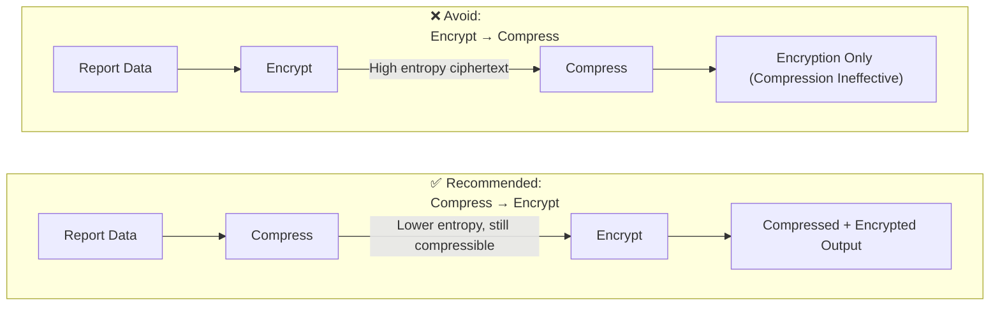
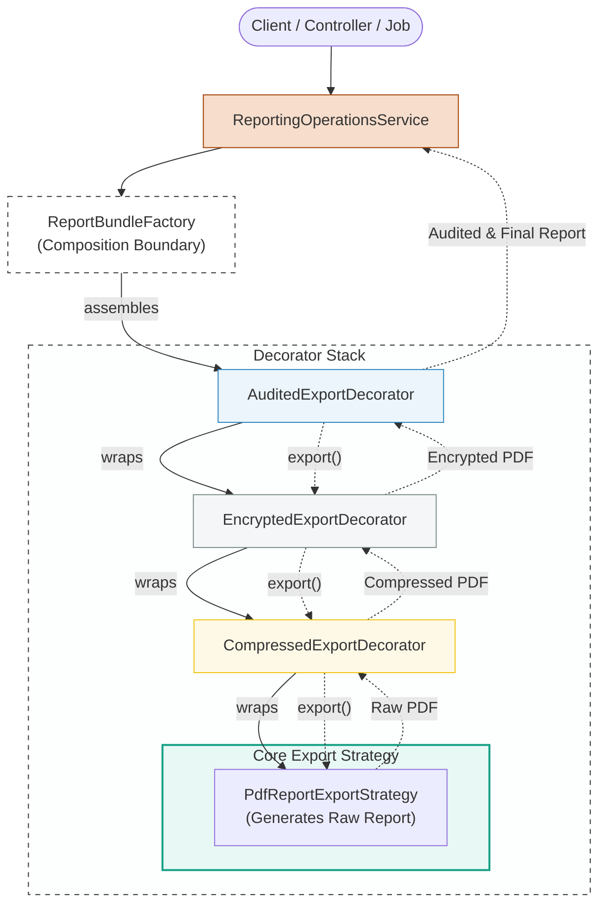

## 1. Recap: What Part 1 Solved

---

In Part 1, we solved:

- ❌ Inheritance explosion
- ❌ Flag-based procedural logic
- ❌ Combinatorial subclass growth

We introduced:

- ReportExportStrategy
- ReportExportStrategyDecorator
- Concrete decorators (Encryption, Compression, Audit)
- Runtime wrapping

We achieved:

> Dynamic behavior composition without modifying existing exporters.

But we left two critical questions unanswered.

---

## 2. The Real Problem Now: Assembly Chaos

---

If decorators are powerful, this becomes possible:

```java
new AuditedReportExportDecorator(
    new CompressedReportExportDecorator(
        new EncryptedReportExportDecorator(
            new PdfReportExportStrategy()
        )
    )
);
```

This works.

But ask yourself:

- Who decides this?
- Where does this live?
- What if order must change?
- What if some bundles forbid encryption?
- What if enterprise customers configure this?

If assembly logic leaks into controllers or services, we just replaced one mess with another.

> Decorator solves behavior explosion.  
> It does NOT solve pipeline assembly responsibility.

---

## 3. Design Constraint: EMS Already Uses Abstract Factory

---

Recall from earlier sections:

We introduced **ReportBundleFactory**.

Each bundle defines:

- Export strategy
- Delivery strategy
- Notification strategy

Now we add a new requirement:

> **Enterprise bundle may optionally apply post-processing decorators.**

This is not a new pattern.

This is composition pressure.

---

## 4. Where Should Decorator Assembly Live?

---

Let’s reason structurally.

Possible places:

| Location                   | Good? | Why                         |
| -------------------------- | ----- | --------------------------- |
| Controller                 | ❌    | leaks orchestration outward |
| ReportingOperationsService | ❌    | violates SRP                |
| Inside exporter            | ❌    | breaks OCP                  |
| Separate builder           | 🤔    | possible                    |
| Inside Abstract Factory    | ✅    | correct boundary            |

### Why Abstract Factory?

Because it already:

- owns export strategy creation
- enforces bundle compatibility
- represents business workflow intent

> The bundle factory should assemble the final export pipeline.

---

## 5. Integrating Decorator with Abstract Factory

---

Let’s evolve PortalDownloadBundleFactory.

Before (Part 2 of Abstract Factory):

```java
@Override
public ReportExportStrategy createExportStrategy() {
    return ReportExportStrategyFactory.getStrategy(format);
}
```

Now we enhance it:

```java
@Override
public ReportExportStrategy createExportStrategy() {

    ReportExportStrategy base =
            ReportExportStrategyFactory.getStrategy(format);

    if (enterpriseFeatures.isEncryptionEnabled()) {
        base = new EncryptedReportExportDecorator(base);
    }

    if (enterpriseFeatures.isCompressionEnabled()) {
        base = new CompressedReportExportDecorator(base);
    }

    if (enterpriseFeatures.isAuditEnabled()) {
        base = new AuditedReportExportDecorator(base);
    }

    return base;
}
```

Notice:

- No exporter classes changed.
- No controller changed.
- No service changed.
- Only the factory evolved.

This is **pattern synergy**.

---

## 6. Ordering Is Not Arbitrary (Critical Insight)

---

Compression and encryption are not interchangeable.



Encryption intentionally produces high-entropy output (ciphertext), which removes predictable patterns — and compression relies on predictable patterns.

So pipeline assembly must:

- Respect domain constraints
- Enforce valid ordering
- Remain explicit

> **Decorator gives flexibility.**  
> **Factory enforces correctness.**

Without a controlled assembly boundary, Decorator makes invalid pipelines just as easy as valid ones.

---

## 7. Cleaner Assembly: Using a Pipeline Builder (Optional Refinement)

---

If factory code grows complex, introduce a small helper:

> **NOTE:** This is a fluent composer helper, not the GoF Builder Pattern.

```java
public final class ExportPipelineAssembler {

    private ReportExportStrategy current;

    public ExportPipelineAssembler(ReportExportStrategy base) {
        this.current = base;
    }

    public ExportPipelineAssembler apply(ExportPostProcessingConfig cfg) {
        // enforce correct order here
        if (cfg.compression()) current = new CompressedReportExportDecorator(current);
        if (cfg.encryption())  current = new EncryptedReportExportDecorator(current);
        if (cfg.audit())       current = new AuditedReportExportDecorator(current);
        return this;
    }

    public ReportExportStrategy build() {
        return current;
    }
}
```

Then factory becomes:

```java
@Override
public ReportExportStrategy createExportStrategy() {
    ReportExportStrategy base = ReportExportStrategyFactory.getStrategy(format);
    return new ExportPipelineAssembler(base)
            .apply(postProcessingConfig)
            .build();
}

```

This improves readability without introducing a new pattern.

---

## 8. Diagram: Final Structural Composition

---



Responsibility separation:

- Client → expresses intent
- Factory → assembles pipeline
- Decorators → add behavior
- Strategy → performs core export

Clean layering.

---

## 9. Why This Is Architecturally Powerful

---

We now have:

- **Strategy** → varies core algorithm
- **Decorator** → adds cross-cutting behaviors
- **Abstract Factory** → enforces valid combinations
- **Facade** → orchestrates workflow

These patterns are not isolated.  
They collaborate.

This is real-world object-oriented design.

---

## 10. Interview-Level Insight

---

If asked:

> “How would you extend export behavior without modifying existing classes?”

Strong answer:

> I would use Decorator for cross-cutting behaviors and let the Abstract Factory assemble valid pipelines based on business rules.

That answer signals:

- OCP understanding
- Responsibility boundaries
- Pattern composition maturity

---

## 11. When NOT to Use Decorator

---

Decorator is powerful, but:

Do **NOT** use it when:

- behavior combinations are fixed
- ordering is irrelevant
- feature set is small and stable
- performance overhead is unacceptable

Decorator introduces:

- more objects
- more indirection
- harder debugging if abused

Use Decorator under **real combinatorial pressure** — not by default.

If the system does not have growing optional behaviors, introducing Decorator is unnecessary abstraction.

---

## Conclusion

---

**Part 1** showed **how to wrap behavior**.

**Part 2** showed **how to assemble behavior responsibly**.

Decorator alone is not enough.  
Factory alone is not enough.

Together, they create:

> A configurable, extensible, maintainable processing pipeline.

EMS reporting is now:

- extensible
- SRP compliant
- OCP aligned
- structurally clean

And we achieved this **without modifying existing exporters**.

That is the real power of structural design patterns.

---

### 🔗 What’s Next?

---

We’ve now covered:

- **Strategy**
- **Abstract Factory**
- **Facade**
- **Decorator**
- **Adapter**

The next structural question is:

> How do we manage object structures when systems grow beyond single-object composition?

That naturally leads to the Composite structural patterns.

👉 **Up Next →**  
**[Composite Pattern – Treating Individuals and Groups Uniformly (Part 1) →](/learning/advanced-skills/low-level-design/4_structural-design-patterns/4_10_composite-pattern-part1)**

---

> 📝 **Final Takeaway**
>
> - Decorator solves combinatorial behavior growth
> - Factory ensures valid pipeline assembly
> - Ordering must be enforced intentionally
> - Patterns become most powerful when composed together
