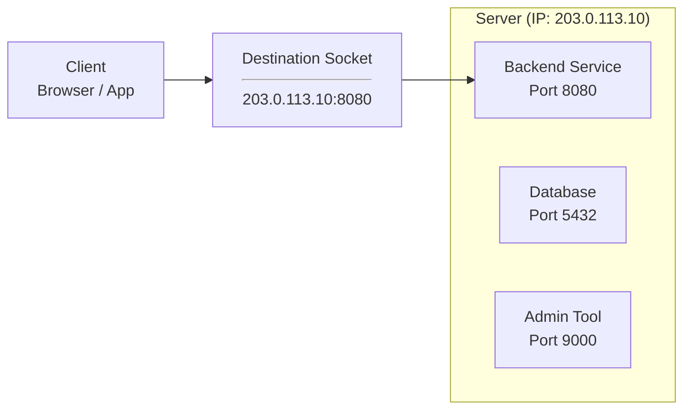
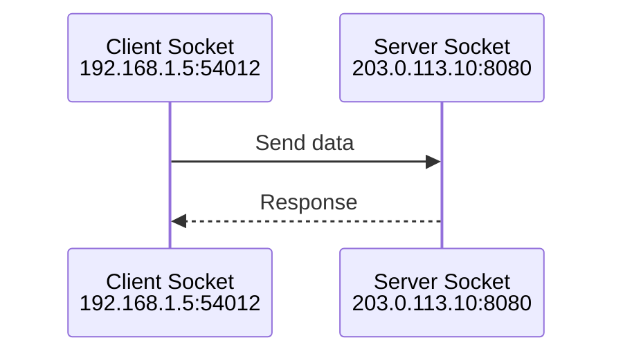

---

## 1. Introduction — Where Networking Really Begins

---

Consider a **learning platform** like this one.

Today it may serve a small number of users, but the fundamental problem it solves is universal:

> A client needs to send a request to a backend application over the network.

Before we talk about scale, cloud, load balancers, or containers, we must understand **how that single request reaches a backend process in the first place**.

This is where networking truly begins.

In this chapter, we will **ignore what the application does** and focus only on:

- how machines are identified
- how processes are addressed
- how a request finds the correct destination

---

## 2. The Running Example (Simplified on Purpose)

---

For the rest of this section, we will reduce the learning platform to its simplest form:

- One server (physical or virtual)
- One backend application running on that server
- One client (browser or another service)
- Communication over the internet

No business logic.  
No databases.  
No frameworks.

Just **a client, a machine, and a process**.



---

## 3. What Is an IP Address?

---

An **IP address** identifies a **machine on a network**.

- It answers the question:  
  **“Which machine should receive this data?”**
- Every machine connected to a network has an IP address.
- The internet is essentially a massive system for routing data between IP addresses.

Important clarification:

> An IP address identifies a **machine**, not an application.

If a client only knows the IP address of a server, it still does not know which **program** on that machine should handle the request.

This limitation is intentional — and necessary.

> 📌 **Conceptual Note**
>
> IPv4 addresses use 32 bits, which limits them to about 4.3 billion unique values.  
> The internet scales beyond this limit using private IP ranges, NAT (Network Address Translation),
> and careful address reuse.
>
> We’ll explore these mechanisms later in the networking section.

---

## 4. Why Ports Exist

---

A single machine rarely runs just one application.

On the same server, you might have:

- a backend service
- a database
- a monitoring agent
- an admin interface

All of them share the **same IP address**.

Ports exist to solve this exact problem.

- A **port** identifies a **process** on a machine.
- Each application listens on one or more ports.
- The operating system uses ports to route incoming network traffic to the correct process.

> IP answers: **Which machine?**  
> Port answers: **Which process on that machine?**

This is why you see errors like:

- “Port already in use”
- “Cannot bind to port 8080”

They are not application bugs — they are **networking constraints**.

---

## 5. The Socket: The First Complete Mental Model

---

A socket is the combination of:

```text
IP Address + Port
```

This pair uniquely identifies a network endpoint.

- The backend application opens a **server socket** (e.g., 0.0.0.0:8080)
- The client opens a **client socket**
- Communication happens **between sockets**, not applications directly

This is a foundational truth:

> Every network request in every distributed system begins with a socket connection.

Load balancers, firewalls, DNS, and service meshes all exist **around this concept**.



---

## 6. What Actually Happens When a Client Sends a Request

---

At a high level:

1. The client targets an **IP address**
2. The client specifies a **port**
3. The operating system routes the traffic
4. The correct process receives the data

We are intentionally avoiding protocol details (HTTP, TCP) for now.  
Those come next.

Right now, the goal is to understand **how a request finds the right process** — nothing more.

---

## 7. Common Failure Scenarios (Real World Intuition)

---

Understanding IPs and ports immediately explains many real issues:

- **Wrong IP** → request reaches the wrong machine
- **Wrong port** → request reaches no process
- **Port already in use** → two processes cannot bind to the same port
- **Application running but unreachable** → network or firewall issue

These problems appear in:

- local development
- cloud deployments
- production outages

They are **networking problems**, not code problems.

---

## 8. Design Limitations of Our Current System

---

Our system works — but only barely.

Limitations:

- Single point of failure
- Limited capacity
- No isolation
- No security boundaries

These are not mistakes.

> They are the natural constraints of a single-machine, single-process design.

Every major networking concept you will learn next exists to address **these exact limitations**.

---

## Conclusion

---

Every distributed system — no matter how large or complex — starts the same way:

A client sends data to a **machine**, and the operating system delivers it to a **process**.

IP addresses, ports, and sockets are not implementation details.
They are the **foundation** on which all networking concepts are built.

If these basics are unclear:

- load balancers feel magical
- cloud networking feels opaque
- production failures feel random

Once they are clear, everything that follows — DNS, firewalls, scaling, reliability —
becomes a **logical response to real constraints**, not a list of memorized components.

This chapter establishes that foundation.

---

### 🔗 What’s Next?

We now know where services live.

Next, we need to understand **how data moves between them**.

In the next chapter, we introduce:

- TCP vs UDP
- Reliability vs speed
- Why transport protocols exist at all

👉 Up Next →
**[Transport & Application Protocols: TCP, UDP, and HTTP](/learning/advanced-skills/networking-essentials/1_networking-foundation/1_2_addressing-and-ports)**

---

> 📝 **Takeaway**:
>
> - Networking starts at the **operating system level**
> - An IP identifies a **machine**
> - A port identifies a **process**
> - A socket is the true unit of network communication
> - Most distributed system issues trace back to these basics
