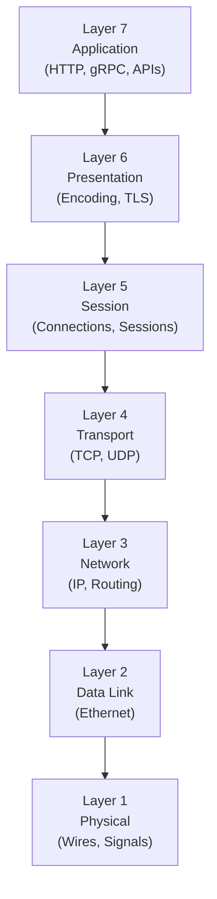
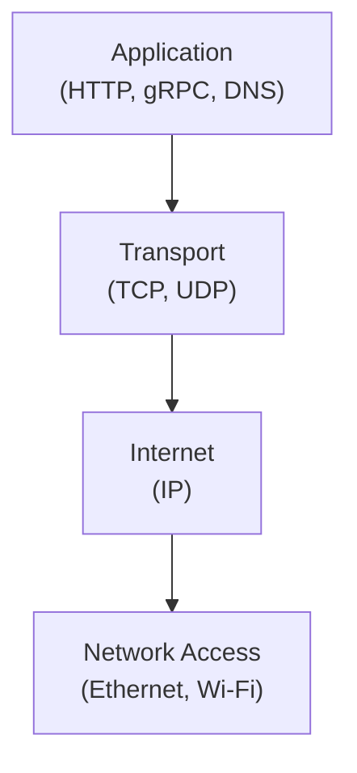
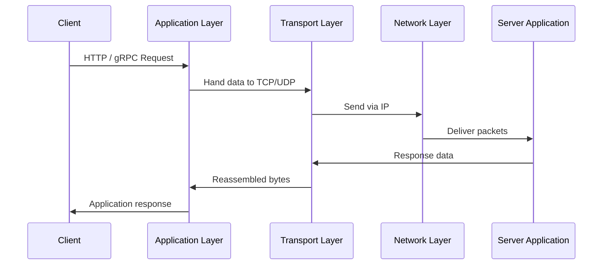

## 1. Why We Need a Layered Mental Model

---

Before diving into IP addresses, ports, or protocols, we need a **map**.

Networking involves multiple concerns:

- identifying machines
- delivering data reliably
- defining application semantics
- handling failures and performance

If these concerns are mixed together, reasoning about systems becomes difficult.

Layered models exist to solve this exact problem.

> They help us answer a simple but powerful question:  
> **“At which layer does this problem or decision belong?”**

---

## 2. OSI Model vs TCP/IP Model (Conceptual vs Practical)

---

Two models are commonly used to describe networking layers:

- **OSI Model** — conceptual, educational, 7 layers
- **TCP/IP Model** — practical, used by real systems, fewer layers

They describe the **same flow**, at different levels of abstraction.

### 2.1 OSI Model (Conceptual View)

The OSI model is **not how systems are implemented**,  
but it is extremely useful for **thinking and communication**.

---

### 2.2 TCP/IP Model (How Systems Are Actually Built)

In practice:

- multiple OSI layers collapse into **the Application layer**
- TCP/IP is simpler and closer to real implementations

---

## 3. How the Two Models Map to Each Other

---

The same networking concepts can be viewed through both models:

| OSI Model (Conceptual) | TCP/IP Model (Practical) | Examples      |
| ---------------------- | ------------------------ | ------------- |
| Layer 7 – Application  | Application              | HTTP, gRPC    |
| Layer 6 – Presentation | Application              | TLS, Encoding |
| Layer 5 – Session      | Application              | Sessions      |
| Layer 4 – Transport    | Transport                | TCP, UDP      |
| Layer 3 – Network      | Internet                 | IP            |
| Layer 2 – Data Link    | Network Access           | Ethernet      |
| Layer 1 – Physical     | Network Access           | Wires         |

> **Key idea:**  
> OSI helps you **locate concepts**  
> TCP/IP shows you **how systems are actually structured**.

---

## 4. End-to-End Request Flow (Layered View)

---

Every request in a distributed system follows the same layered path.

Even when hidden by frameworks or cloud platforms,  
this layered flow is **always present**.

---

## 5. How We Will Use These Layers in This Tutorial

---

We will not teach OSI or TCP/IP as standalone theory.

Instead, throughout the rest of this tutorial:

- When we discuss **IP addressing & routing**,  
  we are working at **OSI Layer 3 / TCP-IP Internet layer**
- When we discuss **ports, TCP, UDP, reliability**,  
  we are working at **OSI Layer 4 / TCP-IP Transport layer**
- When we discuss **HTTP, gRPC, APIs, authentication**,  
  we are working at **OSI Layer 7 / TCP-IP Application layer**

Each article will **explicitly mention the layer** it is operating in.

This ensures you always know:

- where a concept belongs
- which layer a problem lives in
- which layer a design decision affects

---

## 6. Why This Matters for System Design

---

In real systems:

- Connectivity issues usually belong to the **Network layer**
- Performance and reliability issues often belong to the **Transport layer**
- Semantics, security, and APIs live at the **Application layer**

Strong system design depends on:

- separating concerns
- avoiding cross-layer confusion
- making decisions at the correct abstraction level

This layered mental map makes that possible.

---

### 🔗 What’s Next?

We begin the journey at the lowest possible level:

> How does a client reach a backend process in the first place?

The next chapter starts with:

- IP addresses
- Ports
- Sockets
- And the simplest possible system: **one server, one application**

From there, everything else naturally follows.

👉 Up Next →
**[Networking Foundations: Addressing & Ports](/learning/advanced-skills/networking-essentials/1_networking-foundation/1_3_addressing-and-ports)**

---

> 📝 Key Takeaway
>
> OSI and TCP/IP are not content to memorize.  
> They are maps to help you **place concepts where they belong** as systems grow in complexity.
