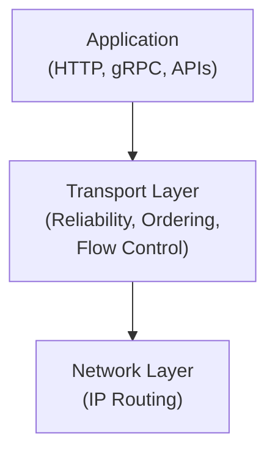
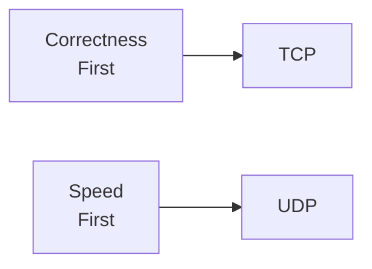

## 1. Introduction — A Socket Is Necessary, but Not Enough

---

In the previous phase, we learned how a client reaches a backend process using an **IP address and a port**.

At that point, we answered an important question:

> **Where should the data go?**

But another, equally important question remains unanswered:

> **How should the data be delivered once it gets there?**

A socket tells the operating system **where** to send data.  
It says nothing about **what happens if things go wrong**.

This is where transport protocols enter the picture.

---

## 2. The Problem Transport Protocols Solve

---

Consider our **learning platform** again.

A client sends a request to the backend service. That request is broken into smaller pieces and sent over the network.

Now consider what can happen in the real world:

- Network links can drop packets
- Packets can arrive out of order
- Receivers can be slower than senders
- Network paths can change mid-communication

Without rules, communication would be unreliable and unpredictable.

Transport protocols exist to define **how data behaves in transit**.

---

## 3. What the Transport Layer Is Responsible For

---

At a high level, the transport layer is responsible for:

- **Delivery guarantees**  
  Should data be retransmitted if it is lost?

- **Ordering**  
  Should data be delivered in the same order it was sent?

- **Flow control**  
  What happens if the receiver is slower than the sender?

- **Congestion awareness**  
  How should sending speed adapt to network conditions?

These responsibilities are **independent of application logic**.

They apply equally to:

- APIs
- databases
- file transfers
- internal service-to-service communication

---

## 4. Why This Cannot Be Handled by Applications Alone

---

A natural question is:

> Why not let every application handle reliability and ordering itself?

In theory, this is possible.  
In practice, it would be disastrous.

Reasons transport behavior is handled by the operating system:

- Consistency across applications
- Performance optimizations at the kernel level
- Shared understanding of network conditions
- Avoidance of duplicated, error-prone logic

Transport protocols provide a **common contract** between sender and receiver.

Applications build on top of that contract.

---

## 5. Two Different Philosophies of Transport

---

Transport protocols are built around a fundamental trade-off:

> **Do we prioritize correctness, or speed?**

From this trade-off emerge two distinct approaches:

- **Reliable, ordered delivery**  
  Ensures correctness, but adds overhead and latency

- **Fast, best-effort delivery**  
  Minimizes overhead, but provides no guarantees

These two philosophies are embodied by two widely used transport protocols:

- TCP
- UDP

We will explore them in detail next.

---

## 6. Transport Layer in the Networking Stack

---

To place transport protocols in context:

- **IP** determines where data should go
- **Transport protocols** determine how data moves
- **Application protocols** determine what the data means

This separation is intentional.

It allows:

- applications to evolve independently
- transport behavior to be reused
- network optimizations without rewriting application logic

> 📍 **Layer Mapping**
>
> Everything discussed in this article operates at the **Transport layer**  
> (OSI Layer 4 / TCP-IP Transport layer).

---

## 7. Design Implications for Backend Systems

---

Understanding transport responsibilities explains many real-world behaviors:

- Why retries exist
- Why timeouts are mandatory
- Why slow receivers can affect fast senders
- Why “the network is flaky” is a real engineering concern

These are **system design concerns**, not implementation details.

---

## Conclusion

---

- A socket defines **where** data is sent
- Transport protocols define **how** data behaves in transit
- Networks are unreliable by default
- Reliability, ordering, and flow control must be explicitly defined
- Transport behavior is a **design choice**, not an assumption

Understanding this layer is what separates:

- systems that _work in ideal conditions_
- from systems that _survive real networks_

---

### 🔗 What’s Next?

Now that we understand why transport protocols exist, we can examine the two dominant approaches in practice.

In the next chapter, we compare:

- TCP — reliable and ordered
- UDP — fast and best-effort

👉 Up Next →
**[TCP vs UDP: Reliability vs Latency](/learning/advanced-skills/networking-essentials/2_transport-and-application-protocol/2_2_tcp-vs-udp)**

---

> 📝 **Takeaway**:
>
> Before systems can scale or optimize,  
> they must first agree on **how data behaves when things go wrong**.
