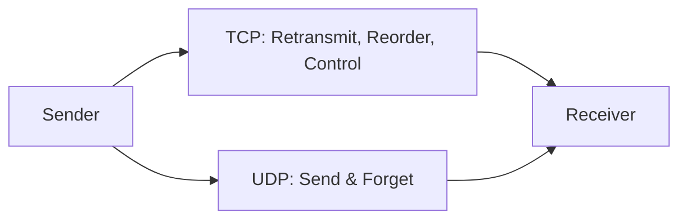
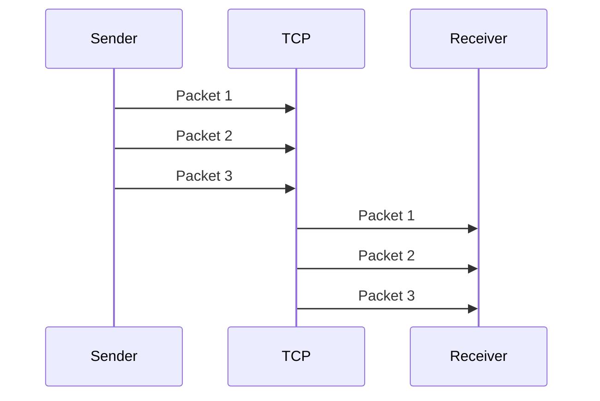
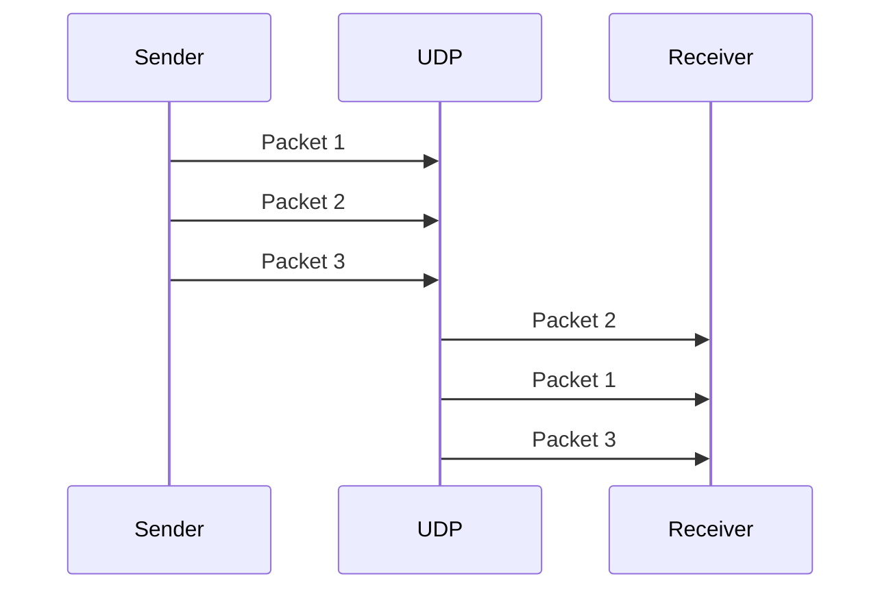

## 1. Introduction — Two Ways to Move Data

---

In the previous chapter, we answered **why transport protocols exist**.

We learned that networks are unreliable by default, and that transport protocols define **how data behaves in transit**.

That leads to a natural follow-up question:

> If transport protocols define behavior,  
> **why do we have more than one?**

The answer lies in a fundamental trade-off every distributed system must make:

> **Do we prioritize correctness, or speed?**

This chapter explores that trade-off through the lens of **TCP and UDP**.

---

## 2. The Core Trade-off: Reliability vs Latency

---

At the transport layer, we cannot optimize for everything at once.

Guarantees like:

- reliable delivery
- strict ordering
- congestion awareness

come at a cost:

- extra coordination
- retransmissions
- increased latency

Conversely, minimizing latency means accepting:

- packet loss
- reordering
- application-managed reliability

This is not a flaw — it is a **design choice**.

TCP and UDP represent **two ends of this spectrum**.

---

## 3. TCP — Reliable and Ordered by Design

---

**TCP (Transmission Control Protocol)** is built for correctness.

It provides:

- **Reliable delivery**  
  Lost packets are detected and retransmitted.

- **Ordered delivery**  
  Data is delivered to the application in the same order it was sent.

- **Flow control**  
  The sender adapts to the receiver’s capacity.

- **Congestion awareness**  
  Sending speed adjusts based on network conditions.

Mental model:

> **TCP assumes the network will fail and compensates for it.**

This is why TCP is the default choice for:

- REST APIs
- databases
- file transfers
- internal service-to-service communication

---

## 4. UDP — Fast and Best-Effort by Design

---

**UDP (User Datagram Protocol)** takes the opposite approach.

It provides:

- no delivery guarantees
- no ordering guarantees
- no congestion control

Each packet is sent independently.

Mental model:

> **UDP assumes the application knows best how to handle loss and timing.**

This makes UDP suitable for:

- DNS queries
- video and audio streaming
- real-time communication (voice, gaming)
- telemetry and metrics

UDP is not “worse” than TCP — it is **intentionally minimal**.

---

## 5. Visualizing the Difference

---

### Delivery Behavior

TCP actively manages delivery.  
UDP simply hands packets to the network.

### 5.1 Ordering Guarantees

---

## 6. TCP vs UDP — System Design Comparison

---

From a system design perspective, the differences matter more than the definitions.

| Aspect             | TCP        | UDP                    |
| ------------------ | ---------- | ---------------------- |
| Delivery           | Guaranteed | Best-effort            |
| Ordering           | Preserved  | Not guaranteed         |
| Latency            | Higher     | Lower                  |
| Overhead           | Higher     | Minimal                |
| Congestion control | Yes        | No                     |
| Typical use        | APIs, DBs  | Streaming, DNS Queries |

In backend systems:

- correctness usually matters more than raw speed
- TCP is therefore the default

---

## 7. Why Most Backend Systems Use TCP

---

For most backend workloads:

- lost requests are unacceptable
- duplicated requests cause bugs
- partial responses are dangerous

TCP’s guarantees allow applications to:

- reason about correctness
- simplify business logic
- handle failures predictably

The cost in latency is a trade-off most backend systems willingly accept.

---

## 8. When UDP Becomes the Better Choice

---

UDP becomes the better option when:

- **Latency matters more than perfection**
- **Stale data is worse than missing data**
- **Applications can tolerate or correct loss**

For example:

- a dropped video frame is better than a frozen stream
- a delayed DNS response is worse than a retried query

In such cases, **application-level logic replaces transport guarantees**.

---

## 9. Layer Mapping (Explicit)

---

> 📍 **Layer Mapping**
>
> Everything discussed in this chapter operates at the  
> **Transport layer (OSI Layer 4 / TCP-IP Transport layer)**.

This distinction will matter even more when we discuss:

- HTTP
- retries and timeouts
- load balancers
- performance bottlenecks

---

## Conclusion

---

- TCP and UDP represent **two transport** philosophies
- TCP prioritizes **correctness and predictability**
- UDP prioritizes **speed and control**
- Protocol choice is a **system design decision**
- Most backend systems default to TCP for safety

---

### 🔗 What’s Next?

Now that we understand transport behavior, we can finally place **HTTP** correctly in the stack.

In the next chapter, we answer a common source of confusion:

- **Why HTTP is not a transport protocol**
- **What HTTP adds on top of TCP**
- **How this separation affects system design**

👉 Up Next →
**[Where HTTP Fits in the Networking Stack](/learning/advanced-skills/networking-essentials/2_transport-and-application-protocol/2_3_where-http-fits)**

---

> 📝 **Takeaway**:
>
> Choosing TCP or UDP is not about preference —  
> it is about deciding **which failures your system is willing to tolerate**.
