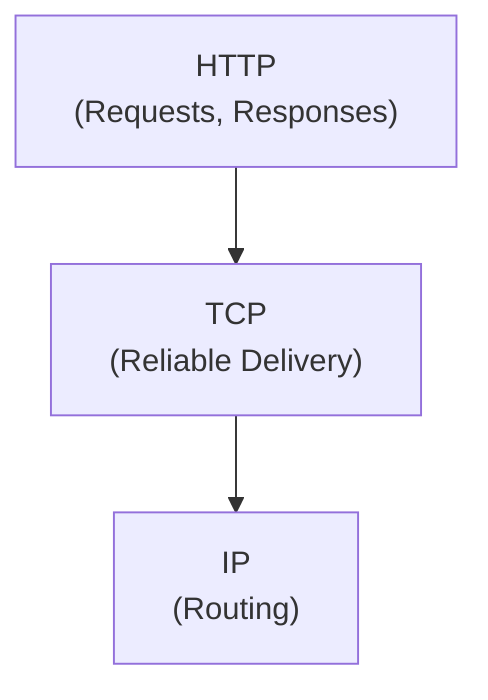
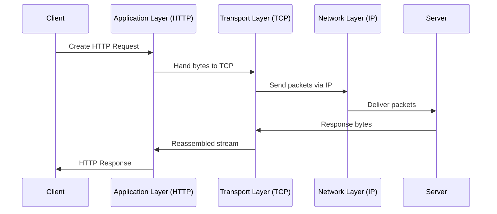

## 1. Introduction — A Common Source of Confusion

---

After learning about TCP and UDP, many developers naturally ask:

> “If HTTP sends requests and responses,  
> isn’t HTTP the transport protocol?”

This confusion is extremely common — and extremely important to resolve.

The short answer is:

> **HTTP does not move bytes across the network.  
> It defines what those bytes mean.**

This chapter clarifies **where HTTP fits**, and why this separation is foundational to system design.

---

## 2. Transport vs Application — A Clear Separation of Responsibilities

---

Let’s restate the responsibilities clearly:

- **Transport protocols (TCP / UDP)**  
  Decide _how bytes are delivered_  
  (reliability, ordering, flow control)

- **Application protocols (HTTP, gRPC)**  
  Decide _how data is structured and interpreted_  
  (requests, responses, headers, semantics)

They solve **different problems**, at different layers.

---

## 3. Where HTTP Actually Lives

---

HTTP operates at the **Application layer**.

It assumes that:

- bytes can already be sent
- bytes can already be received
- delivery guarantees are handled elsewhere

HTTP focuses on:

- request / response structure
- headers and metadata
- resource semantics (e.g. “GET”, “POST”)

### 3.1 Layered View

> HTTP **depends on** TCP.  
> TCP does **not depend on** HTTP.

This dependency direction is intentional.

---

## 4. What HTTP Adds (And What It Does Not)

---

HTTP operates **above the transport layer** and focuses on application semantics.

### What HTTP Adds

- A standardized **request–response** communication model
- Clear **semantics** for operations (e.g., fetching data, submitting data)
- **Metadata support** through headers
- A **stateless** interaction model by default
- Extensibility without changing the transport layer

These features allow applications to communicate in a predictable and interoperable way.

---

### What HTTP Does _Not_ Do

- It does **not** guarantee delivery of data
- It does **not** ensure ordering of packets
- It does **not** handle congestion control
- It does **not** retransmit lost packets

All of these responsibilities belong to the **transport layer**, not HTTP.

HTTP assumes that data delivery concerns are already handled before it is invoked.

---

## 5. Why This Separation Matters in Practice

---

Understanding the separation between **transport protocols** and **application protocols**
explains many real-world system behaviors:

- **Why HTTP retries exist**  
  TCP may retry packets, but it has no concept of application-level requests.

- **Why HTTP timeouts are mandatory**  
  Reliable delivery does not mean infinite waiting.

- **Why duplicate requests can occur**  
  Transport retries and application retries operate at different layers.

- **Why “slow network” issues surface at the HTTP layer**  
  HTTP experiences the _effects_ of transport-layer behavior.

These are **system design concerns**, not framework quirks.

Misunderstanding this boundary is a common cause of:

- cascading failures
- data inconsistencies
- unpredictable latency in production systems

---

## 6. End-to-End Request Flow (Putting It Together)

---

Let’s follow a single request conceptually:

Even though developers interact with HTTP,  
**every request still depends on transport guarantees underneath**.

---

## 7. System Design Implications

---

Once you understand where HTTP fits, several design principles become clear:

- Transport failures can surface as HTTP failures
- Application-level retries must be carefully designed
- Timeouts belong at multiple layers
- Performance tuning often starts below HTTP

This is why system design discussions frequently ask:

> “Is this a transport-level issue or an application-level issue?”

---

## 8. Layer Mapping (Explicit)

---

> 📍 **Layer Mapping**
>
> HTTP operates at the **Application layer**  
> (OSI Layer 7 / TCP-IP Application layer).
>
> It relies on the **Transport layer**  
> (OSI Layer 4) for delivery guarantees.

We will continue to explicitly call out layers as we move forward.

---

## Conclusion

---

- HTTP is **not** a transport protocol
- TCP decides **how bytes** move
- HTTP decides **what those bytes represent**
- This separation enables flexibility, evolution, and reuse
- Many production issues come from misunderstanding this boundary

---

### 🔗 What’s Next?

Now that we understand:

- where HTTP fits
- what it relies on
- what it does not guarantee

we are ready to explore why HTTP itself had to evolve.

In the next phase, we examine:

- HTTP/1.1 limitations
- performance bottlenecks
- and why newer protocols were introduced

👉 **Up Next →**  
**[HTTP, HTTPS & Protocol Evolution (HTTP/1.1 → HTTP/2 → HTTP/3)](/learning/advanced-skills/networking-essentials/3_http-and-protocol-evolution/3_1_http-1.1-original-model)**

---

> 📝 **Takeaway**:
>
> HTTP gives meaning to data —  
> but it is the transport layer that decides whether that data arrives at all.
