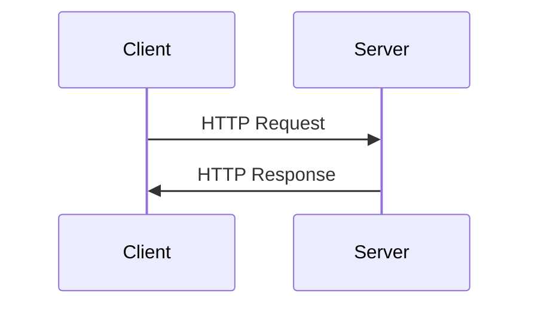
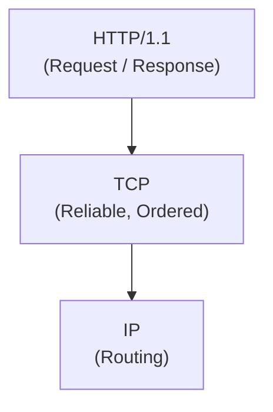
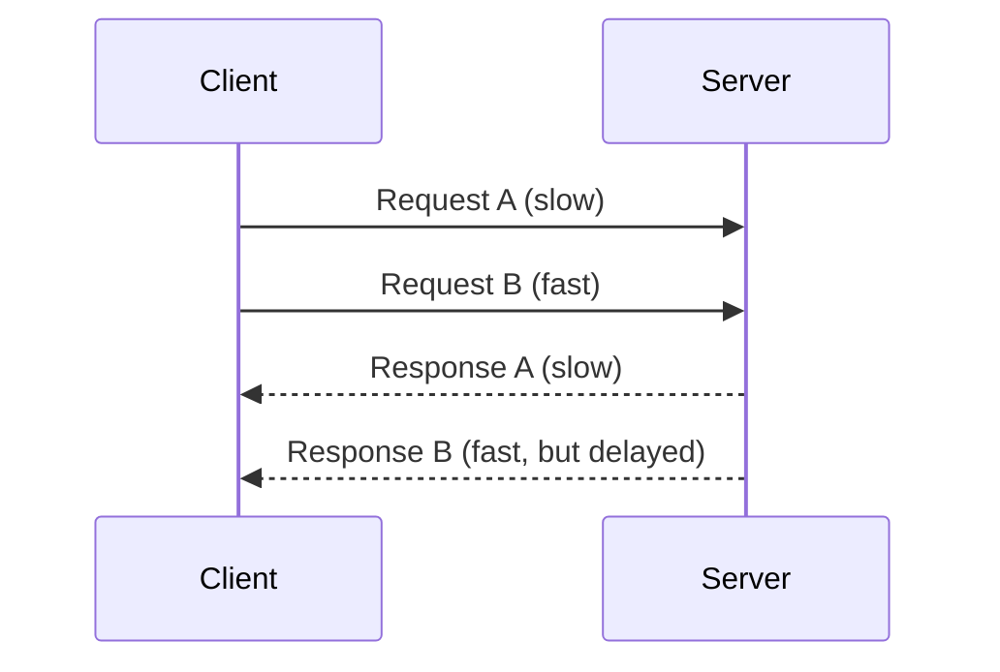

## 1. Introduction — When “Working” Is Not Enough

---

HTTP/1.1 has powered the web for decades.

It is:

- simple
- human-readable
- widely supported
- still in use today

Yet almost every modern networking improvement exists **because of HTTP/1.1’s limitations**.

To understand HTTP/2, gRPC, and HTTP/3, we must first understand **what HTTP/1.1 optimized for — and what it sacrificed**.

---

## 2. The Core HTTP/1.1 Model

---

At its heart, HTTP/1.1 follows a very simple idea:

> One request → one response

A client sends a request.  
The server processes it and sends back a response.

Conceptually:

This simplicity is one of HTTP/1.1’s greatest strengths.

---

## 3. HTTP/1.1 and TCP — A Critical Dependency

---

HTTP/1.1 does **not** move data by itself.

It relies entirely on **TCP** for:

- reliable delivery
- ordering
- congestion control

So the actual stack looks like this:

This dependency has deep consequences for performance.

---

## 4. The Single-Request-at-a-Time Problem

---

Originally, HTTP/1.1 was designed around a simple assumption:

- One TCP connection
- One active request at a time

This means:

- A request must **wait for the previous request to finish**
- Even if the requests are independent
- Even if the server is capable of handling them in parallel

This behavior is known as **application-level serialization**.

The limitation is not about server capability —  
it is about how HTTP/1.1 structures communication over a connection.

---

## 5. Keep-Alive Helped — But Didn’t Solve the Problem

---

To reduce the overhead of opening a new TCP connection for every request,  
HTTP/1.1 introduced **persistent connections** (commonly called _keep-alive_).

With keep-alive:

- Multiple requests can reuse the same TCP connection
- Connection setup cost is reduced

However, a critical limitation remains:

- Requests are still handled **sequentially**
- Responses must be sent **in order**
- A slow response blocks all subsequent responses on that connection

So while keep-alive improved efficiency,  
it did **not** solve the fundamental problem of request blocking.

---

## 6. Head-of-Line Blocking (HTTP/1.1)

---

In HTTP/1.1, if one request is slow:

- all subsequent requests are blocked
- even if they could be processed quickly

This is known as **Head-of-Line (HoL) Blocking at the application layer**.

The problem is not TCP here —
it is how HTTP/1.1 uses TCP.

---

## 7. Browser Workarounds (A Design Smell)

---

As HTTP/1.1 became the backbone of increasingly complex web applications, its limitations became impossible to ignore.

To work around these issues, browsers introduced several techniques:

- Opening **multiple TCP connections** per host
- **Domain sharding** to bypass per-host connection limits
- **Inlining and bundling** multiple resources into larger files

These techniques improved perceived performance — but they came with costs:

- Increased connection overhead
- More congestion and packet loss
- Higher memory and CPU usage
- Greater operational complexity

When a protocol requires widespread workarounds to perform well, it is usually a sign that the **protocol itself is the bottleneck**.

---

## 8. Why HTTP/1.1 Could Not Scale Gracefully

---

HTTP/1.1 was designed for a very different world:

- Fewer resources per page
- Lower concurrency requirements
- Relatively stable network conditions

Modern systems, however, demand:

- Many concurrent requests
- Efficient use of limited connections
- Predictable performance on high-latency and mobile networks
- Service-to-service communication at scale

HTTP/1.1’s sequential request model simply could not meet these demands without excessive workarounds.

The protocol did not fail — **its assumptions were overtaken by reality**.

---

## 9. Layer Mapping (Explicit)

> 📍 **Layer Mapping**
>
> HTTP/1.1 operates at the **Application layer**  
> (OSI Layer 7 / TCP/IP Application layer).
>
> However, its performance characteristics are tightly coupled to  
> **TCP behavior at the Transport layer (OSI Layer 4)**.

This tight coupling explains why improving HTTP/1.1 performance required **rethinking how applications use transport connections**, rather than changing TCP itself.

---

## 10. Key Takeaways

- HTTP/1.1 is simple, stable, and widely supported
- Its request–response model is inherently **sequential**
- Persistent connections reduced overhead but not blocking
- Head-of-line blocking occurs at the **application level**
- Browser-level hacks indicate protocol-level limitations

Understanding these constraints is essential before exploring newer protocols.

---

### 🔗 What’s Next?

So far, we have looked at HTTP purely from a **functionality and performance** perspective.

However, modern systems do not operate on trusted networks.

Before we improve performance with newer protocols, we must answer a more fundamental question:

> **How can clients trust who they are talking to, and how is data protected in transit?**

This is where **TLS** enters the picture.

In the next chapter, we explore:

- why TLS was introduced
- how HTTPS actually works
- where TLS fits in the networking stack
- and why security changes system behavior without changing HTTP semantics

👉 **Up Next →**  
**[HTTPS & TLS — Security Without Changing HTTP](/learning/advanced-skills/networking-essentials/3_http-and-protocol-evolution/3_2_https-and-tls)**

---

> 📝 **Takeaway**
>
> HTTP/1.1 did not fail —  
> the systems built on top of it simply outgrew its original design assumptions.
