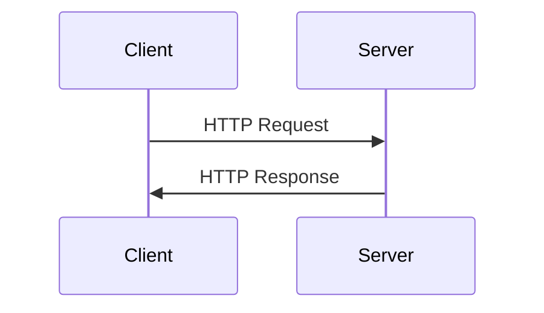
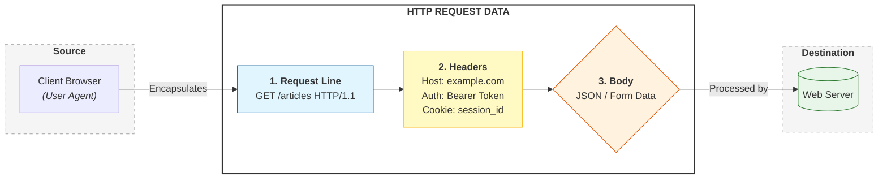
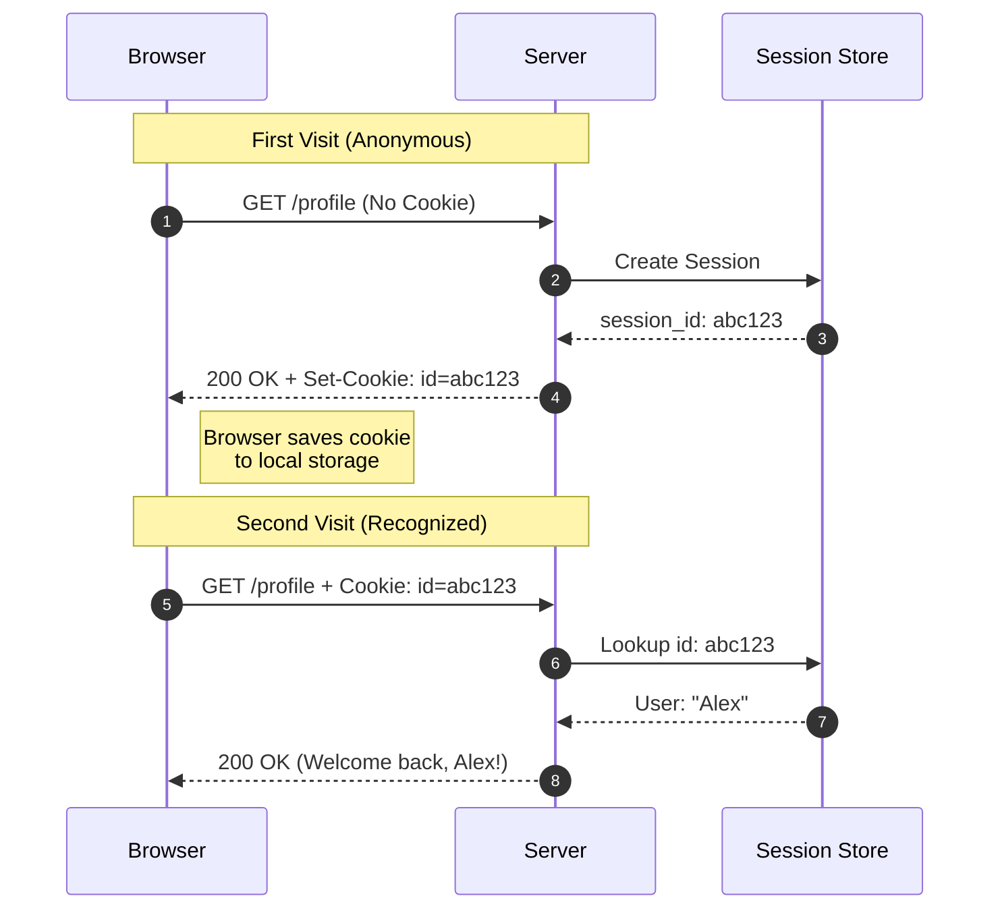
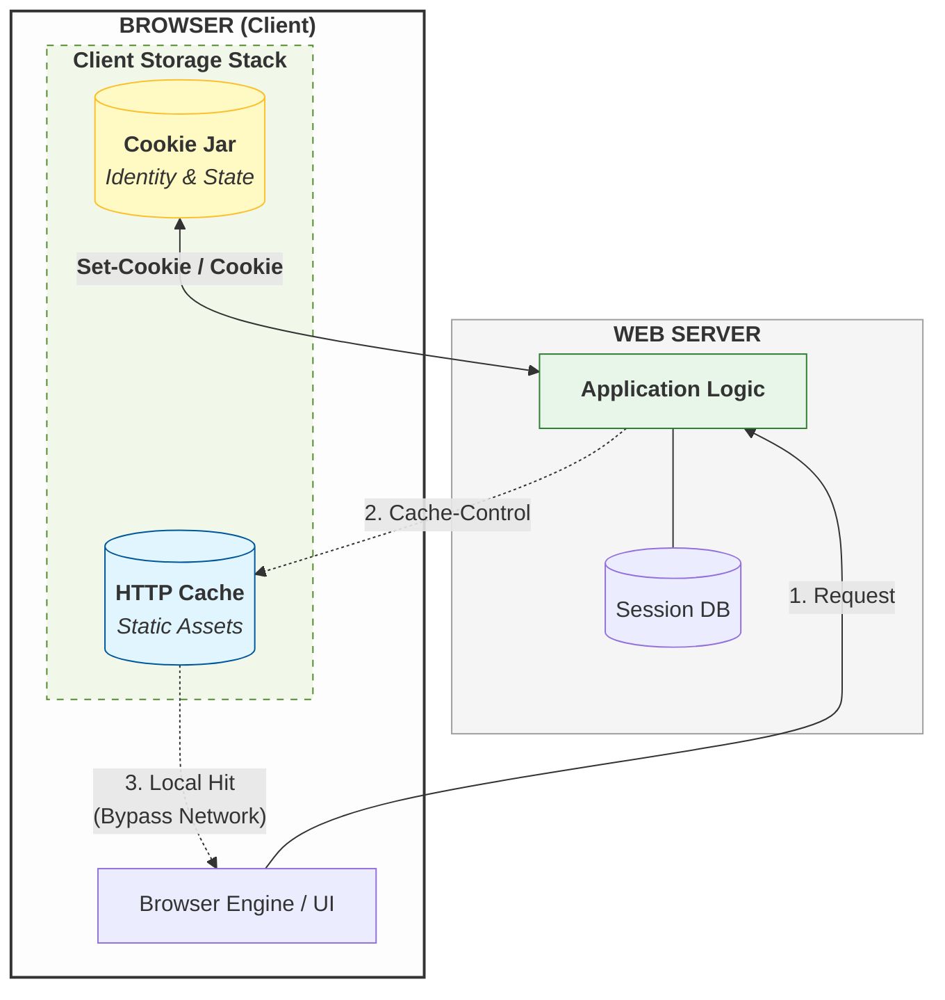

## 1. Introduction — What Actually Travels Over HTTP

---

So far in the networking journey we have covered:

- how machines communicate (IP addresses and ports)
- how transport works (TCP vs UDP)
- why application protocols exist

Now we zoom in on the **most widely used application protocol on the internet — HTTP**.

Before discussing HTTP evolution (HTTP/1.1 → HTTP/2 → HTTP/3), we must understand a more fundamental question:

> **What does an HTTP message actually look like?**

Every interaction between a client and a server using HTTP follows the same basic pattern:

- the client sends an **HTTP request**
- the server returns an **HTTP response**

Understanding this message structure is essential for system design because it explains:

- how APIs work
- how authentication travels across services
- how caching behaves
- how proxies and CDNs inspect traffic

---

## 2. The HTTP Request–Response Model

---

HTTP follows a **request–response communication model**.

A client initiates communication by sending a request, and the server processes that request and returns a response.



Key properties of this model:

- communication is **client initiated**
- each request is **independent**
- servers do not maintain implicit state

This last property leads to an important concept:

> **HTTP is a stateless protocol.**

Each request must contain all information needed to process it.

---

## 3. Anatomy of an HTTP Request

---

An HTTP request typically contains three parts:

1. Request line
2. Headers
3. Optional body

Example request:

```
GET /articles/networking HTTP/1.1
Host: example.com
User-Agent: Mozilla/5.0
Authorization: Bearer abc123
Cookie: session_id=xyz789
```

### Request Line

The request line contains three components:

```
METHOD /path HTTP/version
```

Example:

```
GET /articles HTTP/1.1
```

Common HTTP methods:

- **GET** → retrieve data
- **POST** → create data
- **PUT** → update data
- **DELETE** → remove data

In system design discussions, these methods often map to **API operations**.



---

## 4. Anatomy of an HTTP Response

---

The server returns a response after processing the request.

Example response:

```
HTTP/1.1 200 OK
Content-Type: application/json
Cache-Control: no-cache

{ "status": "success" }
```

A response includes:

1. Status line
2. Headers
3. Optional body

### Status Line

The status line communicates the result of the request.

Example:

```
HTTP/1.1 200 OK
```

Common status codes:

| Code | Meaning               |
| ---- | --------------------- |
| 200  | Success               |
| 201  | Resource created      |
| 400  | Bad request           |
| 401  | Unauthorized          |
| 404  | Resource not found    |
| 500  | Internal server error |

These status codes become important when designing APIs and debugging systems.

---

## 5. Headers — Metadata of HTTP

---

Headers carry **metadata about the request or response**.

They provide additional context that allows servers, proxies, and clients to interpret messages correctly.

Examples of common headers:

| Header        | Purpose                        |
| ------------- | ------------------------------ |
| Host          | Identifies the target server   |
| User-Agent    | Information about the client   |
| Content-Type  | Type of payload being sent     |
| Authorization | Credentials for authentication |
| Cache-Control | Defines caching behavior       |

Headers are heavily used by:

- load balancers
- proxies
- CDNs
- API gateways

Because they allow **routing and policy decisions without inspecting the entire payload**.

---

## 6. Cookies — Maintaining State Over a Stateless Protocol

---

HTTP itself is stateless, but many applications require **user sessions**.

Cookies solve this problem.

A server can send a cookie to the client:

```
Set-Cookie: session_id=abc123
```

The browser then includes that cookie in future requests:

```
Cookie: session_id=abc123
```

This allows servers to associate multiple requests with the same session.



Cookies are commonly used for:

- login sessions
- user preferences
- tracking identifiers

However, cookies also introduce design challenges such as **session storage and security considerations**.

---

## 7. Cookies vs Browser Cache

---

Cookies and browser cache are sometimes confused because both are stored by the browser.

However, they serve completely different purposes.

Cookies store **small pieces of state or identity information** about the user.

Example:

Set-Cookie: session_id=abc123

These cookies are sent back to the server on future requests.

Browser cache, on the other hand, stores **HTTP responses** (such as images, CSS, or API responses) so the browser can reuse them without contacting the server again.

| Feature           | Cookies                     | Browser Cache       |
| ----------------- | --------------------------- | ------------------- |
| Purpose           | Maintain user state         | Improve performance |
| Stored data       | Small key-value identifiers | Full HTTP responses |
| Sent with request | Yes                         | No                  |
| Typical usage     | Sessions, authentication    | Static resources    |

Browsers store cookies and cached responses **in separate storage areas**.



---

## 8. Authentication Headers

---

Modern systems often avoid cookie-based sessions and instead use **authentication headers**.

A common pattern is the **Authorization header**:

```
Authorization: Bearer <token>
```

This token may represent:

- a JWT
- an OAuth access token
- an API key

Authentication headers enable **stateless authentication**, where the server does not need to store session data.

This model is widely used in:

- microservices architectures
- public APIs
- distributed systems

---

## 9. Why HTTP Fundamentals Matter for System Design

---

Understanding HTTP mechanics helps explain many higher-level system behaviors.

For example:

- **Rate limiting** often depends on headers
- **API gateways** inspect headers for routing
- **CDNs** cache responses based on headers
- **Authentication systems** rely on tokens in headers
- **Sticky sessions** may depend on cookies

Without understanding these mechanics, many networking components can appear like "black boxes".

> #### 💡 System Design Insight
>
> Cookies can affect caching behavior.
>
> When requests include cookies, many CDNs and reverse proxies avoid caching the response because the response may depend on the user's identity.
>
> **For example:**
>
> Cookie: session_id=abc123
>
> If a response were cached with this cookie, another user might receive personalized data.
>
> Because of this risk, responses with cookies are often treated as **non-cacheable**, which can reduce caching efficiency.
>
> This is why many large systems separate:
>
> - static content (cacheable)
> - authenticated APIs (not cached)

---

## Key Takeaways

- HTTP communication follows a **request–response model**
- An HTTP request includes a method, headers, and optionally a body
- Responses include a status code, headers, and a payload
- Headers carry metadata used for routing, caching, and authentication
- Cookies allow stateful behavior on top of a stateless protocol
- Authentication headers enable stateless API security

---

### 🔗 What’s Next?

Now that we understand how HTTP messages are structured, we can explore the limitations of the original protocol.

In the next chapter we examine why **HTTP/1.1 struggled with modern workloads**, and how newer versions of HTTP evolved to solve those problems.

👉 **Up Next →**  
**[HTTP/1.1 — The Original Model and Its Limits](/learning/advanced-skills/networking-essentials/3_http-and-protocol-evolution/3_2_http-1.1-original-model)**

---

> 📝 **Takeaway**
>
> Before optimizing protocols or scaling systems, you must understand **what actually travels over the wire.**
