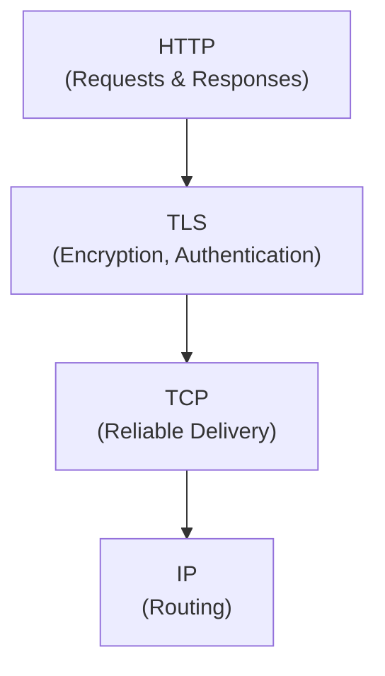
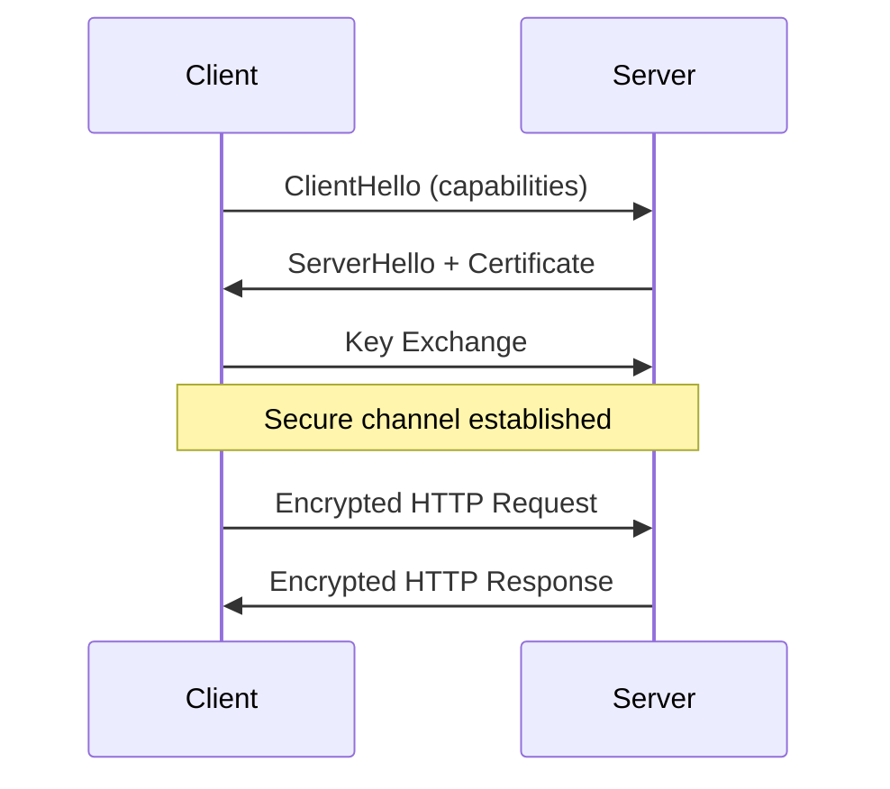
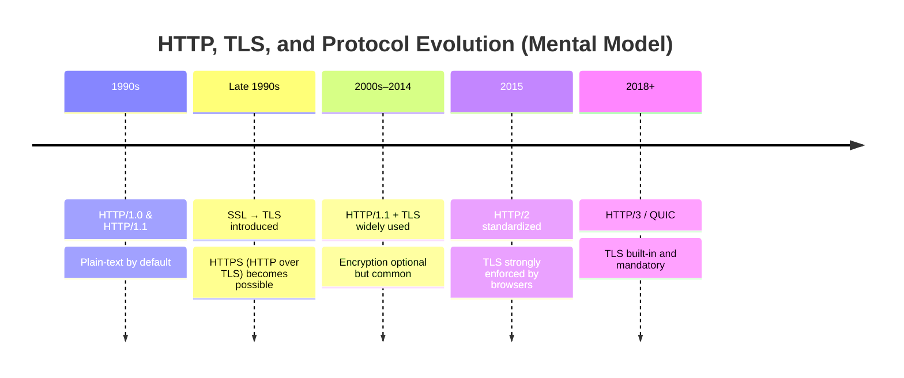

## 1. Introduction — What HTTPS Really Is

---

At some point, almost every developer hears:

> “HTTPS is just HTTP with encryption.”

While this is directionally correct, it hides **critical system design details**.

HTTPS does **not**:

- change HTTP methods
- change request–response semantics
- change application behavior

Yet it **does**:

- change connection setup
- affect latency
- introduce trust and identity
- influence architecture decisions

This chapter explains **what TLS actually does** and **where it fits**, without diving into cryptography.

---

## 2. HTTP vs HTTPS — What Actually Changes?

---

At a conceptual level:

- **HTTP** defines _what_ is sent
- **TLS** defines _how securely_ it is sent

Nothing about HTTP itself changes.

> HTTPS is simply **HTTP running over TLS**.

---

## 3. What TLS Is Responsible For

---

TLS (Transport Layer Security) provides three core guarantees:

### 3.1 🔒 Confidentiality

- Data is encrypted
- Intermediaries cannot read payloads

### 3.2 🧾 Integrity

- Data cannot be modified undetected
- Tampering breaks verification

### 3.3 🪪 Authentication

- Clients can verify server identity
- Trust is established via certificates

### TLS does not:

- define application semantics
- retry requests
- guarantee delivery

Those responsibilities remain elsewhere.

---

## 4. TLS Handshake (High-Level Only)

---

Before application data can flow, TLS must establish trust.

Conceptually:

Key ideas (no crypto math):

- identity is verified **before** data exchange
- encryption keys are negotiated
- handshake adds **latency**

This latency matters in system design.

---

## 5. Why TLS Was Introduced (And Why It Became Mandatory)

---

In the early days of the web, **HTTP traffic was sent in plain text**.

This meant:

- anyone on the network path could read requests and responses
- credentials could be intercepted
- data could be modified in transit without detection

At small scale, this risk was often ignored.  
At internet scale, it became unacceptable.

As the web evolved to support:

- authentication
- payments
- personal data
- enterprise systems

a fundamental requirement emerged:

> **Clients must be able to trust who they are talking to,  
> and data must be protected while in transit.**

This led to the introduction of **SSL**, which later evolved into **TLS**.

Over time:

- threats became more sophisticated
- attack surfaces expanded (public Wi-Fi, ISPs, proxies)
- regulatory and compliance requirements increased

As a result, encryption moved from:

- **optional → recommended → mandatory**

Today:

- browsers mark plain HTTP as unsafe
- modern protocols assume encryption by default
- unencrypted traffic is considered a design flaw

TLS exists not as a feature, but as a **baseline requirement** for operating on untrusted networks.

> 📌 **Mental Model**
>
> TLS existed long before HTTP/2.  
> HTTP/2 normalized encryption, and HTTP/3 made it unavoidable.

---

## 6. Certificates & Trust (Conceptual)

---

TLS relies on a **chain of trust** to verify identity.

At a high level:

- Servers present a **certificate** claiming an identity
- Certificates are **signed by trusted Certificate Authorities (CAs)**
- Clients verify this chain before sending sensitive data

This explains several real-world behaviors:

- An **expired certificate** can take down a production system
- A **misconfigured certificate** causes browsers to block access
- Trust must be **explicitly managed**, not assumed

Certificates are not just a security artifact —  
they are a **critical operational dependency**.

---

## 7. Performance Cost of TLS (And Why It’s Worth It)

---

TLS introduces unavoidable overhead:

- One or more **handshake round trips**
- **Cryptographic computation** during setup

From a system design perspective, this means:

- First requests are often slower
- Connection reuse becomes important
- Cold starts feel more expensive

However, modern systems mitigate this cost:

- Hardware acceleration for encryption
- TLS session reuse
- Long-lived connections (keep-alive)

The trade-off is clear:

> **A small latency cost is acceptable when the alternative is untrusted communication.**

This is why HTTPS is now the default for almost all systems.

---

## 8. TLS Across Modern Protocols

---

TLS behaves slightly differently across protocol generations:

- **HTTP/1.1**  
  TLS runs on top of TCP

- **HTTP/2**  
  TLS is not strictly required by the spec,  
  but is effectively mandatory in practice

- **HTTP/3**  
  TLS is **built directly into QUIC**

Security evolved from:

- optional
- to expected
- to deeply integrated

This mirrors how threat models evolved alongside the internet.

---

## 9. System Design Implications

---

Understanding TLS clarifies many design and operational questions:

- Why the **first request** is slower than subsequent ones
- Why **connection reuse** is critical for performance
- Why **certificate rotation** must be automated
- Why **mTLS** is used for internal service communication
- Why zero-trust architectures exist

TLS is not “just security”.

It actively shapes:

- latency profiles
- connection lifecycles
- infrastructure complexity

---

## 10. Layer Mapping (Explicit)

---

> 📍 **Layer Mapping**
>
> TLS operates **between**:
>
> - the Application layer (HTTP semantics)
> - the Transport layer (TCP / QUIC)
>
> It spans responsibilities traditionally associated with  
> **OSI Layer 6 (Presentation)** and **OSI Layer 5 (Session)**.

This cross-layer nature is why TLS is often misunderstood and misplaced in discussions.

---

## 11. Key Takeaways

---

- HTTPS is simply **HTTP over TLS**
- TLS provides confidentiality, integrity, and authentication
- HTTP semantics do not change
- TLS adds latency, but enables trust
- Modern protocols assume encryption by default

Security is no longer optional —  
it is an architectural baseline.

---

### 🔗 What’s Next?

Now that we understand:

- HTTP semantics
- transport behavior
- and security guarantees

we can return to **performance**.

In the next chapter, we explore:

- how HTTP/2 improves efficiency
- why multiplexing matters
- and how performance evolved without changing HTTP itself

👉 **Up Next →**  
**[HTTP/2 — Multiplexing and Performance](/learning/advanced-skills/networking-essentials/3_http-and-protocol-evolution/3_3_http-2-multiplexing-and-performance)**

---

> 📝 **Takeaway**
>
> TLS does not change what your system does —  
> it changes **who you can trust and at what cost**.
