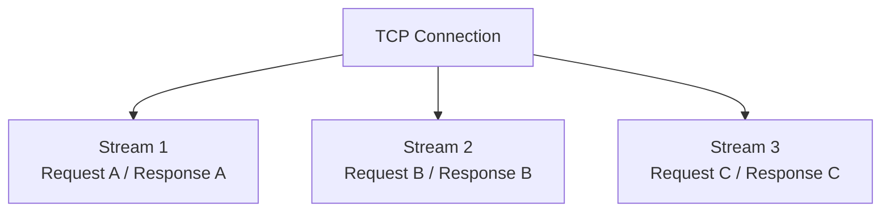
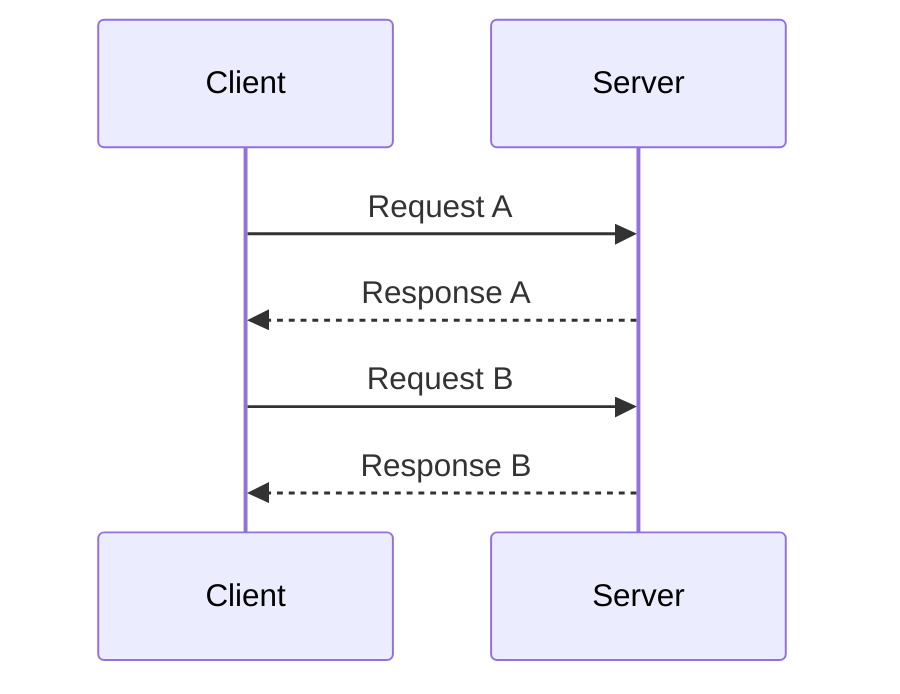
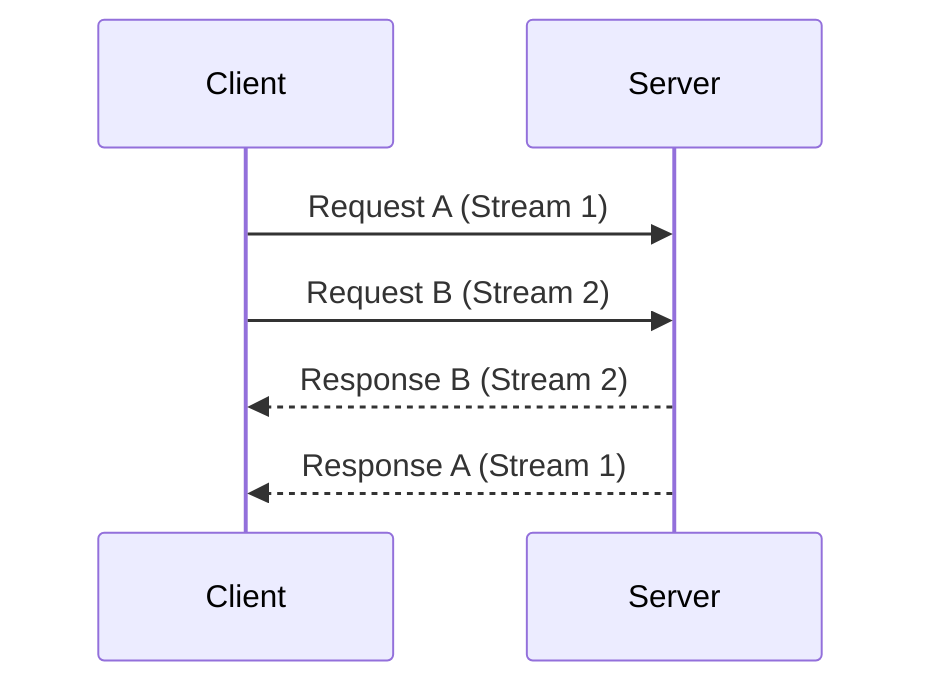

## 1. Introduction — Fixing HTTP Without Replacing It

---

In the previous chapter, we saw why **HTTP/1.1 became a bottleneck**:

- sequential request handling
- application-level head-of-line blocking
- browser-level workarounds

The problem was not _what_ HTTP did —  
it was **how HTTP used a single TCP connection**.

HTTP/2 was designed to fix this exact issue.

Importantly:

> **HTTP/2 does not change HTTP semantics.**  
> It changes how HTTP messages are transported.

---

## 2. The Core Idea Behind HTTP/2

---

The central idea of HTTP/2 is simple:

> **Multiple requests and responses should be able to share a single connection concurrently.**

Instead of treating a connection as a single pipeline,
HTTP/2 treats it as a **multiplexed channel**.

This allows:

- better utilization of a single TCP connection
- reduced latency
- fewer hacks at the application level

> 🕰️ **Timeline Context**
>
> - **2012–2014**: Google experimented with **SPDY**, introducing multiplexing and header compression
> - **May 2015**: HTTP/2 was standardized as **RFC 7540**, heavily influenced by SPDY
> - **2016 onward**: Major browsers, servers, and CDNs adopted HTTP/2 by default
>
> HTTP/2 was not a theoretical improvement — it was a response to real performance bottlenecks observed at scale.

---

## 3. From Messages to Streams

---

In HTTP/2:

- each request–response pair is mapped to a **stream**
- streams are independent
- multiple streams can be active at the same time

Conceptually:

This removes the application-level serialization seen in HTTP/1.1.

---

## 4. Multiplexing in Action

---

Let’s compare behavior.

### 4.1 HTTP/1.1 (Sequential)

### 4.2 HTTP/2 (Multiplexed)

Fast responses are no longer blocked by slow ones.

---

## 5. Binary Framing (Why It Matters)

---

HTTP/2 introduces a **binary framing layer**.

Instead of sending plain text messages:

- requests and responses are split into **frames**
- frames are tagged with **stream IDs**
- frames can be **interleaved** on the wire

This framing is what makes **multiplexing possible**.

Applications do not see frames —  
they still work with **HTTP requests and responses**.

---

## 6. Header Compression (HPACK)

---

HTTP/1.1 headers are:

- verbose
- repetitive
- expensive over slow networks

HTTP/2 introduces **HPACK**:

- headers are compressed
- repeated headers are referenced instead of resent
- bandwidth usage is significantly reduced

This matters especially for:

- mobile networks
- APIs with many small requests

---

## 7. What HTTP/2 Solves (And What It Doesn’t)

---

### Solves

- Application-level head-of-line blocking
- Excessive TCP connections
- Browser hacks (mostly)

### Does _Not_ Solve

- TCP-level head-of-line blocking
- Packet loss affecting all streams
- Transport-layer latency issues

HTTP/2 improves efficiency —  
but it is still **bound to TCP’s behavior**.

---

## 8. System Design Implications

---

HTTP/2 changes how systems behave under load:

- fewer connections → less congestion
- better latency for concurrent requests
- simpler client and server designs

However:

- packet loss on a TCP connection still affects all streams
- long-lived connections require careful timeout handling

Understanding these trade-offs is critical when designing:

- APIs
- gateways
- service meshes

---

## 9. Layer Mapping (Explicit)

---

> 📍 **Layer Mapping**
>
> HTTP/2 operates at the **Application layer**  
> (OSI Layer 7 / TCP-IP Application layer),
>
> while relying on **TCP at the Transport layer**  
> (OSI Layer 4).
>
> Multiplexing is an _application-level_ solution built on top of TCP.

This distinction explains why HTTP/2 helped —  
but did not eliminate all latency problems.

---

## 10. Key Takeaways

---

- HTTP/2 keeps HTTP semantics unchanged
- Multiplexing allows concurrent requests on one connection
- Binary framing enables efficient interleaving
- Header compression reduces overhead
- TCP-level limitations still apply

HTTP/2 is a major improvement — but not the end of the story.

---

### 🔗 What’s Next?

HTTP/2 exposed a deeper limitation:

> Even with multiplexing, **TCP itself can become the bottleneck**.

In the next chapter, we explore:

- why TCP head-of-line blocking still matters
- how QUIC rethinks transport
- and why HTTP/3 moved to UDP

👉 **Up Next →**  
**[HTTP/3 & QUIC — Rethinking Transport](/learning/advanced-skills/networking-essentials/3_http-and-protocol-evolution/3_4_http-3-and-quic)**

---

> 📝 **Takeaway**
>
> HTTP/2 fixed how HTTP _uses_ connections —  
> but it could not change how TCP behaves underneath.
