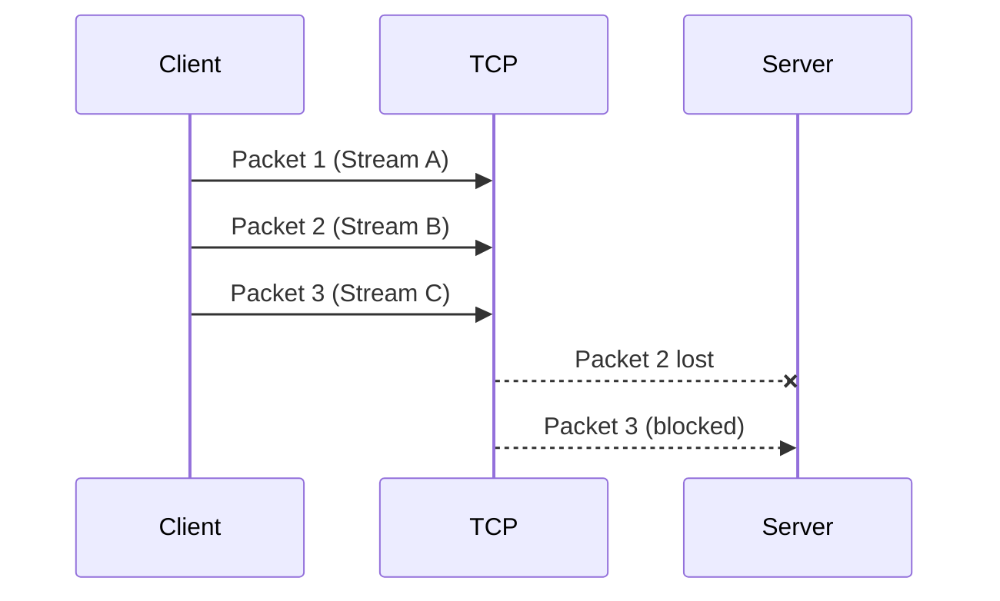
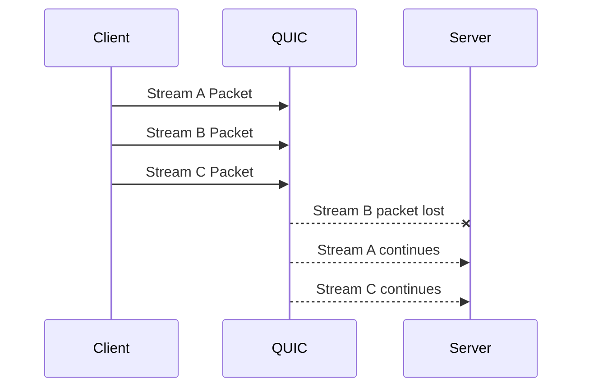
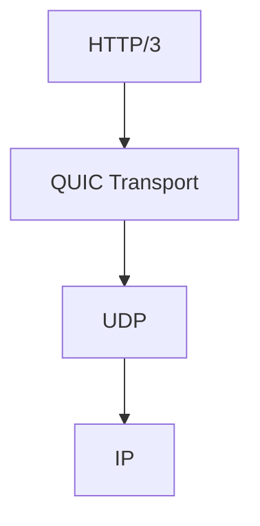

## 1. Introduction — When HTTP/2 Was Still Not Enough

---

HTTP/2 fixed many of HTTP/1.1’s problems:

- multiplexing requests
- reducing connection overhead
- eliminating application-level head-of-line blocking

Yet under real-world conditions, especially on:

- mobile networks
- high-latency links
- lossy connections

performance issues still remained.

The reason was subtle but critical:

> **HTTP/2 fixed the application layer —  
> but it was still bound to TCP at the transport layer.**

---

## 2. The Hidden Bottleneck: TCP Head-of-Line Blocking

---

TCP guarantees **ordered delivery**.

**This means:**

- packets must be delivered in sequence
- later packets cannot be processed until earlier ones arrive

**In HTTP/2:**

- multiple streams share a single TCP connection
- if one TCP packet is lost, **all streams stall**

This is known as **transport-level head-of-line blocking**.

Even though streams are independent at the application level,  
TCP forces them to wait.

---

## 3. Why TCP Could Not Be “Fixed” for This

---

TCP’s behavior is not an implementation detail —  
it is the **core contract of the protocol**.

#### TCP is designed to:

- deliver bytes reliably
- in strict order
- as a single stream

#### This makes TCP excellent for correctness, but problematic for:

- multiplexed workloads
- high packet loss environments

#### Changing TCP itself was not feasible:

- it is deeply embedded in operating systems
- it is widely deployed and standardized

So the industry took a different path.

---

## 4. QUIC — Reliable Transport Built on UDP

---

**QUIC** is a modern transport protocol that runs **on top of UDP**.

This sounds counterintuitive at first.

UDP is:

- connectionless
- unreliable
- unordered

But QUIC adds, at the application level:

- reliability
- ordering (per stream)
- congestion control
- encryption by default

QUIC uses UDP only as a **thin delivery mechanism**.

---

## 5. Streams Without Transport-Level Blocking

---

The key innovation in QUIC is **stream-level independence**.

Each stream:

- is ordered internally
- does not block other streams if packets are lost

Loss in one stream does **not** stall the others.

This directly solves TCP’s head-of-line blocking.

---

## 6. Faster Connection Establishment

---

QUIC also improves connection setup:

- TCP requires a handshake
- TLS requires another handshake
- Together, this adds round-trip latency

QUIC integrates:

- transport setup
- encryption
- authentication

This allows:

- faster first requests
- quicker reconnections (especially on mobile networks)

---

## 7. HTTP/3 — HTTP Over QUIC

---

HTTP/3 is not a new version of HTTP semantics.

Just like HTTP/2:

- request methods
- status codes
- headers

remain conceptually the same.

The difference is **where HTTP runs**:

HTTP/3 inherits:

- stream multiplexing
- reduced latency
- resilience to packet loss

---

## 8. System Design Implications

---

HTTP/3 and QUIC matter most when:

- networks are unreliable
- latency is highly variable
- clients frequently change networks (e.g. mobile)

In controlled environments (e.g. data centers):

- benefits may be marginal
- HTTP/2 is often sufficient

This reinforces an important system design principle:

> **Protocol choice depends on environment, not trend.**

---

## 9. Layer Mapping (Explicit)

---

> 📍 **Layer Mapping**
>
> QUIC spans both:
>
> - Transport behavior (OSI Layer 4 responsibilities)
> - Application-level framing
>
> HTTP/3 operates at the **Application layer**  
> but relies on QUIC instead of TCP.

This is a deliberate cross-layer design.

---

## 10. Key Takeaways

- HTTP/2 solved application-level blocking
- TCP still caused transport-level blocking
- QUIC reimplemented transport semantics over UDP
- HTTP/3 runs on QUIC, not TCP
- UDP here is a **foundation**, not the full solution

Modern protocols evolved by **rethinking layers**, not ignoring them.

---

### 🔗 What’s Next?

We have now seen how:

- HTTP evolved
- transport assumptions were challenged
- performance constraints drove innovation

Next, we look at **how services communicate internally** at scale.

In the next chapter, we explore:

- why REST is not always ideal
- how gRPC builds on HTTP/2
- and when gRPC is the right choice

👉 **Up Next →**  
**[gRPC — High-Performance Service-to-Service Communication](/learning/advanced-skills/networking-essentials/3_http-and-protocol-evolution/3_4_http-3-and-quic)**

---

> **📝 Takeaway**
>
> HTTP/3 exists because fixing performance sometimes means  
> rethinking assumptions at a deeper layer than expected.
