## 1. Introduction — Why REST Isn’t Always Ideal Internally

---

HTTP + REST + JSON is a great default for **public APIs** because it is:

- universal
- debuggable
- browser-friendly
- easy to integrate

But inside a distributed system (service-to-service), teams often hit limits:

- Too much JSON overhead for high-throughput calls
- Weak contracts (breaking changes slip through)
- Inefficient multi-call workflows
- Streaming requirements (events, progress updates) feel awkward

This is where **gRPC** shines.

> gRPC is not “the next version of REST”.  
> It’s a different communication style optimized for **internal services**.

---

## 2. What gRPC Actually Is

---

**gRPC** is an RPC (Remote Procedure Call) framework that:

- uses **HTTP/2** as the transport substrate
- typically uses **Protocol Buffers (Protobuf)** as the message format
- supports unary calls and multiple forms of **streaming**
- generates strongly-typed client/server stubs from a contract

Mental model:

> REST: “Resources over HTTP”  
> gRPC: “Typed function calls over the network”

---

## 3. Where gRPC Fits in the Stack

---

gRPC is an **application-layer protocol** running on top of **HTTP/2**.

> This is why Phase 3 matters:  
> gRPC makes the most sense after you understand HTTP/2.

---

## 4. The Contract-First Model (Why Teams Love It)

---

In REST-based systems, the “contract” often lives in:

- documentation
- OpenAPI specs (sometimes)
- shared understanding or tribal knowledge

This creates room for:

- accidental breaking changes
- runtime failures
- misaligned expectations between teams

gRPC takes a **contract-first** approach.

You define:

- service methods (RPCs)
- request and response message schemas

from a single, authoritative contract.

From this contract, tooling generates:

- client stubs
- server interfaces
- serialization and deserialization logic

The result is:

- strong typing across service boundaries
- compile-time validation instead of runtime surprises
- clear, enforceable API evolution rules

> Contract-first design doesn’t eliminate breaking changes —  
> it makes them **explicit, detectable, and intentional**.

---

## 5. Protobuf vs JSON (System Design View)

---

Both JSON and Protobuf are widely used, but they optimize for different priorities.

### JSON — Strengths

- Human-readable and easy to inspect
- Simple debugging with tools like curl and Postman
- Extremely broad ecosystem support

### Protobuf — Strengths

- Compact binary encoding (smaller payloads)
- Faster serialization and deserialization
- Strongly typed schemas with explicit evolution rules

From a system design perspective:

> Protobuf is not “better” in all cases.  
> It is better when **performance, efficiency, and strict contracts** matter more than human readability.

In high-throughput internal systems, the cumulative benefits of Protobuf  
— smaller payloads, faster parsing, fewer errors — often outweigh the convenience of text-based formats.

---

## 6. Streaming: The Killer Feature for Many Systems

---

REST is great for request/response.  
But when you need continuous or bidirectional communication, it gets awkward.

gRPC supports **four communication patterns**:

```mermaid
flowchart LR
    U[Unary<br/>1 request → 1 response]
    CS[Client Streaming<br/>many requests → 1 response]
    SS[Server Streaming<br/>1 request → many responses]
    BI[Bidirectional Streaming<br/>many ↔ many]

    U --- CS --- SS --- BI
```

### When streaming matters

- live progress updates (report generation, large jobs)
- market data / price feeds
- chat / collaboration
- high-frequency telemetry
- pushing partial results as they become available

This is one reason gRPC is common in:

- trading platforms
- data infrastructure
- internal microservice ecosystems

---

## 7. Why HTTP/2 Makes gRPC Efficient

---

HTTP/2 enables gRPC performance and scalability because it provides:

- multiplexed streams over a single connection
- efficient framing (binary)
- lower connection overhead under concurrent load

Conceptually:

This is a very natural fit for microservices making many parallel calls.

---

## 8. gRPC vs REST — When to Use What

---

### Use REST when

- You expose public APIs to third parties
- Browser compatibility matters
- You want cache-friendly GET semantics
- Consumers vary widely (unknown clients)
- Debugging via curl/Postman is a priority

### Use gRPC when

- You control both client and server (internal systems)
- Performance and efficiency matter
- Strict contracts and type safety matter
- You need streaming
- You want consistent client libraries generated from schema

A common mature architecture looks like this:

> **External:** REST over HTTPS (compatibility and reach)  
> **Internal:** gRPC (performance, contracts, streaming)

---

## 9. Operational Reality (Important for HLD)

---

Adopting gRPC comes with real operational considerations.

### 9.1 Observability

- Metrics and latency tracked per RPC method
- Distributed tracing across service boundaries

### 9.2 Load Balancing

- Long-lived connections with multiplexed streams
- Layer 4 vs Layer 7 load balancing decisions matter

### 9.3 Timeouts & Retries

- Retries must be carefully designed
- Poor retry strategy can cause retry storms

### 9.4 Versioning

- Additive schema changes are easiest
- Breaking changes require coordination and planning

These are not drawbacks —  
they are the **cost of high-performance, strongly-typed communication**.

---

## 10. Layer Mapping (Explicit)

> 📍 **Layer Mapping**
>
> gRPC is an **Application-layer protocol**  
> (OSI Layer 7 / TCP-IP Application layer).
>
> It typically runs over **HTTP/2**, which itself operates at the Application layer but depends on:
>
> - **TLS** (cross-layer security boundary)
> - **TCP** (OSI Layer 4) for reliable delivery

This explains why:

- Understanding HTTP/2 is a prerequisite for gRPC
- TCP behavior still affects gRPC performance under packet loss

---

## 11. Key Takeaways

---

- gRPC is RPC-style communication built on **HTTP/2**
- It is optimized for **internal service-to-service** calls
- Protobuf enables compact payloads and strong contracts
- Streaming is a major differentiator
- REST remains ideal for public APIs
- Protocol choice is an architectural decision, not a trend

---

### 🔗 What’s Next?

Now that we’ve covered:

- HTTP evolution (1.1 → 2 → 3)
- TLS as a security baseline
- gRPC for internal communication

we synthesize everything into a **practical decision guide**:

- HTTP/1.1 vs HTTP/2 vs HTTP/3
- REST vs gRPC
- Internet vs mobile vs data-center environments
- Trade-offs, defaults, and when to deviate

👉 **Up Next →**  
**[Choosing the Right Protocol (REST vs gRPC vs HTTP/2 vs HTTP/3)](/learning/advanced-skills/networking-essentials/3_http-and-protocol-evolution/3_6_choosing-right-protocol)**

---

> 📝 **Takeaway**
>
> gRPC is not about “modernizing APIs”.  
> It’s about building **fast, safe, contract-driven communication** inside distributed systems.
