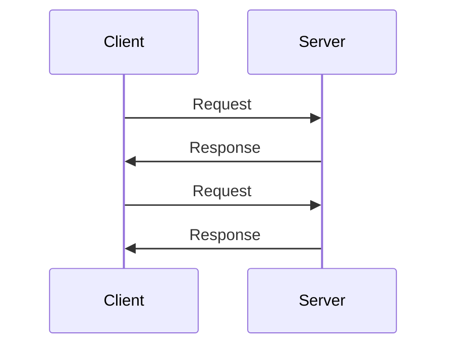
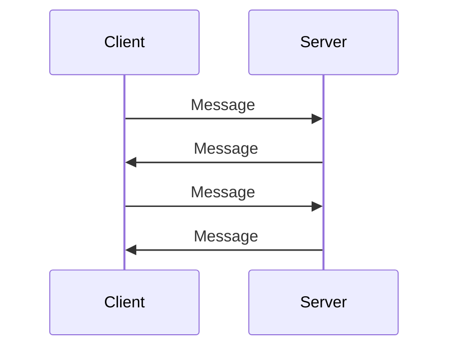
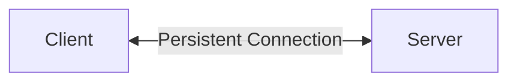

## 1. Introduction — When HTTP Request/Response Is Not Enough

---

In the previous chapters we explored how HTTP evolved:

- **HTTP/1.1** — the original request–response model
- **HTTP/2** — multiplexing requests over a single connection
- **HTTP/3 / QUIC** — reducing transport latency

These improvements make web communication **faster and more efficient**, but the fundamental interaction model remains the same:

1. the client sends a request
2. the server returns a response
3. the interaction ends

This model works well for most use cases such as:

- loading webpages
- calling APIs
- downloading resources

However, some applications require **continuous real-time updates**, such as:

- chat applications
- collaborative editors
- live dashboards
- multiplayer games

In these systems, the server must be able to **send updates to clients instantly** when new data appears.

Traditional HTTP cannot do this easily because communication always begins with a client request.

To support **persistent, bidirectional communication**, a different protocol is needed.

This is where **WebSockets** come in.

---

## 2. The Problem with HTTP for Real‑Time Communication

---

With standard HTTP, communication looks like this:



If the server needs to notify the client about new data, it cannot do so directly.

Instead, the client must repeatedly ask:

```
"Is there new data?"
```

This pattern is known as **polling**.

Problems with polling:

- unnecessary network requests
- increased latency
- inefficient server usage

To solve this, we need a connection where **both sides can send messages anytime**.

---

## 3. What WebSockets Are

---

WebSockets provide a **persistent, bidirectional communication channel** between a client and server.

Key characteristics:

- a **single long‑lived connection**
- both client and server can send messages
- very low communication overhead

Unlike HTTP, where every request opens a new interaction, WebSockets maintain an **ongoing conversation**.



This enables true **real‑time communication**.

---

## 4. The HTTP Upgrade Mechanism

---

Interestingly, WebSockets begin as a normal HTTP request.

The client asks the server to **upgrade the connection**.

Example handshake:

```
GET /chat HTTP/1.1
Host: example.com
Upgrade: websocket
Connection: Upgrade
```

If the server supports WebSockets, it responds:

```
HTTP/1.1 101 Switching Protocols
Upgrade: websocket
Connection: Upgrade
```

After this handshake, the connection switches from **HTTP → WebSocket protocol**.

From this point onward, messages flow freely in both directions.

---

## 5. Persistent Connection Model

---

Once established, the WebSocket connection stays open.



Messages can now travel in either direction at any time.

Advantages:

- minimal latency
- reduced overhead
- efficient real‑time updates

This makes WebSockets ideal for systems that require **frequent, low‑latency communication**.

---

## 6. Where WebSockets Are Used

---

Common real‑world uses include:

### Real‑Time Chat

Messages must appear instantly across all connected clients.

### Live Data Streams

Examples:

- stock market dashboards
- sports score updates
- analytics dashboards

### Collaborative Applications

Examples:

- Google Docs style editing
- shared whiteboards

### Multiplayer Games

Game state must synchronize continuously between players.

---

## 7. Trade‑offs and Limitations

---

Despite their advantages, WebSockets are not always the best choice.

### Connection Management

Each connected client maintains a **long‑lived connection**, which consumes server resources.

### Scaling Complexity

Load balancing WebSocket connections can be more complex than stateless HTTP requests.

### Infrastructure Compatibility

Some proxies, firewalls, and older network infrastructure historically handled WebSockets poorly.

Modern platforms generally support them well, but system designers must still account for connection persistence.

---

## 8. WebSockets vs HTTP APIs

---

| Feature             | HTTP APIs        | WebSockets        |
| ------------------- | ---------------- | ----------------- |
| Communication style | Request–response | Bidirectional     |
| Connection          | Short‑lived      | Persistent        |
| Server push         | Not native       | Native            |
| Ideal for           | APIs, web pages  | Real‑time systems |

Most systems combine both approaches.

For example:

- REST APIs for data operations
- WebSockets for real‑time updates

---

## 9. Why WebSockets Matter for System Design

---

Understanding WebSockets helps explain how modern real‑time systems work.

They are frequently used in architectures involving:

- event streaming
- notification systems
- collaborative tools
- live analytics dashboards

However, WebSockets introduce architectural considerations such as:

- connection management
- horizontal scaling
- message broadcasting

These topics appear later in **High‑Level Design and Large‑Scale Systems discussions**.

---

## 10. Layer Mapping (Explicit)

---

> 📍 **Layer Mapping**
>
> WebSockets primarily operate at the **Application Layer (OSI Layer 7)**.
>
> However, they rely on lower networking layers for transport and reliability.
>
> The stack typically looks like this:
>
> - **Application Layer (L7)** → WebSocket protocol framing
> - **Transport Layer (L4)** → TCP connection
> - **Network Layer (L3)** → IP routing
>
> Importantly, the WebSocket connection is **established using an HTTP upgrade handshake**.
>
> This means the lifecycle looks like:
>
> ```
> HTTP (handshake) → WebSocket protocol (persistent communication)
> ```
>
> After the upgrade occurs:
>
> - HTTP semantics no longer apply
> - the connection becomes a **raw bidirectional WebSocket stream over TCP**
>
> This design allows WebSockets to:
>
> - reuse existing HTTP infrastructure (proxies, load balancers, ports)
> - establish persistent connections without inventing a new discovery mechanism
>
> In other words, WebSockets **start as HTTP but evolve into their own application protocol** running on top of TCP.

---

## Key Takeaways

- HTTP follows a request–response model
- Some applications require real‑time bidirectional communication
- WebSockets provide a persistent connection between client and server
- Communication can happen at any time in either direction
- They enable real‑time systems like chat, dashboards, and multiplayer games

---

### 🔗 What’s Next?

Now that we understand different communication models, we can explore another high‑performance protocol used heavily in distributed systems.

👉 **Up Next →**  
**[gRPC — High-Performance Service-to-Service Communication](/learning/advanced-skills/networking-essentials/3_http-and-protocol-evolution/3_7_grpc-service-to-service-communication)**

---

> 📝 **Takeaway**
>
> HTTP is excellent for request–response interactions, but real‑time systems require protocols that support **continuous bidirectional communication**.
