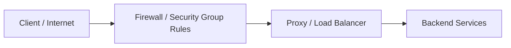
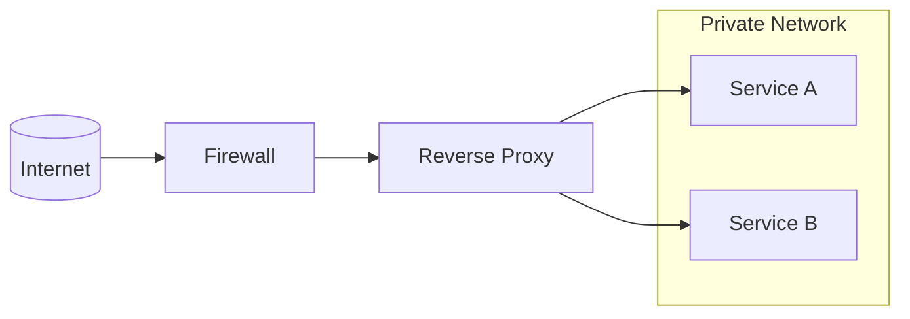

## 1. Introduction — Why Networks Need Boundaries

---

So far in Phase 4, we’ve focused on **how traffic flows**:

- how services are discovered
- how requests are routed
- how proxies control and distribute traffic

But before traffic can be _controlled_, an even more fundamental question must be answered:

> **Should this traffic be allowed at all?**

This is where **firewalls and security groups** come into play.

They define **network-level trust boundaries** — deciding _which traffic is even permitted to reach your system_.

---

## 2. What a Firewall Is (System Design Definition)

---

A **firewall** is a network control mechanism that:

- allows or blocks traffic
- based on predefined rules
- before traffic reaches applications

At a high level:

> **A firewall is a gatekeeper that enforces network boundaries.**

Firewalls operate on the principle of **default deny**:

- traffic is blocked unless explicitly allowed

This is fundamentally different from proxies, which assume traffic is allowed and then apply higher-level logic.

---

## 3. Where Firewalls Sit in a System

Conceptually, firewalls sit **outside or in front of** your application stack.

Key observation:

- Firewalls decide **whether traffic may enter**
- Proxies decide **how allowed traffic is handled**

These responsibilities are complementary, not overlapping.

---

## 4. Firewall vs Proxy (Critical Distinction)

---

This distinction is essential for system design clarity.

| Aspect              | Firewall             | Proxy                     |
| ------------------- | -------------------- | ------------------------- |
| Primary role        | Allow / deny traffic | Inspect & control traffic |
| Awareness level     | Network / transport  | Application-level         |
| Typical layers      | L3 / L4              | L7 (sometimes L4)         |
| Can modify requests | No                   | Yes                       |
| Handles routing     | No                   | Yes                       |

> A firewall answers **“Is this traffic allowed?”**  
> A proxy answers **“What should we do with this traffic?”**

---

## 5. Security Groups — Firewalls in the Cloud

---

In cloud environments, traditional firewalls appear as **security groups** (or equivalent constructs).

A **security group** is:

- a virtual firewall
- attached to cloud resources (VMs, load balancers)
- defined using inbound and outbound rules

Examples (conceptual):

- allow inbound HTTPS (443) from the internet
- allow inbound traffic from a specific subnet
- block all other ports by default

> Security groups enforce **network isolation without physical hardware**.

---

## 6. Why Firewalls Come After Proxies (Conceptually)

---

In the learning flow, firewalls appear **after** proxies intentionally.

Because:

- proxies explain **traffic control**
- firewalls explain **traffic permission**

You must understand _what traffic wants to do_ before deciding _whether it should be allowed_.

In real systems, both are used together:

- firewall sets the outer boundary
- proxy enforces inner policies

---

## 7. Common Firewall Design Patterns

---

### 7.1 Public vs Private Boundaries

- Internet-facing components are tightly restricted
- Backend services live in private networks
- Only proxies or gateways can reach them

> Backend services live in private networks and are reachable **only through controlled entry points**.

### 7.2 Least Privilege Networking

- Only required ports are opened
- Access is limited to known sources
- Everything else is blocked

### 7.3 Defense in Depth

- Firewalls restrict access
- Proxies validate requests
- Applications enforce business rules

Each layer assumes the previous one can fail.

---

## 8. Caveats & Trade-offs

---

Firewalls are powerful, but not sufficient on their own.

### What Firewalls Cannot Do

- Authenticate users
- Inspect application payloads meaningfully
- Enforce business-level authorization

Relying solely on firewalls leads to **false security**.

### Operational Considerations

- Misconfigured rules can block critical traffic
- Overly permissive rules weaken security
- Changes must be carefully managed to avoid outages

> Firewalls reduce attack surface — they do not replace application security.

---

## 9. How Firewalls Fit into Modern Architectures

---

Once understood, firewalls appear everywhere:

- Cloud VPC boundaries
- Subnet isolation
- Private service-to-service communication
- Zero-trust architectures (at a high level)

They quietly enforce the **shape and safety** of your network.

---

## Key Takeaways

---

- Firewalls define network trust boundaries
- They operate before traffic reaches proxies or applications
- Security groups are cloud-native firewalls
- Firewalls block traffic; proxies control traffic
- Both are required for secure system design

---

### 🔗 What’s Next?

Traffic is now:

- discovered
- routed
- controlled
- restricted

Next, we look at how systems improve **performance and availability at global scale**.

👉 **Up Next →**  
**[CDNs & Edge Networks — Performance Beyond the Origin](/learning/advanced-skills/networking-essentials/4_dns-load-balancers-and-traffic-distribution/4_11_cdn-and-edge-network)**

---

> 📝 **Takeaway**
>
> Proxies decide _how traffic behaves_.  
> Firewalls decide _whether traffic is allowed at all_.
