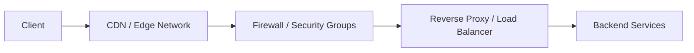

## 1. Introduction — When Routing Is Not Enough

---

Up to this point in Phase 4, we’ve focused on:

- discovering services (DNS)
- distributing traffic (load balancers)
- controlling traffic (proxies)
- restricting traffic (firewalls)

But even with all of this in place, a fundamental problem remains:

> **Distance.**

A user in Asia accessing a server in Europe will always experience higher latency — no matter how well the backend is designed.

This is where **CDNs and edge networks** enter the picture.

---

## 2. The Core Problem CDNs Solve

---

Consider our learning platform again.

#### Without a CDN:

- every request travels to the origin server
- static assets (images, CSS, JS) are fetched repeatedly
- origin servers handle traffic they shouldn’t need to

#### As traffic grows globally, this results in:

- higher latency for distant users
- unnecessary load on backend systems
- increased failure impact during traffic spikes

CDNs exist to **move content closer to users**.

---

## 3. What a CDN Is (System Design Definition)

---

A **Content Delivery Network (CDN)** is a globally distributed network of servers that:

- cache content closer to users
- serve requests without hitting the origin server
- reduce latency and backend load
- absorb traffic spikes and attacks

At a high level:

> **A CDN is a distributed proxy layer at the edge of the network.**

---

## 4. Where CDNs Sit in a System

Conceptually, a CDN sits **in front of your entire infrastructure**.

Key observations:

- clients never directly reach the origin for cached content
- CDNs act as the **first point of contact**
- origin servers handle only cache misses or dynamic requests

---

## 5. How CDNs Improve Performance

---

### 5.1 Latency Reduction

- Content is served from geographically nearby edge locations
- Fewer network hops between client and server
- Faster response times for users across regions

Latency is reduced not by faster servers, but by **shorter physical distance**.

---

### 5.2 Origin Load Reduction

- Static content is served directly from cache
- Fewer requests reach backend services
- Backend capacity is preserved for dynamic and critical operations

This allows backend systems to scale more predictably.

---

### 5.3 Traffic Spike Absorption

- CDNs absorb sudden traffic surges
- Protect origin servers from overload
- Smooth out flash crowds and viral traffic

This is especially important for public-facing systems.

---

## 6. Edge Networks vs Traditional CDNs

---

Modern CDNs have evolved into **edge networks**.

**Traditional CDNs:**

- Focused primarily on static asset caching
- Limited request processing capabilities

**Edge Networks:**

- Run logic at the edge
- Perform authentication, routing, and filtering
- Behave like **globally distributed proxies**

This evolution is why many CDN providers now describe themselves as **edge platforms** rather than simple caching layers.

---

## 7. CDN vs Proxy vs Load Balancer (Clarifying Roles)

---

| Component     | Primary Role             | Where It Operates       |
| ------------- | ------------------------ | ----------------------- |
| CDN           | Performance & caching    | Global edge             |
| Proxy         | Traffic control & policy | Regional / cluster edge |
| Load Balancer | Traffic distribution     | Entry to backend        |

> A CDN optimizes **where content is served from**.  
> A proxy controls **how requests are handled**.  
> A load balancer decides **which backend receives traffic**.

These components complement — not replace — each other.

---

## 8. Common CDN Use Cases

---

CDNs are commonly used for:

- Static assets (images, CSS, JavaScript)
- Public APIs
- Download endpoints
- Media delivery
- DDoS absorption and traffic shielding

Even highly dynamic systems often benefit from CDNs at the edge.

---

## 9. Caveats & Trade-offs

---

CDNs are powerful, but they are not free from complexity.

### Trade-offs to Understand

- Cache invalidation is non-trivial
- Content consistency is often eventual
- Debugging becomes harder due to multiple layers
- Vendor-specific behavior can affect portability

> CDNs improve performance, but they add another layer that must be understood and operated correctly.

---

## 10. Popular CDN & Edge Providers

---

Some widely used CDN and edge providers include:

- Cloudflare
- Akamai
- Fastly

They differ in:

- Global footprint
- Programmability
- Performance characteristics
- Pricing models

At the system design level, the **concept matters more than the vendor**.

---

## 11. How CDNs Fit into Modern Architectures

---

Once understood, CDNs become a natural outer layer:

This layered approach:

- minimizes latency
- reduces blast radius
- improves scalability and resilience

---

## Key Takeaways

---

- CDNs reduce latency by serving content closer to users
- They offload work from origin servers
- Modern CDNs behave like edge proxies
- CDNs complement proxies, firewalls, and load balancers
- Performance optimization starts **outside** the backend

---

### 🔗 What’s Next?

We’ve now covered:

- discovery
- routing
- control
- restriction
- global performance

Next, we tie **everything together**.

👉 **Up Next →**  
**[Putting It All Together — The End-to-End Request Journey](/learning/advanced-skills/networking-essentials/4_dns-load-balancers-and-traffic-distribution/4_11_cdn-and-edge-network)**

---

> 📝 **Takeaway**
>
> The fastest request is the one that never reaches your backend.
