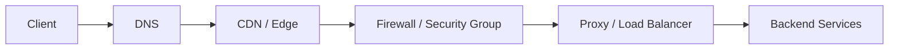

## 1. Introduction — From Pieces to a System

---

Across Phase 4, we studied individual networking components:

- DNS for discovery
- Load balancers for distribution
- Proxies for traffic control
- Firewalls for boundaries
- CDNs for global performance

Individually, each component makes sense.

But **real systems are not built from isolated parts**.

This chapter exists to answer one final question:

> **What actually happens when a real user makes a request?**

---

## 2. The Scenario We’ll Trace

---

We’ll follow a **single request** to our learning platform from a user anywhere in the world.

Assumptions:

- Global users
- HTTPS traffic
- Cloud-hosted backend
- CDN + proxy-based architecture

No edge cases.  
No failures yet.  
Just the **happy path** — clearly and end to end.

> **Note:**  
> In some environments, client requests may pass through a forward proxy before reaching the internet.  
> This is outside the system’s control and does not change the backend request flow.

---

## 3. Step 1 — DNS: Finding the System

---

The journey begins before any network connection is made.

1. The client requests `learning.example.com`
2. DNS resolves the domain
3. The response typically points to a **CDN edge**, not the origin server

> DNS answers: **“Where should I send this request?”**

At this point:

- No backend service is contacted
- No proxy logic is involved yet

---

## 4. Step 2 — CDN: Serving from the Edge (If Possible)

---

The request reaches the nearest CDN edge location.

Two possibilities:

### Cache Hit

- Content is served immediately
- The request never reaches your infrastructure

### Cache Miss

- The CDN forwards the request to the origin

> The fastest request is the one that never reaches your backend.

This step alone:

- reduces latency
- absorbs traffic spikes
- protects origin services

> At this point, the request transitions from the public internet into your controlled infrastructure.

---

## 5. Step 3 — Firewall: Crossing the Trust Boundary

---

If the request must reach the origin:

1. It arrives at your network boundary
2. Firewall or security group rules are evaluated
3. Only allowed traffic is permitted further

Examples:

- HTTPS (443) allowed
- Everything else blocked
- Only known sources allowed for private endpoints

> Firewalls answer: **“Is this traffic allowed to enter?”**

Requests that fail here never reach proxies or services.

---

## 6. Step 4 — Proxy / Load Balancer: Traffic Control

---

Allowed traffic now reaches the **reverse proxy layer**.

This is where most traffic intelligence lives.

The proxy may:

- terminate TLS
- authenticate requests
- apply rate limits
- select a backend instance
- retry on failure
- inject observability metadata

Load balancing happens here as **one responsibility** among many — not the defining feature.

> Proxies answer: **“What should we do with this request?”**

---

## 7. Step 5 — Backend Services: Business Logic

---

Only now does the request reach application code.

At this stage:

- networking concerns are largely abstracted away
- services focus on business logic
- responses are generated

The response then travels **back through the same layers**, often with:

- caching at the CDN
- logging at the proxy
- metrics at multiple points

---

## 8. The Full End-to-End Flow (Mental Model Diagram)

---

This single diagram ties Phase 4 together.

Each component has a **distinct responsibility**:

- DNS → discovery
- CDN → performance
- Firewall → permission
- Proxy → control
- Services → business logic

No overlap. No ambiguity.

---

## 9. Why This Layering Matters

---

This layered design provides:

- **Scalability** — each layer scales independently
- **Security** — multiple enforcement points
- **Resilience** — failures are contained
- **Performance** — work is done as early as possible

Removing any layer:

- increases coupling
- shifts responsibility elsewhere
- weakens the system

---

## 10. Common Failure Points (Preview of What Comes Next)

---

Even on the happy path, each layer introduces potential failures:

- DNS misconfiguration
- CDN cache staleness
- Firewall rule errors
- Proxy overload
- Backend saturation

Understanding _where_ failures occur is the foundation for:

- resilience design
- multi-region systems
- fault tolerance

We’ll tackle those next — explicitly.

---

## 🎯 End of Networking Essentials

---

You’ve now completed **Networking Essentials**.

At this point, you should be able to:

- Trace a request end to end (DNS → CDN → Firewall → Proxy → Service)
- Explain why each networking component exists
- Reason about traffic flow, control, security, and performance
- Understand how networking bridges code-level logic and system architecture

This section answers the question:

> **“How do different machines and services communicate reliably?”**

---

### 🔗 What’s Next?

Next, we move into **High-Level Design (HLD)**.

In HLD, we will **use** the networking concepts you’ve learned — not re-explain them — to design complete systems:

- defining system components
- choosing service boundaries
- placing caches, databases, and APIs
- designing request flows at the system level

Networking becomes a **tool**, not the topic.

👉 **Up Next →**  
**[High-Level Design (HLD)](/learning/advanced-skills/high-level-design/1_introduction/1_1_introduction)**

---

> 📝 **Transition Takeaway**
>
> LLD explains _how code works_.  
> Networking explains _how systems talk_.  
> HLD explains _how systems are structured_.
