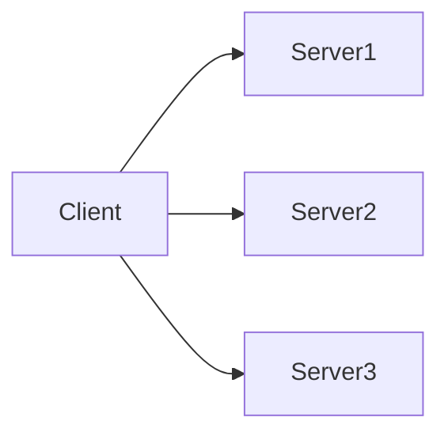

## 1. Introduction — The Single Endpoint Illusion

---

In the early stages of an application, things feel simple.

- One server
- One IP address
- One port
- One endpoint

Clients send requests directly to that endpoint, and everything works.

This creates a dangerous illusion:

> **“If the server is reachable, the system is fine.”**

At scale, this assumption breaks — quickly and repeatedly.

This chapter explains **why single endpoints fail** and why modern systems need **service discovery and traffic distribution** as first-class concepts.

---

## 2. The Original Model: One Client, One Server

---

Let’s start with the simplest possible setup:

- A client application
- A backend service
- A fixed IP address

Conceptually:


This model works when:

- traffic is low
- failures are rare
- scale is not a concern

But it embeds several assumptions that do not hold in real systems.

---

## 3. What Breaks First as Systems Grow

---

As usage increases, the single-endpoint model starts failing in predictable ways.

### 3.1 Capacity Limits

- One machine can handle only a finite number of requests
- CPU, memory, and I/O become bottlenecks

### 3.2 Availability Problems

- If the server crashes, **everything is down**
- Maintenance requires full downtime

### 3.3 Deployment Constraints

- New versions cannot be deployed safely
- Rolling updates are impossible without impact

### 3.4 Network Realities

- Latency varies based on client location
- A single server cannot be “close” to all users

These failures are not bugs.  
They are **natural consequences of centralization**.

---

## 4. The Naive Scaling Attempt (And Why It Fails)

---

A common first reaction is:

> “Let’s add more servers.”

So we end up with:



Now a new problem appears immediately:

> **How does the client know which server to talk to?**

Hardcoding multiple IPs:

- does not scale
- breaks when instances change
- shifts complexity to clients

This is the moment where **service discovery becomes unavoidable**.

---

## 5. The Core Problem: Indirection Is Missing

---

At the heart of the issue is this:

> Clients should not need to know **where services live**.

In real systems:

- servers are added and removed
- IPs change
- instances fail and recover
- regions come and go

Direct addressing creates **tight coupling** between clients and infrastructure.

Modern systems solve this by introducing **indirection**.

---

## 6. Service Discovery — The Missing Abstraction

---

Service discovery introduces a simple but powerful idea:

> **Clients talk to a name, not a machine.**

Instead of:

```text
client → 192.168.1.42:8080
```

We move to:

```text
client → api.myservice.com
```

What happens behind that name is no longer the client’s concern.

This abstraction enables:

- scaling without client changes
- instance replacement without downtime
- infrastructure evolution without breaking consumers

---

## 7. Traffic Distribution — The Second Half of the Problem

---

Finding a service is only half the story.

Once multiple instances exist, the system must decide:

- which instance receives a request
- how load is spread across instances
- what happens when one instance becomes unhealthy

This is the problem of **traffic distribution**.

Key responsibilities include:

- spreading load evenly
- avoiding unhealthy or overloaded instances
- reacting to failures automatically

This responsibility must live **outside application code**.  
Embedding traffic logic inside services tightly couples business logic with infrastructure concerns.

---

## 8. Control Plane vs Data Plane (Mental Model)

---

At this point, it helps to separate concerns clearly:

- **Control Plane**
  - decides _where traffic should go_
  - manages discovery, configuration, and health information

- **Data Plane**
  - actually moves requests and responses
  - optimized for performance and reliability

Modern networking components exist to keep these concerns separate.

This separation is foundational to scalable and maintainable system design.

---

## 9. What This Phase Will Build Toward

---

This chapter intentionally avoids tools and implementations.

Instead, it defines the **problem space**.

In the rest of Phase 4, we will see how this problem is addressed using:

- DNS — locating services by name
- Load balancers — distributing traffic across instances
- Firewalls & security groups — controlling who can communicate
- CDNs — reducing latency by moving content closer to users
- Cloud networking primitives — defining isolation and boundaries

Each component exists to solve **a specific failure of the single-endpoint model**.

---

## 10. Key Takeaways

---

- Single endpoints do not scale
- Hardcoded addresses create tight coupling
- Scale introduces discovery and distribution problems
- Indirection is required for resilience
- Service discovery and traffic distribution are architectural necessities

---

### 🔗 What’s Next?

Now that we understand **why discovery is needed**, we can examine the most fundamental discovery mechanism on the internet.

In the next chapter, we explore:

- how names are resolved to locations
- why caching matters
- and why DNS is the **first load balancer** most systems ever use

👉 **Up Next →**  
**[DNS — How Services Are Found](/learning/advanced-skills/networking-essentials/4_dns-load-balancers-and-traffic-distribution/4_2_dns-how-services-are-found)**

---

> 📝 **Takeaway**
>
> Scalability is not about adding servers.  
> It’s about **decoupling clients from infrastructure**.
