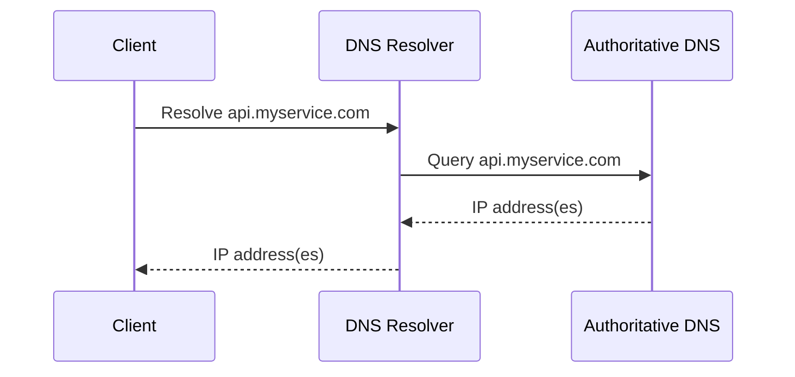
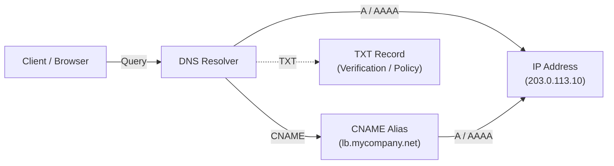
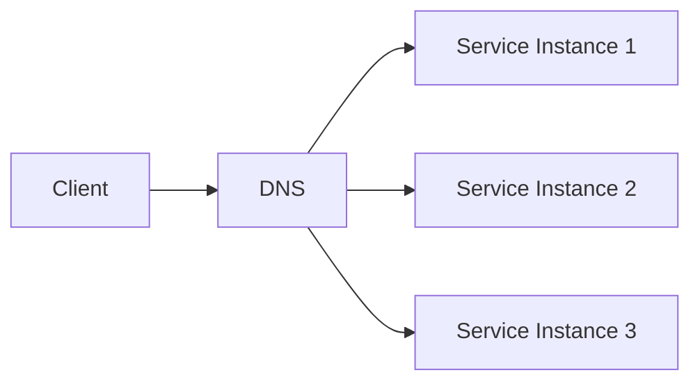

## 1. Introduction — Names Before Machines

---

In Phase 4.1, we established a core principle:

> **Clients should talk to names, not machines.**

DNS (Domain Name System) is the mechanism that makes this possible at internet scale.

DNS answers a deceptively simple question:

> **“Given a name, where should I send traffic?”**

This chapter explains how DNS works conceptually, why caching matters, and why DNS is often the **first traffic distribution layer** in real systems.

---

## 2. What DNS Actually Does (And What It Does Not)

---

### What DNS does

- Maps **names → network locations**
- Enables **indirection** between clients and infrastructure
- Allows infrastructure to change without client updates

### What DNS does _not_ do

- It does not handle application routing
- It does not check service health in real time
- It does not guarantee availability

DNS is about **discovery**, not delivery.

---

## 3. The Basic DNS Resolution Flow

---

At a high level, resolving a name looks like this:



> **Key idea:**
>
> Clients do not usually talk directly to authoritative servers.  
> They rely on **resolvers** that cache and optimize lookups.

---

## 4. Recursive vs Authoritative DNS (Mental Model)

---

### Recursive Resolver

- Acts on behalf of the client
- Caches results
- Reduces latency and load
- Examples: ISP DNS, cloud DNS resolvers

### Authoritative DNS

- Owns the source of truth
- Returns final answers
- Does not cache client results


This separation allows DNS to scale globally.

---

## 5. DNS Records You Need to Understand (Conceptual)

---

You do **not** need to memorize all DNS record types for system design.

The important ones are those that answer a single question:

> **“Given a name, where should traffic go?”**

You can think of DNS records as **instructions** telling resolvers _how_ to answer that question.



### 1. A / AAAA Records — Names to IP Addresses

- **A record** maps a domain name to an **IPv4 address**
- **AAAA record** maps a domain name to an **IPv6 address**

Example:

```text
api.myservice.com → 203.0.113.10      (A record)
api.myservice.com → 2001:db8::42      (AAAA record)
```

Mental model:

> “This service lives at this machine.”

From a system-design perspective:

- This is the **final step** before traffic flows
- Load balancers, servers, and CDNs ultimately resolve to A / AAAA records

---

### 2. CNAME Record — Name to Name (Indirection)

A **CNAME** record maps **one domain name to another domain name**, not to an IP.

Example:

```text
api.myservice.com → lb.mycompany.net   (CNAME)
lb.mycompany.net → 203.0.113.10        (A / AAAA)
```

Mental model:

> “This name is just an alias for another name.”

Why CNAME matters in system design:

- Enables indirection
- Allows infrastructure changes without breaking clients
- Commonly used with load balancers and CDNs

---

### 3. TXT Record — Metadata, Not Routing

A **TXT** record stores **metadata**, not routing information.

Examples:

- Domain ownership verification
- Security policies (SPF, DKIM, DMARC)
- Service configuration hints

Mental model:

> “Extra information about the domain, not where traffic goes.”

TXT records are important for **trust and security**, but they do not participate in request routing.

---

### Design Perspective (What to Focus On)

For HLD discussions:

- Focus on **indirection**, not syntax
- Understand **how names decouple clients from infrastructure**
- Know that traffic ultimately resolves to an **IP address**

You do **not** need:

- Zone files
- Record configuration details
- DNS administration knowledge

---

## 6. TTL & Caching — The Most Important DNS Concept

---

Every DNS record has a **TTL (Time To Live)**.

TTL controls:

- how long DNS resolvers cache results
- how quickly changes propagate
- the trade-off between freshness and stability

### High TTL

- Faster name resolution
- Fewer DNS queries
- Slower reaction to infrastructure changes

### Low TTL

- Faster propagation of updates
- Higher DNS query volume
- Slightly increased lookup latency

> DNS caching is a **design trade-off**, not an implementation detail.

---

## 7. DNS as the First Load Balancer

---

**DNS can return multiple IP addresses for the same name.**

This enables simple traffic distribution:



Common strategies:

- Round-robin responses
- Geo-based resolution
- Weighted records

However, DNS-based distribution has limits:

- No real-time health awareness
- Caching delays reaction to failure

This is why DNS is often combined with **load balancers**, not used alone.

---

## 8. Failure & Change — Where DNS Helps (And Where It Doesn’t)

---

DNS is effective for handling **planned and coarse-grained changes**.

DNS works well for:

- Planned infrastructure changes (deployments, migrations)
- Region-level traffic routing
- Gradual cutovers and failovers

However, DNS is not designed for:

- Rapid instance-level failures
- Per-request routing decisions
- Real-time load awareness

Because of caching and TTLs, DNS reacts to change **slowly by design**.

Understanding this limitation prevents pushing DNS beyond its intended role.

---

## 9. Control Plane vs Data Plane (DNS Perspective)

---

DNS operates firmly in the **control plane**.

- It decides _where traffic should go_
- It does not carry application data
- It influences routing, but does not execute requests

This makes DNS:

- globally scalable
- highly cacheable
- intentionally conservative

DNS is powerful precisely because it does **less**, not more.

---

## 10. Layer Mapping (Explicit)

---

> 📍 **Layer Mapping**
>
> DNS operates at the **Application layer**  
> (OSI Layer 7 / TCP-IP Application layer),
>
> but it indirectly influences **network-level routing decisions**.

This cross-cutting influence is why DNS appears in nearly every system design.

---

## 11. Key Takeaways

---

- DNS enables name-based service discovery
- Indirection decouples clients from infrastructure
- TTL and caching are core design levers
- DNS supports coarse-grained traffic distribution
- DNS is a control-plane mechanism, not a data-plane one

---

### 🔗 What’s Next?

DNS helps clients find _where_ services live, but it does not decide _which instance_ should handle a request.

To solve that problem, systems introduce a more active component.

In the next chapter, we explore:

- why load balancers exist
- what problems they solve beyond DNS
- and how they enable horizontal scaling

👉 **Up Next →**  
**[Load Balancers — Why They Exist](/learning/advanced-skills/networking-essentials/4_dns-load-balancers-and-traffic-distribution/4_3_load-balancers)**

---

> 📝 **Takeaway**
>
> DNS doesn’t make systems fast or resilient by itself —  
> it makes them **changeable without breaking clients**.
