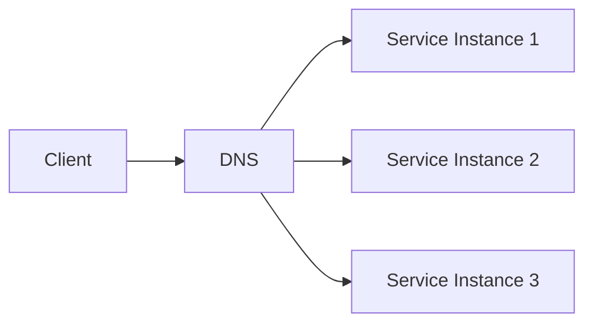
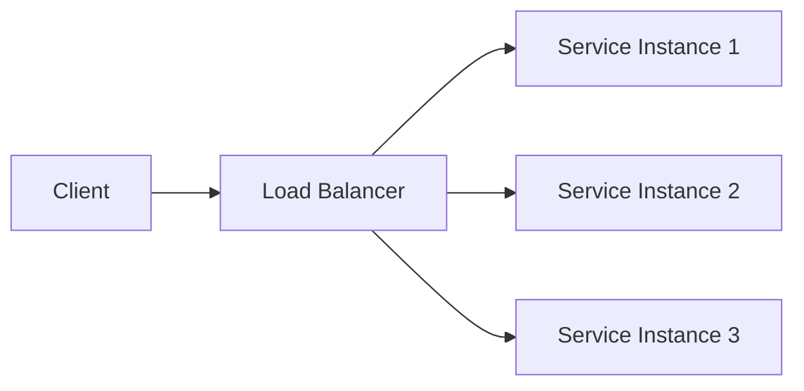

## 1. Introduction — DNS Solved Discovery, Not Distribution

---

In the previous chapter, we learned that **DNS solves discovery**.

- Clients talk to names, not machines
- Infrastructure can change without client updates
- Caching enables global scalability

However, DNS stops short of solving a critical problem:

> **Once traffic reaches a service, who should actually handle the request?**

This is where **load balancers** become necessary.

---

## 2. The Core Limitation of DNS

---

DNS can return multiple IP addresses, but it has fundamental limits:

- It does not know if an instance is healthy _right now_
- It cannot react instantly to failures
- It cannot make per-request decisions
- It is influenced by client-side caching

Because of this, DNS alone cannot guarantee:

- even load distribution
- fast failover
- safe rolling deployments

DNS answers **where services live**.  
Load balancers decide **which instance gets traffic**.

---

## 3. The Scaling Problem Revisited

---

Consider a backend service scaled horizontally:

Now imagine:

- Service Instance 2 **becomes slow**
- Service Instance 3 **crashes**
- Servie Instance 1 **is overloaded**

DNS:

- will continue returning cached results
- cannot stop sending traffic to unhealthy instances
- reacts slowly, by design

This is unacceptable for high-availability systems.

---

## 4. Load Balancers — The Missing Active Component

---

A **load balancer (LB)** sits between clients and service instances.

Its role is to:

- receive incoming traffic
- decide which backend instance should handle each request
- actively avoid unhealthy instances

Conceptually:

This indirection enables **dynamic, real-time traffic control**.

---

## 5. What Load Balancers Actually Do

---

Load balancers are responsible for a set of **infrastructure-level concerns** that applications should not handle themselves.

### 🔁 Traffic Distribution

- Spread incoming requests across multiple instances
- Prevent hot spots
- Improve overall resource utilization

### ❤️ Health Awareness

- Continuously check backend instance health
- Stop routing traffic to unhealthy instances
- Automatically restore traffic when instances recover

### 🧱 Fault Isolation

- Prevent single-instance failures from cascading
- Reduce blast radius when something goes wrong

### 🔄 Deployment Safety

- Enable rolling deployments
- Support blue–green and canary strategies
- Allow capacity changes without client impact

These responsibilities cannot be handled reliably by DNS or application code alone.

---

## 6. Load Balancer vs Application-Level Routing

---

A common question is:

> “Why not handle routing inside the application?”

This approach fails because:

- every client would need routing logic
- health state would need to be shared across clients
- failures would be handled inconsistently
- deployments would require coordinated client changes

Load balancers centralize routing decisions in **infrastructure**, not in business logic.

This separation of concerns is a key system design principle.

---

## 7. Load Balancers as a Control Plane + Data Plane Hybrid

---

Unlike DNS, load balancers interact with **live traffic**.

- **Control plane responsibilities**
  - configuration
  - routing rules
  - health checks

- **Data plane responsibilities**
  - forwarding requests
  - maintaining connections
  - enforcing routing decisions

This dual role is why load balancers are powerful — and why they must be designed and operated carefully.

---

## 8. Availability vs Scalability (Important Distinction)

---

Load balancers serve **two related but distinct goals**.

### Availability

- Survive instance failures
- Keep the service reachable

### Scalability

- Handle increasing traffic
- Add capacity incrementally

A system can scale without being highly available, and vice versa.

Load balancers help address **both**, but they do not guarantee either on their own.

---

## 9. Layer Mapping (Explicit)

---

> 📍 **Layer Mapping**
>
> Load balancers typically operate at:
>
> - **OSI Layer 4** (transport-aware routing)
> - **OSI Layer 7** (application-aware routing)
>
> We will explore this distinction in the next chapter.

Understanding _where_ a load balancer operates explains _what it can and cannot do_.

---

## 10. Key Takeaways

---

- DNS solves discovery, not traffic distribution
- Load balancers provide real-time routing decisions
- Health checks enable fast failure isolation
- Load balancers decouple clients from instance topology
- They are essential for both availability and scalability

---

### 🔗 What’s Next?

Not all load balancers behave the same.

Some operate purely at the transport level.  
Others understand application protocols like HTTP.

In the next chapter, we compare:

- Layer 4 load balancing
- Layer 7 load balancing
- Trade-offs between performance and flexibility

👉 **Up Next →**  
**[Layer 4 vs Layer 7 Load Balancing](/learning/advanced-skills/networking-essentials/4_dns-load-balancers-and-traffic-distribution/4_4_layer4-layer7-load-balancing)**

---

> 📝 **Takeaway**
>
> DNS tells clients _where a service exists_.  
> Load balancers decide _who actually handles the request_.
