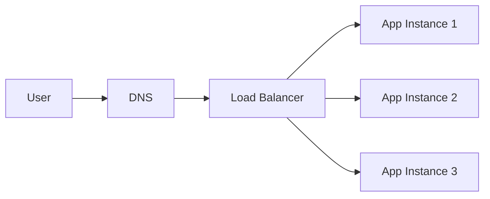
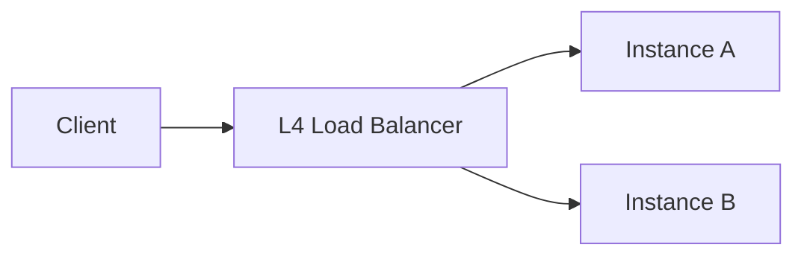
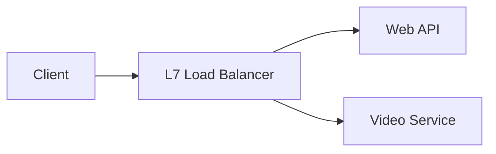
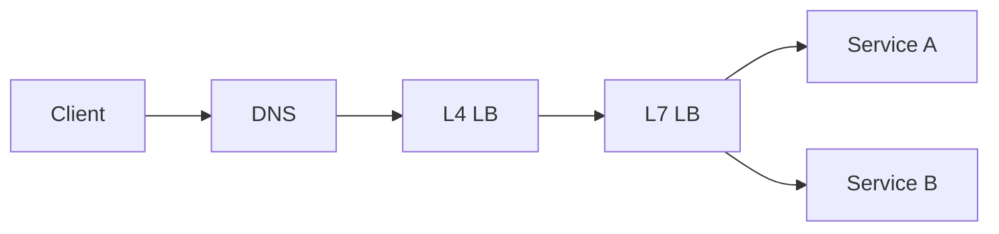

## 1. Introduction — Not All Load Balancers Are the Same

---

In the previous chapter, we established **why load balancers exist**.

Now comes the next critical question:

> **What does the load balancer actually understand about the traffic?**

The answer defines two fundamentally different categories:

- **Layer 4 (L4) load balancing**
- **Layer 7 (L7) load balancing**

Choosing between them is a **system design decision**, not a configuration detail.

---

## 2. Re-Introducing the Example: The Learning Platform

---

Let’s bring back our **learning platform**.

Current setup:

- Users access the platform via a browser
- Requests go to `learn.myplatform.com`
- The backend is horizontally scaled

Conceptually:

At this point, the **type of load balancer** we choose starts to matter.

---

## 3. What “Layer” Means in Load Balancing

---

The “layer” refers to **how much of the request the load balancer understands**.

- **Layer 4** → Transport layer (TCP/UDP)
- **Layer 7** → Application layer (HTTP)

This maps directly to the networking layers you’ve already learned.

---

## 4. Layer 4 Load Balancing (Transport-Level)

---

### 4.1 How L4 Load Balancers Work

Layer 4 load balancers:

- operate at the TCP/UDP level
- do not inspect HTTP headers or URLs
- forward traffic based on:
  - IP address
  - port
  - connection metadata

From their perspective:

> “This is a stream of bytes — I don’t care what it means.”

---

### 4.2 L4 Load Balancing in Our Example

Using L4 load balancing:

- all HTTP requests are treated the same
- /login, /search, /video are indistinguishable
- traffic is distributed purely at the connection level

This works well when:

- all instances are identical
- routing logic is simple
- performance is critical

---

### 4.3 Strengths of Layer 4

- Very fast (minimal inspection)
- Low latency
- High throughput
- Protocol-agnostic (not HTTP-specific)

---

### 4.4 Limitations of Layer 4

- No awareness of URLs, headers, or methods
- Cannot route based on application logic
- Limited control for complex architectures

---

## 5. Layer 7 Load Balancing (Application-Level)

---

### 5.1 How L7 Load Balancers Work

Layer 7 load balancers:

- understand application protocols (usually HTTP)
- inspect:
  - URLs
  - headers
  - cookies
  - request methods

From their perspective:

> “I understand what this request is trying to do.”

---

### 5.2 L7 Load Balancing in Our Example

With L7 load balancing, the learning platform can do things like:

- Route `/api/*` → backend API service
- Route `/videos/*` → video service
- Route `/admin/*` → internal admin service
- Apply different rate limits per endpoint

This enables **application-aware routing**.

---

### 5.3 Strengths of Layer 7

- Fine-grained routing control
- Better support for microservices
- Enables **canary releases** (gradually sending a small percentage of traffic to a new version)
- Supports **A/B testing** (routing different users to different versions for comparison)
- Supports **authentication** and **rate limiting** based on HTTP headers (user identity, API keys, metadata)

---

### 5.4 Limitations of Layer 7

- Higher latency than L4
- More CPU usage
- Protocol-specific (usually HTTP/HTTPS)

---

## 6. Side-by-Side Comparison

---

| Aspect                      | Layer 4 Load Balancing    | Layer 7 Load Balancing               |
| --------------------------- | ------------------------- | ------------------------------------ |
| Operates on                 | TCP / UDP                 | HTTP / HTTPS                         |
| Understands request content | ❌ No                     | ✅ Yes                               |
| Routing granularity         | Connection-level          | Request-level                        |
| Performance                 | Very high                 | Slightly lower                       |
| Flexibility                 | Low                       | High                                 |
| Protocol awareness          | Protocol-agnostic         | Protocol-specific                    |
| Common use cases            | Simple horizontal scaling | APIs, microservices, complex routing |

This comparison highlights a core truth:

> **The difference is not tooling — it’s how much the load balancer understands about the traffic.**

---

## 7. Which One Should You Choose?

---

The choice between Layer 4 and Layer 7 load balancing depends on **system requirements**, not personal preference.

### Use Layer 4 when:

- All backend instances are identical
- You want maximum throughput and minimal latency
- Routing rules are simple
- You don’t need visibility into request contents

### Use Layer 7 when:

- Multiple services share a single domain
- Routing depends on URL paths, headers, or methods
- You need fine-grained traffic control
- You want safer deployment strategies (canary, blue–green)

Many mature production systems use **both approaches together**, each where it fits best.

> Layer 4 optimizes for **speed**.  
> Layer 7 optimizes for **control**.

---

## 8. Real-World Architecture Pattern

---

A common production setup:

Why this works:

- L4 handles raw scale efficiently
- L7 handles intelligent routing
- Responsibilities are cleanly separated

---

## 9. Layer Mapping (Explicit)

---

> 📍 **Layer Mapping**
>
> - **Layer 4 Load Balancers** operate at OSI Layer 4 (Transport)
> - **Layer 7 Load Balancers** operate at OSI Layer 7 (Application)
>
> The difference is not tooling — it’s **how much the load balancer understands** about the traffic.

Understanding this mapping explains why:

- L4 load balancers are faster but less flexible
- L7 load balancers are more powerful but slightly more expensive

---

## 10. Key Takeaways

---

- Load balancers can operate at different layers of the networking stack
- Layer 4 focuses on speed and simplicity
- Layer 7 focuses on intelligence and routing flexibility
- The correct choice depends on system requirements, not personal preference
- Mature systems often combine both approaches

---

### 🔗 What’s Next?

Now that we understand _how_ traffic is routed, the next question is:

> **How exactly is traffic distributed among instances?**

In the next chapter, we explore:

- round-robin
- least connections
- weighted strategies
- sticky sessions (and why they’re risky)

👉 **Up Next →**  
**[Load Balancing Algorithms & Strategies](/learning/advanced-skills/networking-essentials/4_dns-load-balancers-and-traffic-distribution/4_5_load-balancing-algo)**

---

> 📝 **Takeaway**
>
> Layer 4 decides _where traffic can go_.  
> Layer 7 decides _where traffic should go_.
