# Load Balancing Algorithms & Strategies

So far, we’ve answered **why load balancers exist** and **where they operate (Layer 4 vs Layer 7)**.

Now comes the critical question:

> **Once traffic reaches the load balancer, how does it decide _which_ instance should handle the request?**

That decision is made using **load balancing algorithms**.

---

## 1. What Is a Load Balancing Algorithm?

---

A load balancing algorithm is a **traffic distribution rule** that determines how incoming requests are assigned to backend instances.

At a high level, every algorithm tries to balance one or more of the following goals:

- Even distribution of traffic
- Efficient use of resources
- Low latency
- Fault tolerance
- Predictable behavior

No single algorithm is “best” — the choice depends on **system characteristics**.

---

## 2. Round Robin Algorithm

---

### How It Works

Requests are distributed sequentially across instances in a fixed order.

#### Example:

Each new request goes to the next instance in the list.

### Round Robin — Summary

| Aspect              | Details                                                  |
| ------------------- | -------------------------------------------------------- |
| **Core Idea**       | Sequentially distributes requests across instances       |
| **State Awareness** | Stateless                                                |
| **Pros**            | Simple, minimal overhead, easy to reason about           |
| **Cons**            | Ignores real-time load, slow instances get equal traffic |
| **Best Used When**  | Homogeneous instances with short, uniform requests       |

---

## 3. Weighted Round Robin Algorithm

---

### How It Works

Each instance is assigned a **weight** based on its capacity.

#### Example:

### Weighted Round Robin — Summary

| Aspect              | Details                                                  |
| ------------------- | -------------------------------------------------------- |
| **Core Idea**       | Distributes traffic based on predefined instance weights |
| **State Awareness** | Static capacity awareness                                |
| **Pros**            | Handles mixed instance sizes better than Round Robin     |
| **Cons**            | Weights are static, no reaction to load spikes           |
| **Best Used When**  | Predictable workloads with different instance capacities |

---

## 4. Least Connections Algorithm

---

### How It Works

The request is sent to the instance with the **fewest active connections**.

```mermaid
flowchart LR
    C[Client] --> LB[Load Balancer]

    LB --> A[Instance A\nActive: 10]
    LB --> B[Instance B\nActive: 4  ✅ Selected]
    LB --> D[Instance C\nActive: 7]

    LB -. decision .-> B
```

### Least Connections — Summary

| Aspect              | Details                                                           |
| ------------------- | ----------------------------------------------------------------- |
| **Core Idea**       | Routes traffic to the instance with the fewest active connections |
| **State Awareness** | Tracks active connections                                         |
| **Pros**            | Adapts well to uneven request durations                           |
| **Cons**            | Connection count may not reflect true load                        |
| **Best Used When**  | Long-lived connections, streaming, WebSockets                     |

---

## 5. Least Response Time Algorithm (Advanced Variant)

---

### How It Works

Routes traffic to the instance with:

- Lowest response time
- Often combined with least connections

```mermaid
flowchart LR
    C[Client] --> LB[Load Balancer]

    LB --> A[Instance A\nAvg: 120ms]
    LB --> B[Instance B\nAvg: 60ms ✅ Selected]
    LB --> D[Instance C\nAvg: 90ms]

    LB -. decision .-> B
```

### Least Response Time — Summary

| Aspect              | Details                                                      |
| ------------------- | ------------------------------------------------------------ |
| **Core Idea**       | Routes traffic to the instance with the lowest response time |
| **State Awareness** | Tracks latency (often combined with connections)             |
| **Pros**            | Optimizes end-user latency                                   |
| **Cons**            | Monitoring overhead, possible oscillation                    |
| **Best Used When**  | Latency-sensitive, high-traffic production systems           |

---

## 6. Random Selection Algorithm

---

### How It Works

Each request is sent to a randomly selected instance.

### Random Selection — Summary

| Aspect              | Details                                    |
| ------------------- | ------------------------------------------ |
| **Core Idea**       | Randomly selects a backend instance        |
| **State Awareness** | None                                       |
| **Pros**            | Extremely simple (rarely used)             |
| **Cons**            | No fairness or predictability              |
| **Best Used When**  | Testing, fallback, or low-stakes scenarios |

---

## 7. Algorithm Selection Is a Design Decision

---

Choosing a load balancing algorithm is not about popularity — it is about **matching system behavior and constraints**.

Different systems fail in different ways, and each algorithm optimizes for a different assumption.

| Scenario                                      | Recommended Algorithm |
| --------------------------------------------- | --------------------- |
| Identical backend instances                   | Round Robin           |
| Mixed instance sizes                          | Weighted Round Robin  |
| Variable request processing time              | Least Connections     |
| Long-lived connections (WebSocket, streaming) | Least Connections     |
| Latency-sensitive systems                     | Least Response Time   |

There is no universally correct choice — the **workload shape** determines the algorithm.

---

## 8. What Load Balancing Algorithms Do _Not_ Solve

---

Most basic algorithms assume:

- Services are **stateless**
- Any instance can handle **any request**
- Instances come and go infrequently

These assumptions break down when:

- User sessions must be preserved
- Cache locality matters
- Instances scale up/down dynamically
- A node failure should not reshuffle all traffic

At this point, algorithms alone are insufficient.

```mermaid
flowchart LR
    U[User] --> LB[Load Balancer]

    LB --> A[Instance A\nCache: Warm]
    LB --> B[Instance B\nCache: Cold]
    LB --> C[Instance C\nSession: Missing]

    note1["Same user routed to different instances\n→ cache misses / session issues"]:::note
    LB -.-> note1

    classDef note fill:transparent,stroke:transparent,color:inherit;
```

This is where **session affinity** and **hash-based routing** enter the picture.

---

### 🔗 What’s Next?

Now that we understand **how traffic is distributed**, the next logical questions are:

- What if a user must always hit the same instance?
- What happens when an instance goes down?
- How do we prevent massive request reshuffling?

👉 **Up Next →**  
**[Sticky Sessions & Session Affinity](/learning/advanced-skills/networking-essentials/4_dns-load-balancers-and-traffic-distribution/4_6_sticky-sessions-and-affinity)**

---

### Key Takeaway

> Load balancing algorithms are intentionally simple.  
> Real complexity appears when **state, variability, and failures** are introduced.

Understanding where algorithms stop — and higher-level strategies begin — is essential for both **system design interviews** and **production architectures**.
