# Sticky Sessions & Session Affinity

In the previous article, we explored **load balancing algorithms** and how traffic is distributed across instances.

However, all those algorithms rely on a **critical assumption**:

> Any request can be handled by any instance.

This assumption breaks down the moment **state** enters the system.

---

## 1. Why Stateless Load Balancing Breaks

---

Consider a system with:

- In-memory user sessions
- Local caches
- Stateful workflows

A stateless load balancer might route the **same user** to **different instances** on every request.

### Problems that arise

- User is logged out unexpectedly
- Cache warm-up repeats
- Requests fail due to missing context

To solve this, we need **deterministic routing**.

---

## 2. What Are Sticky Sessions?

---

**Sticky sessions** (also called **session affinity**) ensure that:

> Requests from the same client are consistently routed to the same backend instance.

Once an instance is selected, future requests from that client are “stuck” to it.

---

## 3. How Sticky Sessions Work

---

There are multiple ways to achieve session affinity.

### High-level idea

The key question is: **how does the load balancer remember this mapping?**

---

## 4. Common Session Affinity Strategies

---

### 4.1 Cookie-Based Affinity (Most Common)

The load balancer injects a cookie into the response.

#### Characteristics

| Aspect            | Details                               |
| ----------------- | ------------------------------------- |
| Routing Basis     | Cookie value                          |
| LB State Required | Sometimes (depends on implementation) |
| Pros              | Precise, user-level affinity          |
| Cons              | Breaks if instance goes down          |
| Common In         | Application Load Balancers            |

---

### 4.2 IP-Based Affinity

The client’s IP address determines the backend instance.

#### Characteristics

| Aspect        | Details                           |
| ------------- | --------------------------------- |
| Routing Basis | Client IP                         |
| Pros          | Simple, no cookies required       |
| Cons          | Breaks behind NAT / proxies       |
| Accuracy      | Low for mobile or shared networks |

---

### 4.3 Header-Based Affinity

Custom headers (user ID, token) are used for routing.

- Requires application cooperation
- More common in internal systems
- Rarely exposed publicly

---

## 5. Why Sticky Sessions Are a Trade-Off

---

Sticky sessions **solve one problem** but **introduce others**.

### Key drawbacks

- Uneven load distribution
- Hot instances under heavy users
- Poor fault tolerance
- Harder autoscaling

```mermaid
flowchart LR
    LB["Load Balancer"] --> A["Instance A\n🔥 Overloaded"]
    LB["Load Balancer"] --> B["Instance B\nIdle"]
    LB["Load Balancer"] --> C["Instance C\nIdle"]
```

If Instance A fails, **all its sessions are lost**.

---

## 6. When Sticky Sessions Make Sense

---

Sticky sessions are not inherently bad — they are **contextual tools**.

They make sense when the system constraints leave you with limited options.

| Scenario                               | Recommendation       |
| -------------------------------------- | -------------------- |
| Legacy systems with in-memory sessions | ✅ Often unavoidable |
| Small-scale systems                    | ✅ Acceptable        |
| Short-lived user sessions              | ✅ Low risk          |
| High availability requirements         | ❌ Avoid             |
| Frequent autoscaling                   | ❌ Avoid             |

Sticky sessions should be treated as a **temporary or transitional solution**, not a long-term architecture.

---

## 7. Sticky Sessions vs Stateless Design

---

Modern systems typically avoid sticky sessions by **removing server-side state**.

Common approaches include:

- External session storage (Redis, database)
- Stateless authentication using JWTs
- Centralized or distributed caching layers

This enables:

- True horizontal scaling
- Easier failover
- Better resilience during deployments and crashes

Stateless systems allow load balancers to route requests freely without user impact.

---

## 8. What Sticky Sessions Still Don’t Solve

---

Even with session affinity in place:

- Node failures still cause session loss
- Scaling events reshuffle traffic
- Cache locality remains fragile

Sticky sessions improve routing **consistency**, but they do not address **rebalancing during failures**.

To solve that problem, we need a strategy that minimizes disruption when nodes are added or removed.

👉 This leads directly to **Consistent Hashing**.

---

### 🔗 What’s Next?

In the next article, we’ll answer:

- Why naïve hashing fails during node changes
- How consistent hashing minimizes reshuffling
- Why it’s used in load balancers, caches, and databases

👉 **Up Next →**  
**[Consistent Hashing — Routing Without Chaos](/learning/advanced-skills/networking-essentials/4_dns-load-balancers-and-traffic-distribution/4_6_sticky-sessions-and-affinity)**

---

### Key Takeaway

> Sticky sessions trade scalability and resilience for simplicity.

They are a **tactical fix**, not a strategic foundation.

Knowing when to use them — and when to replace them — is a core system design skill.
