# Consistent Hashing — Routing Without Chaos

In the previous article, we saw that **sticky sessions** solve one problem but introduce many others:

- Poor scalability
- Fragile failover
- Tight coupling between users and instances

So the next logical question is:

> **How do systems keep routing predictable without pinning users to servers?**

This is where **consistent hashing** comes in.

---

## 1. The Core Problem: Naive Hashing Breaks at Scale

---

A common first attempt is **simple modulo hashing**:

```code
instanceIndex = hash(request) % numberOfInstances
```

This works **only as long as the number of instances never changes**.

### What Goes Wrong?

If the instance count changes:

- Almost **all keys remap**
- Cache becomes useless
- Traffic reshuffles aggressively
- Users hit cold instances

```mermaid
flowchart LR
    R[Requests] --> H[Hash % N]
    H --> A[Instance A]
    H --> B[Instance B]
    H --> C[Instance C]

    note["Change N → almost all mappings change"]:::note
    H -.-> note

    classDef note fill:transparent,stroke:transparent,color:inherit;
```



This is unacceptable in real systems where instances are added, removed, or fail regularly.

---

## 2. What Is Consistent Hashing?

---

Consistent hashing is a strategy that ensures:

> **When nodes change, only a small fraction of requests are remapped.**

Instead of hashing into a fixed array, both **requests and nodes** are placed on a **hash ring**.

---

## 3. How Consistent Hashing Works (Conceptually)

---

1. Hash space is treated as a **circle**
2. Each instance is assigned a position on the ring
3. Each request is hashed to a point on the ring
4. The request is routed to the **next instance clockwise**

```mermaid
flowchart LR
    subgraph HashSpace["Hash Space (0 → 360°)"]
        K1["Key: user123"]
        K2["Key: order789"]
        K3["Key: session456"]
    end

    A["Node A\nRange: 0–120"]
    B["Node B\nRange: 121–240"]
    C["Node C\nRange: 241–360"]

    K1 --> B
    K2 --> C
    K3 --> A
```



### What Happens When a Node Fails?

- Only requests mapped to that node move

```mermaid
flowchart LR
    subgraph Before["Before Node Failure"]
        A1["Node A\n0–120"]
        B1["Node B\n121–240"]
        C1["Node C\n241–360"]
    end

    subgraph After["After Node B Removed"]
        A2["Node A\n0–120"]
        C2["Node C\n121–360"]
    end

    Before --> After
```



- Other mappings remain unchanged

This dramatically reduces disruption.

---

## 4. Why Consistent Hashing Is Powerful

---

### Key Properties

| Property               | Benefit                        |
| ---------------------- | ------------------------------ |
| Minimal reshuffling    | Stable routing during failures |
| Predictable behavior   | Easier capacity planning       |
| Horizontal scalability | Safe autoscaling               |
| Cache locality         | Higher cache hit rates         |

Because of these properties, consistent hashing is widely used in:

- Distributed caches (e.g., Redis, Memcached)
- Distributed databases (e.g., Cassandra, Dynamo-style systems)
- Message partitioning systems
- Advanced load balancer routing modes

---

## 5. Virtual Nodes (VNodes)

---

In practice, instances are assigned **multiple positions** on the ring.

Why?

- Prevents uneven load
- Improves balance
- Smooths traffic distribution

```mermaid
flowchart LR
    subgraph HashSpace["Hash Space"]
        A1["A₁"]
        A2["A₂"]
        B1["B₁"]
        B2["B₂"]
        C1["C₁"]
        C2["C₂"]
    end

    A1 --> NodeA["Node A"]
    A2 --> NodeA

    B1 --> NodeB["Node B"]
    B2 --> NodeB

    C1 --> NodeC["Node C"]
    C2 --> NodeC
```



Each physical node owns multiple slices of the ring.

---

## 6. Important Limitation: Consistent Hashing ≠ Session Management

---

At this point, a common misunderstanding appears:

> “If consistent hashing exists, why did we need sticky sessions?”

### Key clarification:

- Consistent hashing is about **data locality**
- Sticky sessions are about **user state**

They solve **different problems**.

Consistent hashing **does not manage sessions by itself**.

---

## 7. So How Do Modern Systems Handle Sessions?

---

Modern systems solve the session problem **by removing server-side state entirely**.

### The Core Strategy

#### 1. Externalize session state

- Sessions stored in Redis / database
- Not kept in application memory

#### 2. Stateless authentication

- JSON Web Token (JWTs) or access tokens
- Any instance can validate requests

#### 3. Load balancer stays stateless

- No user pinning
- Free routing


### Result

- No sticky sessions needed
- Any instance can serve any user
- Failures become non-events
- Autoscaling works naturally

---

## 8. Where Consistent Hashing Is Still Used

---

Even in fully stateless systems, consistent hashing remains a critical building block for **data placement**, not user sessions.

Common real-world use cases include:

| Area                                                | Why Consistent Hashing Is Used                            |
| --------------------------------------------------- | --------------------------------------------------------- |
| Distributed caches (Redis, Memcached)               | Preserves cache locality and minimizes cache invalidation |
| Sharded databases (Cassandra, Dynamo-style systems) | Keeps data partitions stable during scaling               |
| Message queues / streams                            | Ensures predictable partition ownership                   |
| Edge routing / CDN systems                          | Reduces reshuffling when nodes join or leave              |

The key distinction is:

**Sessions are centralized.  
Data is distributed.**

Consistent hashing is applied where **data locality matters**, not where **user identity** must be preserved.

---

## 9. When You Might Still See Hash-Based Routing for Users

---

Although uncommon, some specialized systems still route users using hash-based strategies:

- Stateful real-time gaming servers
- Ultra-low-latency trading systems
- Legacy monoliths with in-memory state
- Region-locked or compliance-driven systems

In these cases:

- Scaling is tightly controlled
- Failures are carefully mitigated
- Trade-offs are explicitly accepted

This is the exception, not the norm.

---

### 🔗 What’s Next?

Now that we understand:

- Why sticky sessions fail at scale
- How consistent hashing minimizes reshuffling
- How modern systems eliminate server-side sessions

We’re ready to connect theory to real infrastructure.

👉 **Next Article: Popular Load Balancers — Nginx, HAProxy, AWS ALB**

---

### Key Takeaway

> Consistent hashing solves **traffic reshuffling**, not **session management**.

Modern systems handle sessions by **removing server-side state**,  
and use consistent hashing only where **data distribution and locality** are required.

Understanding this separation is essential for building resilient, scalable systems.
