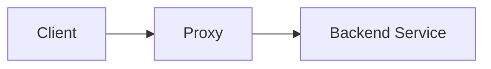
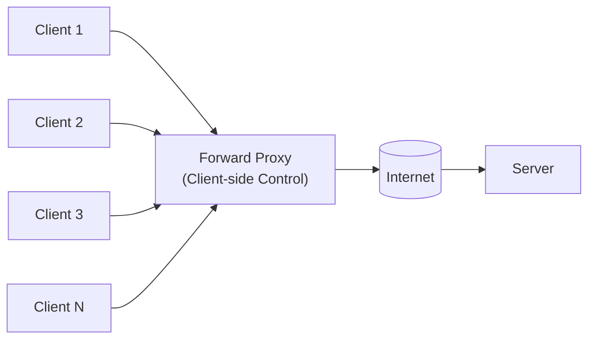
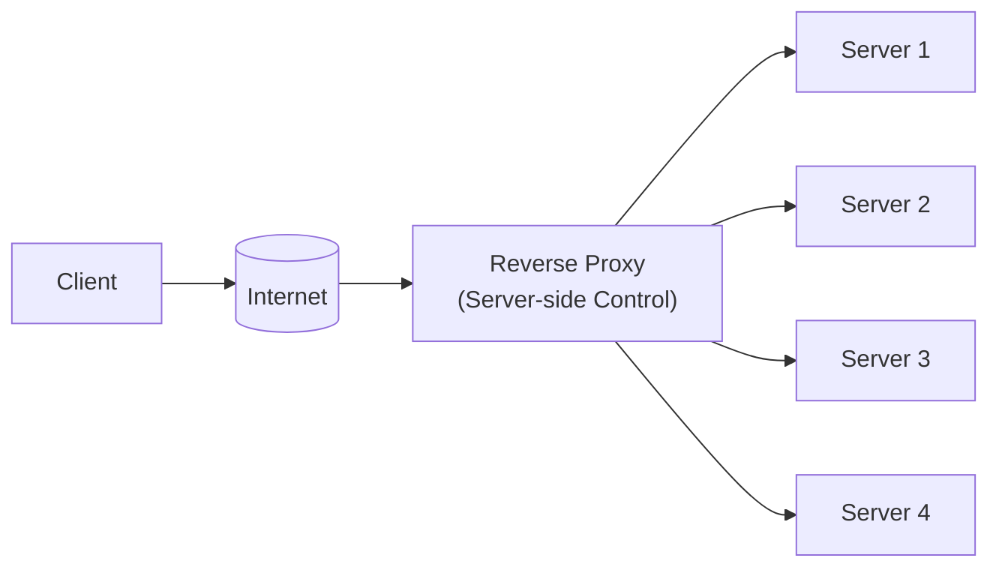
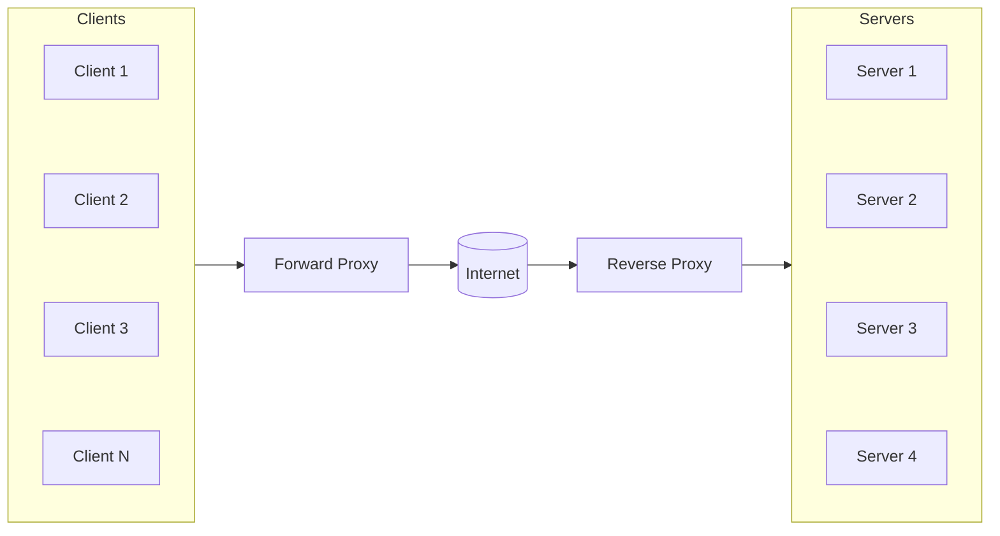
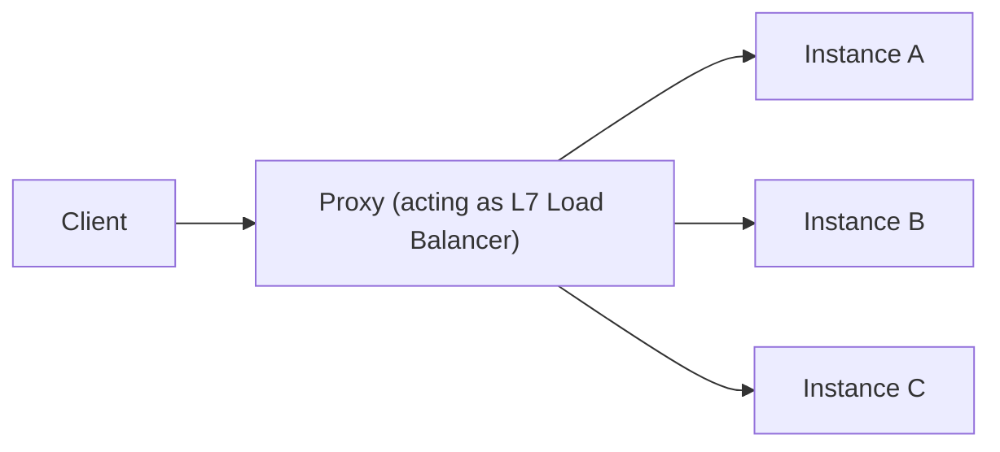

## 1. Introduction — The Missing Piece in Traffic Control

---

So far in Phase 4, we’ve discussed:

- how services are discovered (DNS)
- how traffic is distributed (load balancers)
- how routing strategies work (algorithms, hashing, affinity)

But one crucial question is still unanswered:

> **Where do these decisions actually get enforced?**

They are enforced by a component that sits **directly in the request path**.

That component is a **proxy**.

This chapter explains what proxies are, why they exist, and why so many modern networking components are, at their core, **specialized proxies**.

---

## 2. What a Proxy Is (System Design Definition)

---

A **proxy** is an intermediary that:

- receives traffic on behalf of another service
- can inspect requests and responses
- can modify, block, or forward traffic
- applies routing and policy decisions centrally

At the highest level:

> **A proxy is a programmable traffic control point.**

Unlike DNS (discovery) or routing tables (forwarding), proxies actively participate in request handling.

---

## 3. Where a Proxy Sits (Most Important Diagram)

The single most important thing to understand about a proxy is **where it lives**.

Key observations:

- All client traffic flows **through** the proxy
- Backend services never talk to clients directly
- This makes the proxy the **ideal place** to apply control, policy, and protection

In backend system design, this proxy is almost always a **reverse proxy**.

---

## 4. Forward Proxy vs Reverse Proxy (Conceptual Only)

---

### Forward Proxy

- Sits **in front of clients**
- Represents the client to the outside world
- Common in corporate networks and outbound control

Example intent:

> “Clients must go through me to access external services.”

---

### Reverse Proxy

- Sits **in front of servers**
- Represents servers to the outside world
- This is what most backend systems use

Example intent:

> “All traffic to my services must go through me.”  
> In system design, when we say _proxy_, we almost always mean a **reverse proxy**.

### In real world scenario, the most common strucure is:

---

## 5. Why Proxies Exist (Beyond Load Balancing)

---

Load balancing is only **one responsibility** a proxy can handle.

Proxies exist because systems need a place to:

- centralize routing logic
- enforce security and policy
- protect services from overload
- observe and control traffic
- evolve infrastructure without changing clients

Trying to push this logic into:

- application code, or
- client libraries

leads to **tight coupling and brittle systems**.

---

## 6. What Proxies Can Do (Complete but Bounded)

---

This is the most important section of the chapter.

A proxy is **not a single-purpose component**.
It can perform multiple responsibilities — **load balancing is just one of them**.

### 6.1 Traffic Routing

- Decide **where** a request should go
- Based on:
  - paths (/api, /admin)
  - headers (tenant, user, region)
  - protocol (HTTP vs gRPC)

---

### 6.2 Load Balancing (One Responsibility)

- Distribute traffic across instances
- Apply algorithms (round-robin, least connections, hashing)
- Avoid unhealthy backends

> **Important:**  
> Load balancing is a **routing policy enforced by the proxy**, not a separate conceptual component.

---

### 6.3 Security Enforcement

- Terminate TLS (offloading encryption from backend services)
- validate authentication headers
- block unauthorized requests

This answers:

> Should this request be allowed to proceed at all?

---

### 6.4 Traffic Shaping & Protection

- rate limit requests
- Request throttling
- Load shedding during spikes

These protect backend services from abuse and overload.

---

### 6.5 Reliability Controls

- Timeouts
- Bounded retries
- Basic circuit breaking (conceptual)

These prevent **failure propagation**.

---

### 6.6 Observability & Context Propagation

- Request logging
- Latency and error metrics
- Injecting correlation / request IDs

This is why proxies are often the **best observation point** in a system.

---

### 6.7 Protocol & Connection Handling

- HTTP ↔ HTTP/2 ↔ gRPC
- Connection pooling
- Keep-alive management

This is transport optimization — not business logic.

> 🔑 **Mental Model Lock**
>
> A proxy is a **single component** that can perform many traffic-related responsibilities:
>
> - routing
> - load balancing
> - security enforcement
> - reliability controls
> - observability
>
> A _load balancer_ is not a different box — it is **one responsibility a proxy can perform**.

---

## 7. Caveats & Trade-offs (What Can Go Wrong)

---

Proxies centralize control — which is powerful — but that centralization also introduces important trade-offs that system designers must understand.

### 7.1 Forward Proxy Caveat — Policy Bypass & Visibility

#### Because a forward proxy represents clients to the outside world, it can:

- hide the true origin of requests
- bypass network-level restrictions imposed by organizations or governments
- centralize outbound traffic through a single egress point

#### This is why controlled environments typically:

- restrict which forward proxies can be used
- require authentication and auditing
- block unknown or untrusted proxy endpoints

> Forward proxies increase flexibility and control, but also introduce **policy, compliance, and governance considerations**.

---

### 7.2 Reverse Proxy Caveat — Bottlenecks & Single Point of Failure

#### Because all inbound traffic flows through a reverse proxy:

- a failed proxy can block access to all backend services
- an overloaded proxy can become a performance bottleneck
- misconfiguration can impact every downstream service at once

#### For this reason, production systems usually:

- run multiple proxy instances
- place proxies behind L4 load balancers or DNS-based routing
- design proxies to be stateless and horizontally scalable

> Proxies simplify backend systems — but the proxy layer itself must be **highly available**.

---

## 8. Proxy vs Load Balancer — Resolving the Confusion

---

This distinction often causes confusion.

### Key clarification:

> **Most modern Layer 7 load balancers are proxies.**

A load balancer describes **one job**.  
A proxy describes **the component** doing that job.

In practice:

- L7 load balancers are **specialized proxies**
- Proxies can act as load balancers

This is why tools like Nginx and Envoy appear in multiple roles.

---

## 9. Why Proxies Come After Algorithms and Hashing

---

In this learning flow, we intentionally placed proxies **after**:

- load balancing algorithms
- sticky sessions
- consistent hashing

Because:

- algorithms define **what decision should be made**
- proxies define **where that decision is enforced**

This separation keeps:

- policy separate from mechanism
- design separate from tooling

---

## 10. Proxies as the Foundation of Modern Networking

---

Once proxies are understood, many modern systems make sense:

- **API Gateways →** policy-focused proxies
- **Ingress Controllers →** platform-managed proxies
- **Service Meshes →** proxy per service
- **Edge Networks →** globally distributed proxies

Different names.  
Same core idea:

> **Put intelligence in the traffic path.**

---

## 11. Layer Mapping (Explicit)

---

> 📍 **Layer Mapping**
>
> Proxies typically operate at:
>
> - **OSI Layer 7** (HTTP-aware proxies)
> - sometimes **Layer 4** (TCP proxies)
>
> The key distinction is not the layer — it’s **traffic awareness and control**.

---

## 12. Key Takeaways

---

- Proxies sit directly in the traffic path
- It is a **multi-responsibility traffic control component**
- Load balancing is one responsibility, not the definition
- Most L7 load balancers are proxies
- Proxies apply routing strategies defined earlier
- Modern networking is largely proxy-driven

---

### 🔗 What’s Next?

Now that we understand **what a proxy is**, we can finally look at **real-world implementations**.

In the next chapter, we explore:

- Nginx
- HAProxy
- AWS ALB

Not as tools — but as **concrete realizations of proxy concepts**.

👉 **Up Next →**  
**[Popular Load Balancers — Nginx, HAProxy & AWS ALB](/learning/advanced-skills/networking-essentials/4_dns-load-balancers-and-traffic-distribution/4_9_popular-load-balancers)**

---

> 📝 **Takeaway**
>
> Proxies are not just components —  
> they are the **control points of modern networks**.
