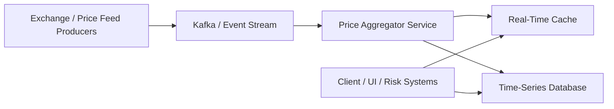
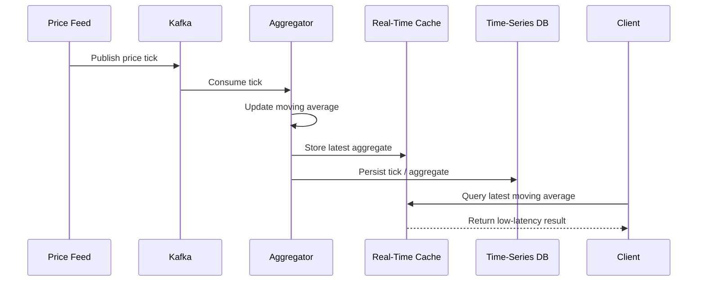
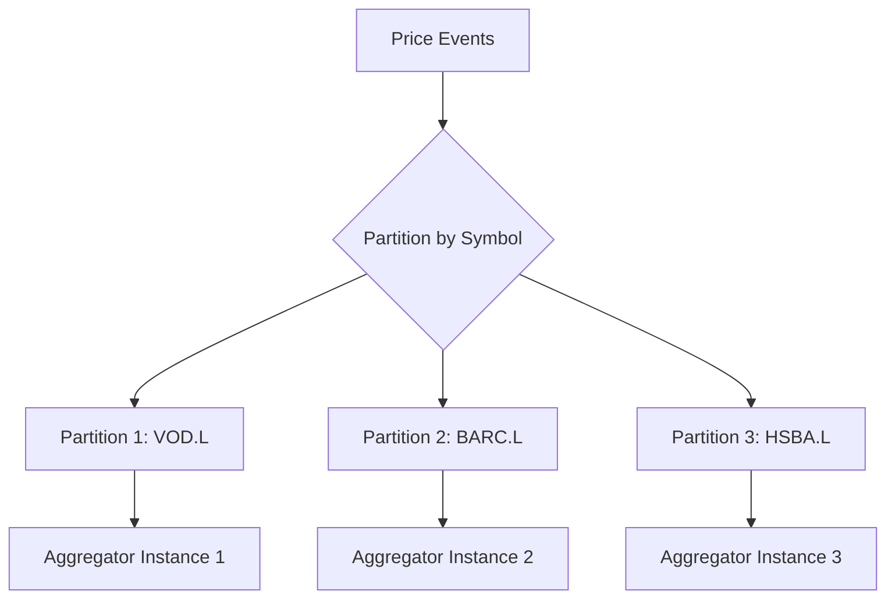
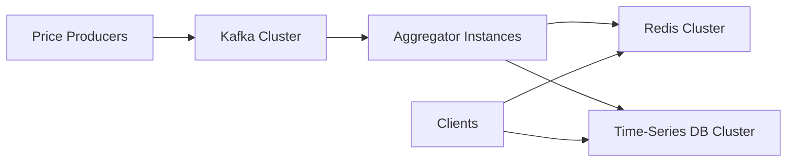

## 1. Goal of This Article

---

In Level 1 and Level 2, we designed an in-memory `PriceTracker`.

Now we need to design a distributed system that can:

- ingest high-frequency price ticks
- calculate moving averages in real time
- serve low-latency queries
- store historical prices for later analysis
- survive failures

> 📝 **Goal:**  
> Move from a single in-memory class to a scalable price aggregation architecture.

---

## 2. High-Level Architecture

---

At a high level, the system can be split into five major parts:

1. Price producers
2. Event streaming layer
3. Aggregator service
4. Real-time cache
5. Historical storage

---



---

## 3. Component Responsibilities

---

### 1. Price Feed Producers

These are systems that publish price updates.

Examples:

- exchange feeds
- market data providers
- internal pricing systems

They produce events such as:

```json
{
  "symbol": "VOD.L",
  "price": 102.45,
  "eventTime": "2026-05-04T10:15:00Z"
}
```

---

### 2. Event Streaming Layer

Kafka or a similar message broker acts as the durable event pipeline.

It helps with:

- buffering spikes
- replaying events
- decoupling producers from consumers
- horizontal scaling using partitions

---

### 3. Price Aggregator Service

This service consumes price ticks and computes aggregates.

Responsibilities:

- consume price events
- maintain recent price windows
- calculate moving averages
- publish latest aggregate state

---

### 4. Real-Time Cache

A cache such as Redis can store the latest computed moving averages.

Used for:

- fast client queries
- dashboards
- risk systems

Example keys:

```text
price:VOD.L:latest
moving-average:VOD.L:100
moving-average:VOD.L:1000
```

---

### 5. Time-Series Database

A time-series database stores historical tick data and aggregates.

Used for:

- audit
- backtesting
- analytics
- historical queries

Examples:

- TimescaleDB
- InfluxDB
- ClickHouse

---

## 4. Request / Data Flow

---



---

## 5. Why Kafka Fits This Problem

---

Kafka is useful because price updates are naturally event streams.

Kafka gives us:

- ordered events within a partition
- durable storage for replay
- consumer groups for horizontal scaling
- backpressure handling through buffering

> 🧠 **Key Point:**  
> Kafka turns price ticks into a replayable stream instead of transient in-memory updates.

---

## 6. Partitioning Strategy

---

To preserve ordering for each symbol, partition events by symbol.

```text
partition key = symbol
```

Example:

```text
VOD.L  → Partition 1
BARC.L → Partition 2
HSBA.L → Partition 3
```

---



---

## 7. Why Partition by Symbol?

---

Moving average depends on the order of prices for the same symbol.

If events for the same symbol are processed out of order, calculations may become incorrect.

Partitioning by symbol ensures:

- all ticks for the same symbol go to the same partition
- ordering is preserved within that partition
- one consumer processes that symbol stream in order

---

## 8. Real-Time vs Historical Paths

---

The system has two different read needs.

### Real-Time Path

```text
Client → Cache → latest aggregate
```

Optimized for:

- low latency
- dashboard updates
- risk views

---

### Historical Path

```text
Client → Time-Series DB → historical prices / aggregates
```

Optimized for:

- analytics
- audit
- backtesting

---

## 9. Why Separate Cache and Database?

---

A single storage system usually cannot optimize for everything.

| Need                  | Better Fit     |
| --------------------- | -------------- |
| Latest moving average | Cache          |
| Historical ticks      | Time-series DB |
| Low-latency reads     | Cache          |
| Long-term analysis    | Database       |

---

## 10. High Availability View

---

To avoid single points of failure, each major component should run with redundancy.



---

This gives us:

- Kafka replication
- multiple aggregator instances
- replicated cache
- replicated/persistent historical storage

---

## 11. Interview Explanation

---

In an interview, you could explain the architecture like this:

> “I would move price updates into an event stream like Kafka. Producers publish ticks, partitioned by symbol to preserve ordering. Aggregator services consume those ticks, maintain rolling windows, and write latest moving averages to Redis for low-latency reads. Historical ticks and aggregates can be persisted to a time-series database for audit and analytics. This separates ingestion, computation, real-time serving, and long-term storage.”

---

## Conclusion

---

The high-level architecture separates responsibilities clearly:

```text
ingestion → streaming → aggregation → real-time cache → historical storage
```

This makes the system:

- scalable
- fault-tolerant
- low-latency
- suitable for real-world trading workloads

---

### 🔗 What’s Next?

👉 **[Level 3 — State Management & Data Flow →](/learning/advanced-skills/system-design-practice/beginner-systems/1_the-price-aggregator/3_level-3/3_3_state-management-and-data-flow/)**

---

> 📝 **Takeaway**:
>
> - Use Kafka to decouple producers and consumers
> - Partition by symbol to preserve ordering
> - Use cache for real-time reads
> - Use time-series storage for historical queries
> - Separate real-time and historical paths
