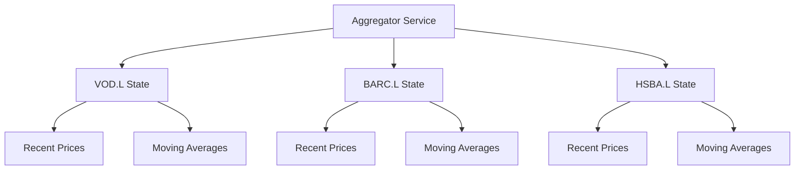
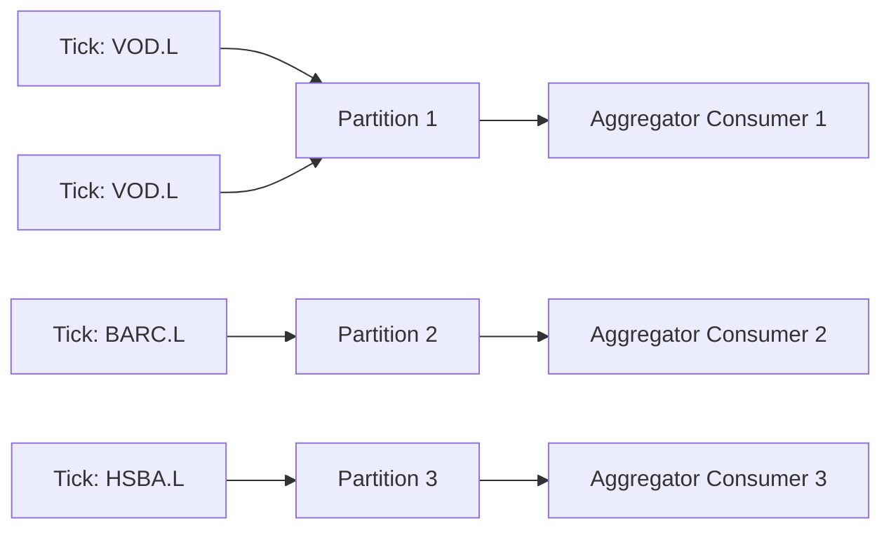
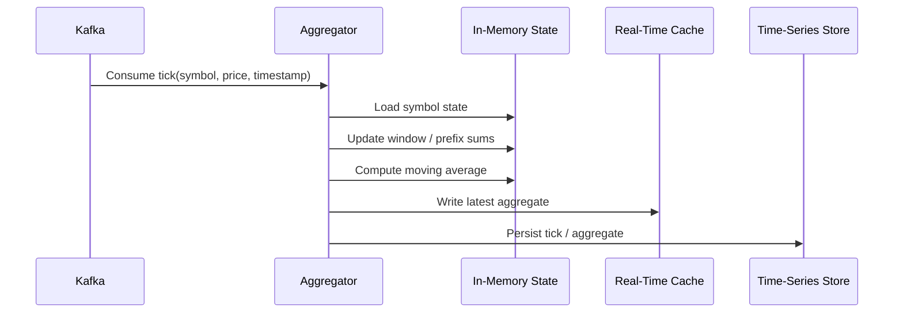
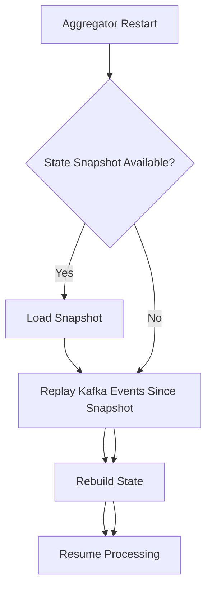

## 1. Why State Management Matters

---

In Level 1, our state was simple:

```java
List<Double> prices;
List<BigDecimal> prefixPriceSums;
```

That worked because everything lived inside one JVM.

In a distributed system, state becomes harder because:

- multiple symbols are processed in parallel
- multiple aggregator instances may exist
- events may arrive late or duplicated
- instances can fail and restart

> 📝 **Key Point:**  
> In a distributed price aggregator, the main challenge is not only processing events — it is managing state correctly.

---

## 2. What State Do We Need?

---

For each symbol, the aggregator needs enough information to calculate moving averages.

Example symbol:

```text
VOD.L
```

State may include:

- latest price
- recent price window
- prefix sums or rolling sums
- last processed event timestamp / sequence number
- computed moving averages

---

## 3. State Per Symbol

---

The key idea is:

```text
state is maintained per symbol
```

Example:

```text
VOD.L  → state for Vodafone prices
BARC.L → state for Barclays prices
HSBA.L → state for HSBC prices
```

---



---

## 4. Why Event Ordering Matters

---

Moving average depends on the order of price ticks.

Example:

```text
100 → 101 → 102
```

is not the same stream as:

```text
102 → 100 → 101
```

If events are processed out of order, the rolling window can become incorrect.

---

## 5. Preserving Order with Kafka Partitioning

---

Kafka preserves ordering **within a partition**.

So we partition by symbol:

```text
partition key = symbol
```

This ensures all events for the same symbol go to the same partition.

---



---

## 6. Data Flow for One Price Tick

---

When a new price tick arrives, the flow looks like this:



---

## 7. Rolling Window State

---

If we only care about fixed windows, such as:

```text
last 100 prices
last 1000 prices
```

we can maintain rolling sums.

Example state:

```text
symbol = VOD.L
lastPrice = 102.45
window100Sum = 10,245
window100Queue = [...]
window1000Sum = 102,450
window1000Queue = [...]
```

---

## 8. Variable `k` vs Predefined Windows

---

In Level 1, we supported variable `k`:

```text
getMovingAverage(5)
getMovingAverage(100)
getMovingAverage(1000)
```

In production, systems often precompute common windows:

```text
MA_50
MA_100
MA_1000
```

Why?

- faster reads
- predictable memory usage
- simpler cache keys

---

### Trade-off

| Approach           | Benefit              | Cost               |
| ------------------ | -------------------- | ------------------ |
| Variable k         | flexible queries     | more complex state |
| Predefined windows | fast and predictable | less flexible      |

---

## 9. Real-Time Cache Update

---

After computing the latest aggregates, write them to cache.

Example keys:

```text
moving-average:VOD.L:50
moving-average:VOD.L:100
moving-average:VOD.L:1000
```

Example value:

```json
{
  "symbol": "VOD.L",
  "window": 100,
  "average": 102.45,
  "eventTime": "2026-05-04T10:15:00Z"
}
```

---

## 10. Historical Store Update

---

The historical store is used for:

- audit
- replay
- analytics
- backtesting

The aggregator may persist:

- raw tick events
- computed aggregates
- processing metadata

---

## 11. Handling Duplicate Events

---

Distributed systems may process the same event more than once.

To protect correctness, events should contain a unique identifier or sequence number.

Example:

```json
{
  "eventId": "evt-123",
  "symbol": "VOD.L",
  "sequence": 10045,
  "price": 102.45
}
```

The aggregator can track the last processed sequence per symbol.

---

## 12. Handling Late Events

---

A late event is an event that arrives after newer events have already been processed.

Options:

- reject late events
- process with allowed lateness window
- recompute affected aggregates

For a beginner-level design, we can keep the rule simple:

```text
process events in Kafka order per symbol
```

Advanced systems can handle event-time processing separately.

---

## 13. State Recovery After Crash

---

If an aggregator instance crashes, it needs to rebuild its state.

Possible recovery sources:

- Kafka replay
- snapshot from state store
- cache/database reload

---



---

## 14. Interview Explanation

---

In an interview, you could explain it like this:

> “I would maintain state per symbol. Kafka events would be partitioned by symbol so ordering is preserved for each instrument. The aggregator consumes events, updates rolling window state, computes moving averages, writes the latest values to a low-latency cache, and persists raw ticks or aggregates to a time-series store. For recovery, the service can rebuild state by replaying Kafka events, optionally starting from a saved snapshot.”

---

## Conclusion

---

State management is the heart of a distributed price aggregator.

The key ideas are:

```text
partition by symbol → preserve order → update per-symbol state → publish aggregates
```

This keeps the system scalable while maintaining correctness for each instrument stream.

---

### 🔗 What’s Next?

👉 **[Level 3 — Consistency & Failure Handling →](/learning/advanced-skills/system-design-practice/beginner-systems/1_the-price-aggregator/3_level-3/3_4_consistency-and-failure-handling/)**

---

> 📝 **Takeaway**:
>
> - Maintain state per symbol
> - Partition by symbol to preserve event order
> - Use cache for latest aggregates
> - Use time-series storage for history and replay
> - Plan for duplicate events, late events, and recovery
