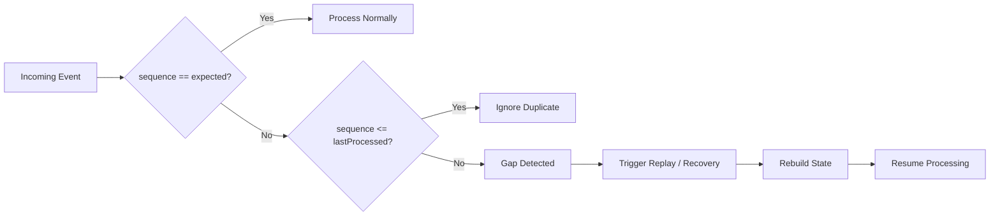
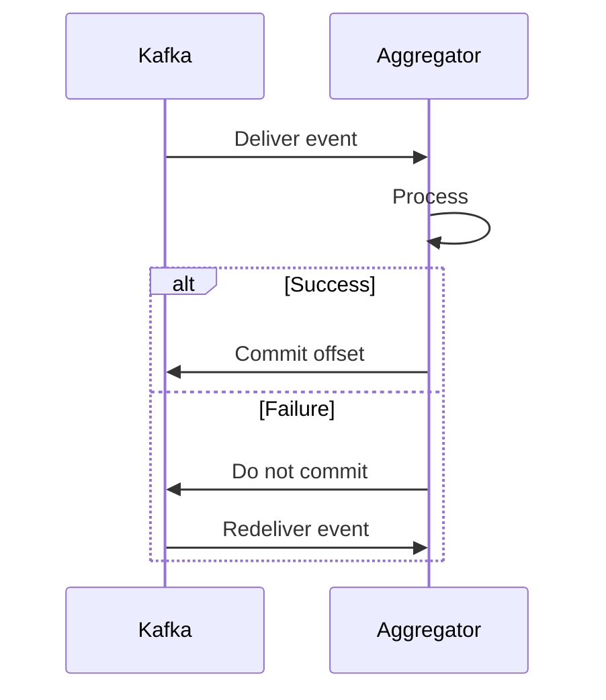
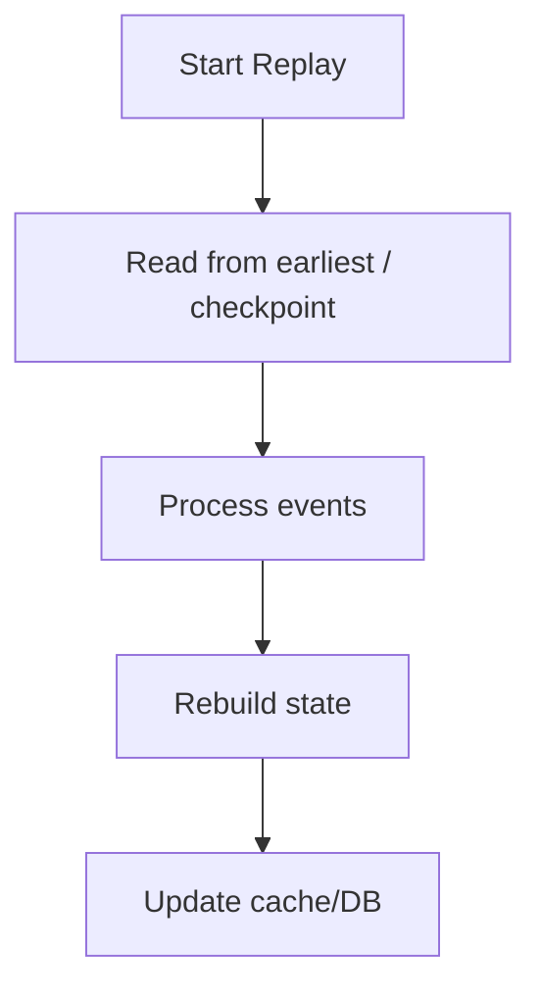

## 1. Why This Matters

---

In a distributed system, failures are normal, not exceptional.

For a price aggregator, incorrect handling of failures can lead to:

- wrong moving averages
- missed or duplicated ticks
- inconsistent views across regions

> 📝 **Goal:** Ensure correctness even when messages are duplicated, delayed, or components crash.

---

## 2. Delivery Semantics

---

Message brokers like Kafka provide different delivery guarantees.

### At-most-once

```text
Message may be lost, never retried
```

❌ Not acceptable for trading data.

---

### At-least-once (most common)

```text
Message is delivered one or more times
```

✔ No data loss
❗ Duplicates possible

---

### Exactly-once (complex)

```text
Processed exactly once end-to-end
```

✔ Ideal but costly/complex (transactions, idempotent producers, EOS semantics)

---

> 🧠 **Practical choice:** Use **at-least-once + idempotency**.

---

## 3. Idempotency (Critical)

---

We must ensure processing the same event twice does not change the final state.

### Event shape

```json
{
  "eventId": "evt-123",
  "symbol": "VOD.L",
  "sequence": 10045,
  "price": 102.45,
  "eventTime": "2026-05-04T10:15:00Z"
}
```

### Strategy

Maintain **last processed sequence per symbol**.

```text
expected = lastProcessedSequence + 1

if incoming.sequence <= lastProcessedSequence:
    ignore (duplicate or late event already processed)

else if incoming.sequence == expected:
    process normally and update lastProcessedSequence

else:
    gap detected → trigger replay/recovery before processing
```

---



---

## 4. Ordering Guarantees

---

We rely on **Kafka partitioning by symbol**:

```text
partition key = symbol
```

Guarantee:

```text
Within a partition → events are ordered
```

Implication:

- Each symbol is processed **sequentially** by one consumer
- No need for complex reordering logic (baseline design)

> #### Important distinction:
>
> Kafka guarantees ordering of events within a partition, but it does not guarantee completeness of the sequence. If producers publish events out of order or late, missing sequences can still occur. Therefore, sequence validation is still required at the consumer level.

---

## 5. Handling Duplicates

---

Duplicates can occur due to retries or consumer restarts.

Approaches:

- **Sequence check (preferred)** per symbol
- **EventId dedupe cache** (short TTL) if sequence not available

Trade-off:

```text
Sequence → lightweight, requires ordered stream
EventId cache → extra memory, works without strict ordering
```

---

## 5.1 Handling Gaps (Missing Events)

---

Building on the sequence validation logic above, let’s understand why gap detection is critical in distributed systems. Even with Kafka ordering, **missing sequences can still occur** if:

- producers send events out of order
- upstream systems delay certain events
- transient failures cause temporary gaps

Example:

```text
lastProcessedSequence = 100
incoming = 103
→ missing 101, 102
```

### Why this is dangerous

```text
Moving average depends on complete ordered data
Missing events → incorrect aggregates
```

### Strategy

```text
Do NOT process the newer event immediately
Pause processing for that symbol
Trigger replay/recovery
Fetch missing events
Rebuild correct state
Resume processing
```

---

### Final Design Decision

```text
We combine:
- Kafka ordering (per partition)
- Sequence validation (consumer-side)
- Replay-based recovery (for gaps)

This ensures correctness without relying solely on infrastructure guarantees.
```

---

## 6. Handling Retries

---

When processing fails:

- do not commit offset
- retry processing



---

## 7. Offset Management

---

Offsets represent how far a consumer has progressed.

Best practice:

```text
Commit offset AFTER successful processing
```

This ensures:

- no data loss
- duplicates handled via idempotency

---

## 8. Failure Scenarios & Handling

---

### 8.1 Aggregator Crash

- On restart, consumer resumes from last committed offset
- Replays uncommitted events
- Idempotency prevents double counting

---

### 8.2 Cache Failure (e.g., Redis)

- Continue processing events
- Rebuild cache from stream or DB

---

### 8.3 Database Failure

- Use retries / circuit breaker
- Buffer writes (short term)
- Prioritize real-time path (cache) if needed

---

### 8.4 Kafka Broker Failure

- Kafka replication handles broker loss
- Consumers re-balance to other brokers

---

## 9. Exactly-Once (When Needed)

---

Kafka supports Exactly-Once Semantics (EOS) via:

- idempotent producers
- transactional writes

But costs include:

- higher latency
- operational complexity

> 🧠 Use EOS only when strict financial correctness requires it end-to-end.

---

## 10. Reprocessing & Backfill

---

Kafka enables replay for rebuilding state or correcting bugs.



Use cases:

- bug fixes
- new aggregates
- audit/reconciliation

---

## 11. Multi-Region Considerations (Brief)

---

- Use region-local consumers for low latency
- Replicate streams across regions (e.g., MirrorMaker)
- Accept **eventual consistency** across regions

---

## 12. SLA Choices

---

Decide explicitly:

- Freshness (ms vs seconds)
- Consistency (strict vs eventual)
- Availability (always serve vs degrade)

Example stance for trading dashboards:

```text
Low latency + at-least-once + idempotent processing
```

---

## 13. Interview Answer

---

> “I would rely on Kafka partitioning to preserve ordering per symbol, but I would not depend on it for correctness. I would implement sequence validation at the consumer level to detect duplicates and gaps. Duplicates would be ignored, while gaps would trigger replay/recovery, because continuing without missing events would corrupt rolling aggregates like moving averages. Offsets would be committed only after successful processing, and replay would be used for recovery.”

---

## Conclusion

---

In streaming systems, correctness is not just about processing events in order, but ensuring that no required event is missing from the sequence.

Correctness in distributed systems comes from combining:

```text
at-least-once delivery + idempotency + ordering + replay
```

---

### 🔗 What’s Next?

👉 **[Level 3 — Scaling & Performance (Throughput, Partitioning, Caching) →](/learning/advanced-skills/system-design-practice/beginner-systems/1_the-price-aggregator/3_level-3/3_5_scaling-and-performance/)**

---

> 📝 **Takeaway**:
>
> - Prefer at-least-once + idempotent consumers
> - Partition by symbol to preserve order
> - Commit offsets after processing
> - Plan for retries, duplicates, and replays
> - Use exactly-once only when necessary
