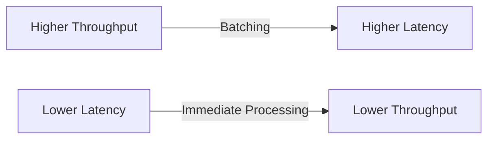
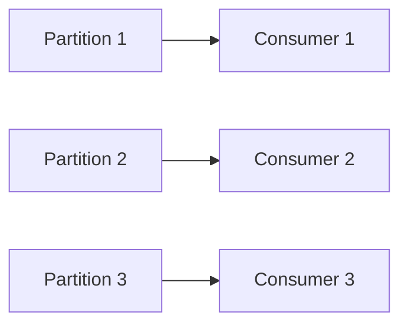
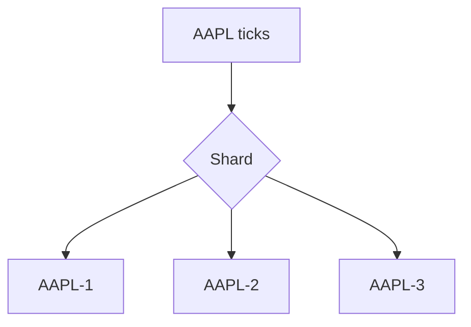
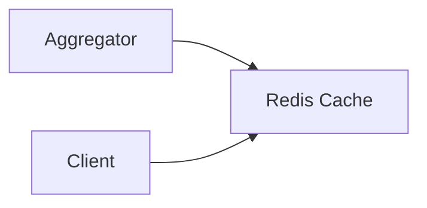

## 1. Goal of This Article

---

We now have a correct and resilient architecture. The next step is to ensure it performs under **production-scale load**.

> 📝 **Goal:** Maximize throughput while keeping latency low.

---

## 2. Throughput vs Latency

---

- **Throughput** → how many ticks per second we can process
- **Latency** → how fast a single tick becomes visible to clients

These are often in tension.



> 🧠 Balance depends on product requirements (e.g., dashboards vs HFT - High Frequency Trading).

---

## 3. Horizontal Scaling with Kafka Consumers

---

Scale the aggregator by adding more consumer instances.

Constraint:

```text
#Consumers ≤ #Partitions
```



- Each partition is processed by **one consumer** at a time
- Adding partitions increases parallelism

---

## 4. Partitioning Strategy (Revisited)

---

Baseline:

```text
partition key = symbol
```

### Problem: Hot Symbols

Some symbols (e.g., popular stocks) receive far more ticks.

```text
AAPL → very high traffic (hot partition)
```

---

### Mitigation Options

1. **Sub-partition by symbol + shard**

```text
key = symbol + hash(shardId)
```

2. **Split heavy symbols explicitly**

```text
AAPL-1, AAPL-2, AAPL-3
```

3. **Dedicated topic for hot symbols**

---



---

## 5. Consumer Scaling Patterns

---

### Option 1 — Scale by partitions

- Increase partitions
- Add more consumers

---

### Option 2 — Scale by symbols

- Assign symbol ranges to services

```text
Service 1 → A–M
Service 2 → N–Z
```

---

### Option 3 — Hybrid

- Partition + service-level sharding

---

## 6. Batching vs Real-Time Processing

---

### Immediate Processing

```text
Process each tick individually
```

✔ Lowest latency  
❌ Lower throughput

---

### Batch Processing

```text
Process N ticks together
```

✔ Higher throughput  
❌ Slight delay

---

### Practical Approach

- micro-batching (e.g., 10–100 events)
- time-based batching (e.g., 10–50 ms)

---

## 7. Efficient State Updates

---

Avoid expensive operations per tick.

Instead of recomputing:

```text
sum of last k prices each time
```

Use rolling state:

```text
newSum = oldSum + newPrice - oldPrice
```

👉 This keeps processing O(1) per event.

---

## 8. Cache Design for Low Latency

---

Use Redis (or similar) for serving queries.

### Key design

```text
moving-average:{symbol}:{window}
```

### Optimizations

- use pipelining
- use TTL for stale cleanup
- store precomputed windows

---



---

## 9. Read Scaling

---

To support many clients:

- use **cache replicas**
- use **read replicas**
- optionally use **CDN / edge caching** for dashboards

---

## 10. Backpressure Handling

---

If consumers cannot keep up:

- Kafka buffers messages
- lag increases

Mitigation:

- scale consumers
- increase partitions
- reduce processing cost

---

## 11. Monitoring Key Metrics

---

Track:

- consumer lag
- processing latency
- cache hit ratio
- error rate
- throughput (events/sec)

---

## 12. Cost vs Performance Trade-offs

---

| Strategy        | Benefit            | Cost             |
| --------------- | ------------------ | ---------------- |
| More partitions | higher parallelism | more overhead    |
| More consumers  | higher throughput  | infra cost       |
| Larger cache    | faster reads       | memory cost      |
| Batching        | throughput gain    | latency increase |

---

## 13. Interview Explanation

---

> “I would scale the system horizontally using Kafka partitions and multiple consumers. Each symbol would be processed in order within a partition. To handle hot symbols, I would introduce sub-partitioning or dedicated topics. For performance, I would use rolling aggregates, micro-batching, and Redis caching for low-latency reads. I would monitor consumer lag and scale dynamically to maintain SLA.”

---

## Conclusion

---

Scaling a streaming system requires careful balancing of:

```text
partitioning + consumer scaling + efficient state + caching
```

---

### 🔗 What’s Next?

👉 **[Level 3 — Final Summary & System Recap →](/learning/advanced-skills/system-design-practice/beginner-systems/1_the-price-aggregator/3_level-3/3_6_final-summary-and-system-recap/)**

---

> 📝 **Takeaway**:
>
> - Partitioning drives scalability
> - Consumers scale horizontally
> - Rolling state ensures O(1) updates
> - Cache enables low-latency reads
> - Monitor and adapt under load
