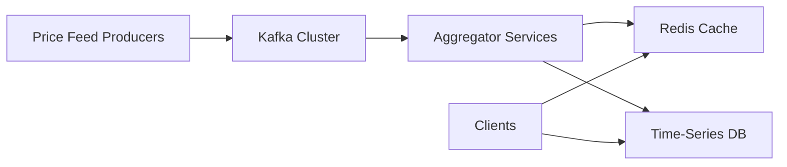
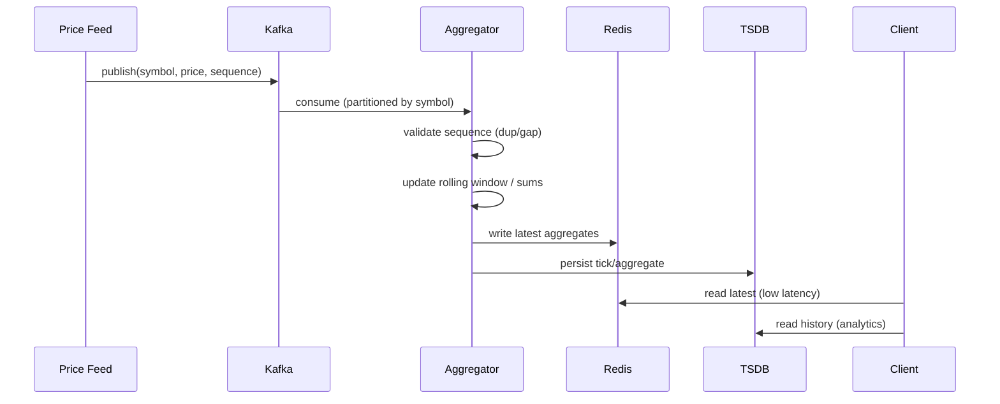

## 1. What We Built (End-to-End)

---

We started with a simple requirement:

```text
Compute moving average of last k prices
```

And evolved it into a **production-grade distributed system**.

---

## 2. Evolution Across Levels

---

### Level 1 — Algorithmic Baseline (LLD)

- Rolling sum / prefix sum for O(1) average
- Proper validation and edge cases
- (Optionally) integer-based representation for precision

```text
Goal → Correctness + O(1) performance
```

---

### Level 2 — Concurrency (Single Node)

- Thread-safe updates
- Read vs write separation (ReadWriteLock)
- Understanding contention and throughput

```text
Goal → Safe concurrent access (not strict ordering)
```

> 📝 Note: Thread safety ≠ deterministic ordering. Ordering is solved at the distributed layer.

---

### Level 3 — Distributed System (HLD)

- Event-driven ingestion (Kafka)
- Partitioning by symbol (ordering per stream)
- Aggregator services maintain per-symbol state
- Redis for low-latency reads
- Time-series DB for history
- Idempotency + sequence validation + replay

```text
Goal → Scalability + Availability + Correctness under failure
```

---

## 3. Final Architecture (Clean View)

---



---

## 4. Data Flow (One Tick)

---



---

## 5. Key Design Decisions (Why)

---

- **Kafka (event stream)** → decouples producers/consumers, enables replay
- **Partition by symbol** → preserves per-symbol ordering
- **Per-symbol state** → isolates correctness and scaling
- **Redis cache** → sub-millisecond reads for dashboards/risk
- **Time-series DB** → durable history, analytics, audit
- **At-least-once + idempotency** → practical correctness with simpler ops
- **Sequence validation + replay** → correctness when gaps occur

---

## 6. Correctness Model (Critical)

---

```text
Ordering (Kafka) + Idempotency (consumer) + Replay (recovery)
```

- Duplicates → ignored
- In-order events → processed
- Gaps → pause + replay + rebuild state

> 🧠 Key insight: Ordering guarantees do not imply sequence completeness.

---

## 7. Throughput vs Latency (Positioning)

---

- Dashboards / analytics → **balanced** (micro-batching OK)
- HFT-style systems → **latency-first** (no batching, minimal locks)

Your design supports both by tuning:

- batching window
- partition count
- cache strategy

---

## 8. Common Interview Pitfalls

---

- ❌ Ignoring ordering and assuming threads are enough
- ❌ No plan for duplicates (at-least-once reality)
- ❌ No strategy for missing events (gaps)
- ❌ Treating Kafka as “magic correctness”
- ❌ Mixing real-time reads with historical queries
- ❌ No recovery/replay story

---

## 9. One-Minute Interview Answer

---

> “I’d start with an in-memory O(1) solution using a rolling sum for the last k prices. Then I’d make it thread-safe using a ReadWriteLock for concurrent reads. To scale, I’d move to an event-driven architecture using Kafka, partitioned by symbol to preserve ordering. Aggregator services would maintain per-symbol rolling state, write the latest aggregates to Redis for low-latency reads, and persist ticks/aggregates to a time-series database for history. For correctness, I’d use at-least-once delivery with idempotent consumers, validate sequences per symbol to detect duplicates and gaps, and trigger replay to rebuild state when gaps are found. Offsets are committed after successful processing.”

---

## 10. Extensions (If Pushed Further)

---

- **SMA → VWAP / TWAP Evolution**
  - Current system uses Simple Moving Average (SMA)
  - **VWAP (Volume Weighted Average Price)** → requires tracking `price × volume` and total volume
  - **TWAP (Time Weighted Average Price)** → requires time-based windows instead of count-based windows
  - These are widely used in real trading systems for execution and benchmarking

- Time-based windows (e.g., last 5 minutes) instead of count-based
- VWAP / TWAP instead of simple average (for realistic trading scenarios)
- Multi-region active-active with eventual consistency

- Snapshotting state to speed up recovery
- Stream processing frameworks (Flink) for advanced windows

---

## Conclusion

---

We evolved a simple requirement into a system that is:

```text
Correct + Scalable + Fault-Tolerant + Low-Latency
```

---

### 🔗 End of Design

This concludes the **Price Aggregator** system design journey.

---

> 📝 **Final Takeaway**:
>
> - Start simple (algorithm)
> - Make it safe (concurrency)
> - Make it scale (distributed system)
> - Make it correct under failure (idempotency + replay)
