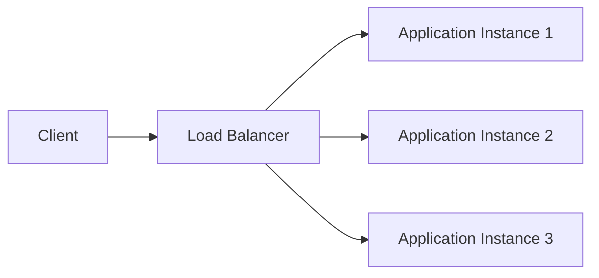
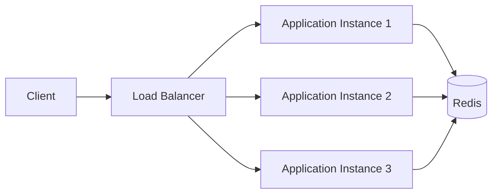

## 1. What Changes in Phase 3?

---

In Phase 1 and Phase 2, our rate limiter worked correctly because everything happened inside:

```text
One application instance
```

We handled:

```text
✔ request counting
✔ time windows
✔ thread safety
✔ concurrency inside one JVM
```

But real production systems rarely run on a single server.

---

> 📝 **Reality Check:**  
> Modern systems usually run across multiple application instances behind a load balancer.

---

## 2. The Distributed System Problem

---

Consider this deployment:



Each application instance has its own memory.

That means:

```text
App1 → own rate limit state
App2 → own rate limit state
App3 → own rate limit state
```

---

## 3. Why Single-Node Logic Breaks

---

Assume:

```text
Rate limit = 100 requests/minute
```

And we have:

```text
3 application servers
```

Now imagine:

```text
Client sends:
40 requests → App1
40 requests → App2
40 requests → App3
```

---

### What happens?

Each server sees:

```text
Only 40 requests
```

So all servers allow traffic.

---

### Final Result

```text
Total requests allowed = 120 ❌
Expected limit = 100
```

---

## 4. Root Cause

---

The problem is:

```text
No shared state between servers
```

Each instance makes decisions independently.

---

## 5. Why Thread Safety Is No Longer Enough

---

In Phase 2, we solved:

```text
Multiple threads inside one process
```

But now the problem is:

```text
Multiple machines with different memory
```

---

### Important distinction

```text
Phase 2 → thread coordination
Phase 3 → distributed state coordination
```

---

## 6. What We Need Now

---

We need:

```text
One shared source of truth
```

So that:

```text
All application servers see the same request count
```

---

## 7. Common Solution — Centralized Store

---

The most common approach is:

```text
Application Servers → Shared Store → Rate Limit Decision
```

Usually the shared store is:

```text
Redis
```

Because Redis provides:

```text
✔ very low latency
✔ atomic operations
✔ expiry support (TTL)
✔ high throughput
```

---

## 8. Distributed Rate Limiting Architecture

---



---

### Flow

```text
1. Request reaches any application instance
2. Instance checks shared Redis state
3. Redis returns current count
4. Instance decides allow/reject
```

Now all servers share the same limit state.

---

## 9. New Challenges Introduced

---

Distributed systems introduce new problems.

---

### Network Latency

Every request now involves:

```text
Application → Redis → Application
```

---

### Availability

What if Redis becomes unavailable?

```text
Should we allow traffic?
Or block traffic?
```

---

### Consistency

All servers must observe consistent rate-limit state.

---

### Hot Keys

Popular clients may create:

```text
High contention on one Redis key
```

---

## 10. Why Redis Fits Well

---

Redis is widely used because it supports:

```text
INCR
EXPIRE
Sorted Sets
Lua Scripts
```

These are extremely useful for distributed rate limiting.

---

## 11. What We Will Build Next

---

In the next articles, we will implement:

```text
✔ Fixed Window using Redis
✔ Sliding Window using Redis
✔ Token Bucket using Redis
✔ Atomic distributed operations using Lua scripts
```

---

## 12. Interview Explanation

---

> “Single-node rate limiting works only when all requests are processed by the same application instance. In distributed systems, each server has its own memory, so clients can bypass limits by spreading requests across instances. To solve this, we need a shared source of truth, typically Redis, so all application instances observe the same rate-limit state.”

---

## Conclusion

---

Scaling the application horizontally changes the problem completely.

We move from:

```text
thread safety
```

to:

```text
distributed state consistency
```

---

### 🔗 What’s Next?

👉 **[Centralized Design Using Redis →](/learning/advanced-skills/system-design-practice/intermediate-systems/3_api-rate-limiter/3_phase-3/3_2_centralized-design/)**

---

> 📝 **Takeaway**:
>
> - Single-node rate limiting fails in distributed systems
> - Multiple application instances need shared state
> - Redis is commonly used as the centralized coordination layer
> - Distributed systems introduce consistency and availability trade-offs
