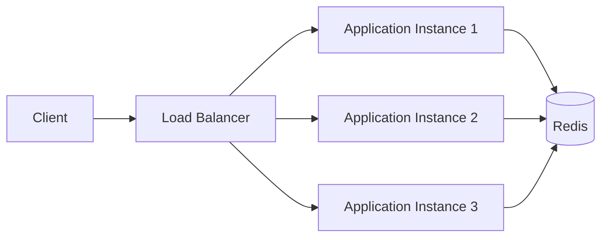

## 1. Why Do We Need a Centralized Design?

---

In the previous article, we saw that single-node rate limiting fails in distributed systems.

The root cause was:

```text
Each application instance maintains its own local state
```

Which leads to:

```text
Inconsistent rate-limit decisions
```

---

> 📝 **Goal:**  
> Ensure all application instances observe the same rate-limit state.

---

## 2. The Core Idea

---

Instead of storing rate-limit state in local memory:

```text
Application Instance → Local Counter
```

we move the state into:

```text
One centralized shared store
```

Usually:

```text
Redis
```

---

## 3. Why Redis Is Commonly Used

---

Redis is widely used for distributed rate limiting because it provides:

```text
✔ very low latency
✔ in-memory performance
✔ atomic operations
✔ TTL / expiry support
✔ extremely high throughput
```

---

### Why low latency matters

Rate limiting happens:

```text
For every incoming request
```

So the coordination layer must be extremely fast.

---

## 4. High-Level Architecture

---



---

### Key Difference

Previously:

```text
Each application had independent counters
```

Now:

```text
All applications share the same centralized state
```

---

## 5. Request Flow

---

```text
1. Request reaches any application instance
2. Application checks Redis
3. Redis returns current usage state
4. Application decides allow/reject
```

---

### Example

```text
Request → App2
App2 → Redis → current count = 95
App2 → allow request
Redis count becomes 96
```

Now every application instance sees:

```text
96
```

instead of maintaining separate local counts.

---

## 6. Shared State Solves the Multi-Node Problem

---

Previously:

```text
App1 count = 40
App2 count = 40
App3 count = 40
```

Result:

```text
120 requests allowed ❌
```

---

With Redis:

```text
Shared Redis count = 120
```

Now all servers observe the same value.

So once the limit is crossed:

```text
All instances reject consistently
```

---

## 7. Why Not Use a Database?

---

A traditional relational database is usually not ideal for rate limiting.

---

### Problem 1 — High Write Volume

Rate limiting requires:

```text
read + update per request
```

At large scale:

```text
millions of updates per second
```

This creates heavy database load.

---

### Problem 2 — Latency

Databases are generally slower than Redis.

Rate limiting sits on the critical request path:

```text
Request cannot proceed until limit is checked
```

So latency matters significantly.

---

### Problem 3 — Expiry Management

Rate limiting naturally requires:

```text
temporary counters
```

Redis supports this directly using:

```text
TTL / EXPIRE
```

---

## 8. Redis Key Design

---

A good distributed design requires predictable keys.

---

### Example Key

```text
rate_limit:user123:20260523:1201
```

Meaning:

```text
rate_limit → namespace
user123 → client ID
20260523 → date
1201 → minute window
```

---

### Another Example

```text
rate_limit:apiKey123
```

The key design depends on:

```text
- algorithm
- window strategy
- client identification model
```

---

## 9. TTL (Expiry) Is Extremely Important

---

Rate-limit counters should not live forever.

Example:

```text
100 requests per minute
```

After the minute expires:

```text
counter becomes useless
```

Redis allows automatic cleanup:

```text
EXPIRE key 60
```

This avoids:

```text
manual cleanup logic
```

---

## 10. New Distributed Trade-offs

---

Moving to Redis solves consistency problems, but introduces new challenges.

---

### Network Hop

Every request now involves:

```text
Application → Redis → Application
```

This adds latency.

---

### Redis Dependency

If Redis becomes unavailable:

```text
Rate limiting may stop working
```

---

### Hot Keys

Popular clients may generate:

```text
Heavy contention on one Redis key
```

---

### Scalability

Redis itself may need:

```text
replication
clustering
sharding
```

at very large scale.

---

## 11. Why Centralized Design Is Still Worth It

---

Even with extra complexity, centralized coordination provides:

```text
✔ globally consistent limits
✔ shared visibility
✔ scalable distributed enforcement
```

Which is essential for production systems.

---

## 12. Interview Explanation

---

> “In distributed systems, application instances cannot maintain independent in-memory counters because clients can bypass limits by spreading traffic across servers. To solve this, we move the rate-limit state into a centralized store like Redis. Redis provides low latency, atomic operations, and expiry support, making it ideal for distributed coordination. All application instances consult Redis before allowing requests, ensuring globally consistent rate limiting.”

---

## Conclusion

---

Centralized coordination is the foundation of distributed rate limiting.

We move from:

```text
local in-memory state
```

to:

```text
shared distributed state
```

using Redis as the coordination layer.

---

### 🔗 What’s Next?

👉 **[Distributed Fixed Window Using Redis →](/learning/advanced-skills/system-design-practice/intermediate-systems/3_api-rate-limiter/3_phase-3/3_3_fixed-window-with-redis/)**

---

> 📝 **Takeaway**:
>
> - Distributed systems require shared rate-limit state
> - Redis is commonly used because it is fast and supports atomic operations
> - Centralized coordination ensures globally consistent limits
> - TTL-based expiry is critical for efficient cleanup
