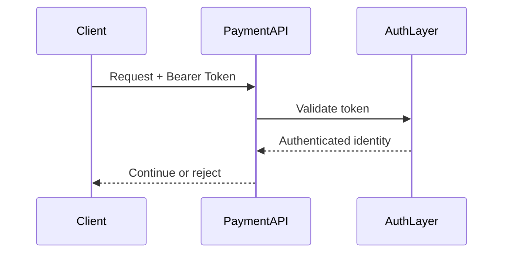

## 1. Why Authentication Matters

---

Before a payment API processes any request, it must answer a basic question:

> ❗ **Who is calling this API?**

Without authentication:

- anyone can create payments
- anyone can confirm payments
- the system becomes unsafe immediately

---

## 2. What This Article Focuses On

---

We are NOT re-explaining:

- authorization
- rate limiting
- data masking

👉 This article focuses only on:

- how callers prove identity
- which authentication model fits which type of system

---

## 3. What Authentication Does

---

Authentication answers:

```text
Who are you?
```

It does **not** answer:

```text
What are you allowed to do?
```

That belongs to **authorization**, which comes next.

---

## 4. Where Authentication Fits in Our Flow

---

For our payment API, authentication happens before business logic.

```text
Client Request
   → Authentication
   → Authorization
   → Idempotency
   → Business Logic
```

---

👉 Invalid or unauthenticated requests should fail early.

---

## 5. Common Authentication Options

---

For backend APIs, the most common strategies are:

### 1. API Keys

### 2. JWT Tokens

### 3. OAuth 2.0

---

## 6. Option 1 — API Keys

---

### What it is

A client sends a secret key with each request.

Example:

```java
POST /payments
X-API-Key: abc123
```

---

### How it works

- server checks whether key is valid
- if valid → request continues
- if invalid → reject request

---

### Good for

- internal service-to-service calls
- simple partner integrations
- low-complexity systems

---

### Limitations

- weak identity model
- hard to represent user-specific claims
- difficult to rotate/manage at scale

---

## 7. Option 2 — JWT (JSON Web Token)

---

### What it is

A signed token containing identity and claims.

Example:

```java
Authorization: Bearer <jwt-token>
```

---

### Typical contents

- user ID
- merchant ID
- roles / scopes
- expiration time

---

### How it works

- client sends JWT
- API validates signature and expiry
- claims are extracted
- request proceeds with authenticated identity

---

### Good for

- modern backend APIs
- stateless authentication
- microservices and mobile/web clients

---

### Benefits

- no DB lookup required for every request (in many setups)
- easy to carry identity and roles
- scales well

---

### Limitations

- token revocation is harder
- must protect signing keys carefully

---

## 8. Option 3 — OAuth 2.0

---

### What it is

OAuth 2.0 is an authorization framework that typically issues access tokens (often JWTs).

---

### Important clarification

OAuth 2.0 is **not just “a token format”**.

It defines:

- how clients obtain tokens
- how users/services grant access

---

### Good for

- enterprise systems
- third-party access
- delegated access flows

---

### In practice for our system

The payment API usually does **not** implement OAuth server logic itself.

Instead:

- an identity provider issues tokens
- payment API validates them

---

## 9. Which Option Fits Our Payment API?

---

For our design, the most practical choice is:

### External Clients

👉 **JWT-based bearer authentication**

---

### Internal Service Calls

👉 **API key or service token authentication**

---

### Enterprise / Multi-client Ecosystem

👉 **OAuth 2.0 + JWT tokens**

---

## 10. Example Authentication Flow

---



---

## 11. What Authentication Layer Should Expose to the System

---

After authentication succeeds, the backend should know:

- who the caller is
- what tenant / merchant they belong to
- what roles/scopes they carry

Example:

```text
userId = U123
merchantId = M456
role = MERCHANT_ADMIN
```

---

👉 This context is then used by the **authorization layer**.

---

## 12. Security Best Practices

---

### 1. Always use HTTPS

- tokens and keys must never travel over plain HTTP

---

### 2. Validate token expiry

- expired tokens must be rejected

---

### 3. Validate signature properly

- never trust unsigned or invalid tokens

---

### 4. Keep secrets out of code

- API keys and signing keys should come from secure secret storage

---

## 13. Common Mistakes

---

### ❌ Treating authentication as authorization

- knowing identity is not enough

---

### ❌ Accepting expired JWTs

- major security issue

---

### ❌ Hardcoding API keys

- secret leakage risk

---

### ❌ Building custom token formats unnecessarily

- increases security risk

---

## 14. Design Insight

---

> 🧠 **Authentication should be simple, standardized, and early in the request pipeline.**

---

For most modern backend systems:

- use **JWT bearer tokens** for client-facing APIs
- use **API keys/service tokens** for controlled internal integrations

---

## Conclusion

---

Authentication ensures that only trusted callers can access the payment API.

For our payment system:

- JWT is the strongest default choice for client-facing APIs
- API keys can still work well for internal or simple integrations
- OAuth 2.0 is useful when identity is managed by an external authorization platform

---

### 🔗 What’s Next?

👉 **[Authorization & Ownership Checks →](/learning/advanced-skills/system-design-practice/intermediate-systems/6_payment-api/10_phase-10/10_3_authorization-and-ownership-checks)**

---

> 📝 **Takeaway**:
>
> - Authentication answers “who are you?”
> - JWT is a strong default for modern APIs
> - API keys are useful for simple/internal integrations
> - OAuth 2.0 is an access framework, not just a token type
