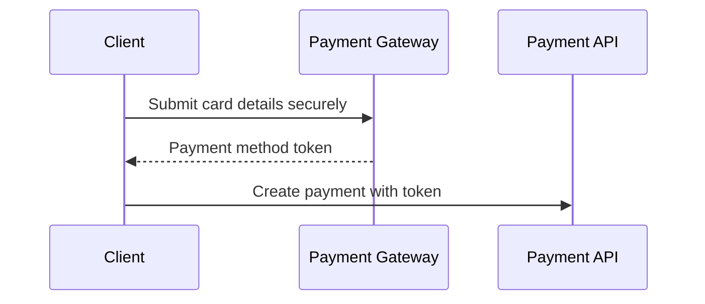

## 1. Why Sensitive Data Handling Matters

---

Payment systems do not only process money.

They also deal with data that can be highly sensitive:

- payment method details
- personally identifiable information (PII)
- merchant and user data

> ❗ **A system can be functionally correct and still be unsafe if it mishandles sensitive data.**

---

## 2. What This Article Focuses On

---

We are NOT doing a deep compliance tutorial.

👉 This article focuses on practical backend design decisions for:

- what data should not be stored
- how sensitive values should be represented
- how to avoid leaking them in logs, APIs, and storage

---

## 3. What Counts as Sensitive Data?

---

In our payment system, sensitive data may include:

### 1. Payment Method Data

- raw card number
- CVV
- expiry details

---

### 2. User Data

- full name
- email address
- phone number
- billing address

---

### 3. Internal Security Data

- API keys
- gateway credentials
- signing secrets

---

👉 Not all payment-related data is equally sensitive, but anything that can expose identity, financial information, or access must be treated carefully.

---

## 4. Core Principle: Minimize What You Store

---

> 🧠 **The safest sensitive data is the data you never store.**

---

This means:

- do not store raw card data
- do not store secrets in business tables
- do not keep unnecessary personal data

---

## 5. Never Store Raw Card Details

---

### ❌ Bad Design

```json
{
  "cardNumber": "4111111111111111",
  "cvv": "123",
  "expiry": "12/27"
}
```

stored directly in your backend database.

---

### Why this is dangerous

- massive security risk
- compliance burden becomes much higher
- log leaks become catastrophic

---

### ✅ Better Design

Use a **gateway-issued token** or payment method reference instead.

Example:

```json
{
  "paymentMethodToken": "pm_tok_abc123"
}
```

---

👉 Your backend should process tokenized payment references, not raw card values.

---

## 6. Tokenization

---

Tokenization means replacing sensitive payment details with a safe reference token.

---

### Flow

```text
Card details → Payment provider / secure collection layer → Token → Our backend
```

---

### Example



---

### Why this is better

- backend never sees raw card number
- blast radius is reduced
- easier to reason about security boundaries

---

## 7. Masking Sensitive Values

---

Even when some data must be shown, it should be masked.

### Example

Instead of:

```text
4111111111111111
```

show:

```text
**** **** **** 1111
```

---

### Where masking matters

- API responses
- admin dashboards
- logs
- support tooling

---

## 8. Safe Logging Practices

---

Logs are one of the most common places where sensitive data leaks.

### ❌ Bad

```java
log.info("Create payment request: {}", request);
```

If `request.toString()` contains sensitive fields, they may be written into logs.

---

### ✅ Better

Log only non-sensitive context:

```java
log.info("Create payment request received. orderId={}, merchantId={}", orderId, merchantId);
```

---

### Good logging rule

> Log identifiers and operational context, not secrets or sensitive payloads.

---

## 9. Protecting Secrets

---

Sensitive operational secrets include:

- gateway API keys
- JWT signing keys
- encryption secrets

---

### ❌ Bad

- hardcoding secrets in code
- committing secrets to Git

---

### ✅ Better

- use environment variables
- use secret managers / vaults
- rotate secrets regularly

---

## 10. Data in API Responses

---

Be careful what your API returns.

### Example

A payment response should include:

- paymentId
- status
- amount
- currency

It should NOT include:

- full card details
- internal gateway secrets
- raw provider error payloads

---

## 11. Data in the Database

---

Our payment tables should store only what is necessary.

### Safe examples

- `paymentMethodToken`
- masked last four digits (if needed)
- gateway reference

---

### Unsafe examples

- raw CVV
- full PAN
- raw authentication secrets

---

## 12. Data Retention Awareness

---

Even valid data should not necessarily be kept forever.

Examples:

- temporary tokens should expire
- logs should have retention policies
- old sensitive operational data should be cleaned up

---

👉 Security is not only about storage, but also about **lifetime**.

---

## 13. Common Mistakes

---

### ❌ Logging full request/response payloads

- leaks sensitive values

---

### ❌ Storing raw card details directly

- dangerous and unnecessary

---

### ❌ Returning too much data in APIs

- exposes internals

---

### ❌ Hardcoding credentials

- secret management failure

---

## 14. Design Insight

---

> 🧠 **Sensitive data should be minimized, tokenized, masked, and tightly controlled.**

---

A secure payment backend should assume:

- logs can leak
- dashboards can be misused
- storage can be inspected

So the design must reduce exposure everywhere.

---

## Conclusion

---

A robust sensitive-data strategy:

- minimizes what is stored
- tokenizes payment inputs
- masks values when displayed
- keeps secrets out of code and logs

---

### 🔗 What’s Next?

👉 **[Transport Security & HTTPS →](/learning/advanced-skills/system-design-practice/intermediate-systems/6_payment-api/10_phase-10/10_6_transport-security-and-https)**

---

> 📝 **Takeaway**:
>
> - Never store raw card details in the payment backend
> - Prefer tokenization over direct sensitive-data handling
> - Mask values in logs and APIs
> - Minimize, protect, and expire sensitive data wherever possible
