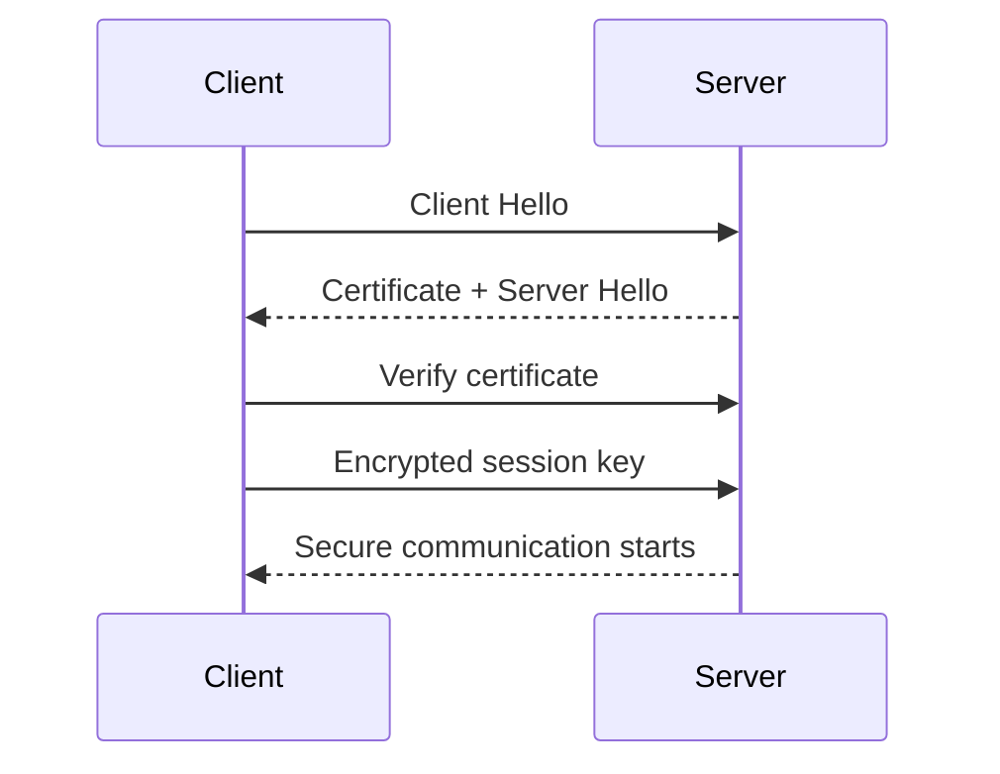

## 1. Why Transport Security Matters

---

Even if your backend is perfectly designed, data still travels over the network.

> ❗ **If data in transit is not protected, attackers can intercept or modify it.**

In a payment system, this can expose:

- authentication tokens (JWT, API keys)
- idempotency keys
- payment details
- user data

---

## 2. What This Article Focuses On

---

We are NOT diving deep into cryptography.

👉 This article focuses on practical backend concerns:

- why HTTPS is mandatory
- how TLS protects communication
- how to configure and validate transport security

---

## 3. HTTP vs HTTPS

---

### ❌ HTTP (Insecure)

```text
Client → API (plaintext)
```

- data is readable in transit
- can be intercepted (MITM attack)
- can be modified

---

### ✅ HTTPS (Secure)

```text
Client → API (encrypted via TLS)
```

- data is encrypted
- integrity is protected
- server identity is verified

---

👉 **All payment APIs must use HTTPS only.**

---

## 4. What TLS Provides

---

TLS (Transport Layer Security) ensures:

### 1. Encryption

- attackers cannot read data in transit

---

### 2. Integrity

- data cannot be tampered without detection

---

### 3. Authentication

- client verifies it is talking to the correct server

---

## 5. TLS Handshake (High Level)

---



---

👉 After handshake, all communication is encrypted.

---

## 6. Where HTTPS Fits in Our System

---

```text
Client
  → HTTPS
  → API Gateway / Load Balancer
  → Internal Services
```

---

👉 External communication must always be encrypted.

---

## 7. Enforce HTTPS Only

---

### ❌ Bad

- allowing both HTTP and HTTPS

---

### ✅ Good

- redirect HTTP → HTTPS
- or reject HTTP completely

---

Example (conceptual):

```text
http://api.example.com → redirect → https://api.example.com
```

---

## 8. Certificate Validation (Critical)

---

Clients must verify server certificates.

---

### What to validate

- certificate is signed by trusted authority
- hostname matches
- certificate is not expired

---

### ❌ Bad Practice

- disabling certificate validation (e.g., in dev code)

---

👉 This defeats TLS security completely.

---

## 9. Internal Service Communication

---

In microservices, internal calls may also need protection.

---

Options:

- HTTPS between services
- service mesh (mTLS)

---

👉 Especially important in distributed systems.

---

## 10. Protecting Sensitive Headers

---

Headers like:

- `Authorization: Bearer ...`
- `X-API-Key`

must always travel over HTTPS.

---

👉 Otherwise, they can be stolen and reused.

---

## 11. Secure Configuration Basics

---

### Use modern TLS versions

- TLS 1.2 or TLS 1.3

---

### Disable weak protocols

- SSL
- TLS 1.0 / 1.1

---

### Use strong ciphers

- avoid outdated cipher suites

---

👉 These are usually handled at load balancer / gateway level.

---

## 12. Common Mistakes

---

### ❌ Allowing HTTP endpoints

- exposes sensitive data

---

### ❌ Ignoring certificate validation

- enables MITM attacks

---

### ❌ Logging full headers

- may leak tokens

---

### ❌ Using outdated TLS versions

- weak security

---

## 13. Design Insight

---

> 🧠 **Transport security protects data between systems — without it, everything above it is at risk.**

---

Even if:

- authentication is correct
- authorization is enforced

Without HTTPS:

👉 attackers can still steal or modify requests.

---

## Conclusion

---

Transport security ensures that:

- sensitive data is encrypted in transit
- communication cannot be tampered with
- clients can trust the server they connect to

---

### 🔗 What’s Next?

👉 **[Rate Limiting & Abuse Protection →](/learning/advanced-skills/system-design-practice/intermediate-systems/6_payment-api/10_phase-10/10_7_rate-limiting-and-abuse-protection)**

---

> 📝 **Takeaway**:
>
> - Always enforce HTTPS for payment APIs
> - Never disable certificate validation
> - Protect tokens and headers in transit
> - Keep TLS configuration up to date
