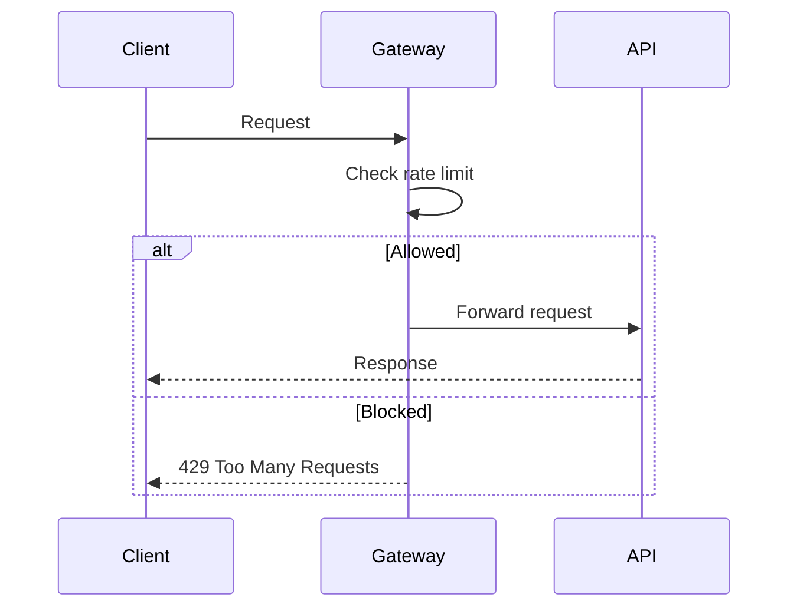

## 1. Why Rate Limiting Matters

---

Even a secure and correct system can be taken down by excessive or malicious traffic.

> ❗ **Rate limiting protects your system from abuse, overload, and unfair usage.**

In a payment system, this is critical because:

- attackers may flood APIs
- clients may retry aggressively
- bugs can generate traffic spikes

---

## 2. What This Article Focuses On

---

We are NOT re-explaining:

- authentication
- authorization

👉 This article focuses on:

- how to control request rate
- where to apply limits
- practical strategies to prevent abuse

---

## 3. What Problems Rate Limiting Solves

---

### 1. Abuse / Spam

```text
Same client sending thousands of requests
```

---

### 2. Brute-force Attempts

```text
Repeated guessing of tokens or keys
```

---

### 3. Retry Storms

```text
Clients retrying too aggressively on failures
```

---

### 4. Resource Protection

```text
Prevent CPU/DB exhaustion
```

---

## 4. Where to Apply Rate Limiting

---

### 1. API Gateway (Preferred)

```text
Client → Gateway (rate limit) → Backend
```

---

👉 Advantages:

- blocks traffic early
- reduces load on backend
- centralized control

---

### 2. Service Layer (Optional)

Used for:

- critical endpoints
- additional fine-grained control

---

👉 Often used as a second layer (defense-in-depth)

---

## 5. What to Rate Limit By

---

### 1. API Key / Client ID

```text
Limit per client
```

---

### 2. User / Merchant ID

```text
Limit per tenant
```

---

### 3. IP Address

```text
Limit anonymous traffic
```

---

👉 Best practice: combine multiple dimensions.

---

## 6. Common Rate Limiting Algorithms

---

### 1. Fixed Window

```text
100 requests per minute
```

---

### Problem

- burst at boundary

---

### 2. Sliding Window

```text
More accurate over time window
```

---

### 3. Token Bucket (Most Practical)

```text
Tokens added over time, consumed per request
```

---

### Benefits

- allows bursts
- smooth rate control

---

### 4. Leaky Bucket

```text
Requests processed at constant rate
```

---

👉 Good for smoothing traffic

---

## 7. Token Bucket (Simple View)

---

```text
Bucket capacity = 100 tokens
Refill rate = 10 tokens/sec

Each request consumes 1 token
```

---

### Behavior

- burst allowed up to capacity
- sustained rate limited by refill rate

---

## 8. Example Flow

---



---

## 9. HTTP Response for Rate Limiting

---

When limit exceeded:

```http
HTTP 429 Too Many Requests
```

---

Optional headers:

```text
Retry-After: 30
X-RateLimit-Limit: 100
X-RateLimit-Remaining: 0
```

---

👉 Helps clients behave correctly.

---

## 10. Payment-Specific Considerations

---

### 1. Protect Critical APIs

- create payment
- confirm payment

---

### 2. Prevent Duplicate Storms

- combine rate limiting + idempotency

---

### 3. Different Limits per Operation

```text
Create → higher limit
Confirm → stricter limit
```

---

## 11. Handling Legitimate Traffic Spikes

---

Avoid being too strict.

---

Strategies:

- allow burst (token bucket)
- use adaptive limits
- whitelist trusted clients

---

## 12. Common Mistakes

---

### ❌ No rate limiting

- system easily abused

---

### ❌ Too strict limits

- breaks legitimate clients

---

### ❌ Only IP-based limits

- ineffective for authenticated systems

---

### ❌ No feedback to client

- clients retry blindly

---

## 13. Design Insight

---

> 🧠 **Rate limiting is not just protection — it is traffic control.**

---

A good system:

- protects itself
- guides client behavior
- maintains fairness

---

## Conclusion

---

Rate limiting ensures:

- system stability under load
- protection from abuse
- fair usage across clients

---

### 🔗 What’s Next?

👉 **[Audit Logging & Traceability →](/learning/advanced-skills/system-design-practice/intermediate-systems/6_payment-api/10_phase-10/10_8_audit-logging-and-traceability)**

---

> 📝 **Takeaway**:
>
> - Apply rate limiting at gateway level
> - Use token bucket for flexibility
> - Combine with idempotency for safety
> - Return proper feedback (429) to clients
