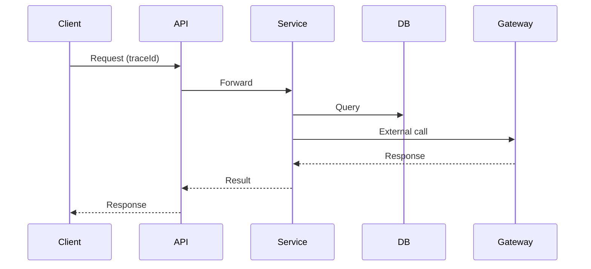

## 1. Why Observability Matters

---

In production, failures are inevitable.

> ❗ **If you cannot see what your system is doing, you cannot debug or operate it.**

Observability gives you the ability to:

- detect issues quickly
- understand system behavior
- debug incidents efficiently
- make data-driven improvements

---

## 2. What This Article Focuses On

---

We are NOT re-explaining logging basics.

👉 This article focuses on:

- what to observe in a payment system
- how logs, metrics, and tracing work together
- practical signals to monitor

---

## 3. The Three Pillars

---

Observability is built on three pillars:

### 1. Logs

- detailed, event-level records

### 2. Metrics

- numerical aggregates over time

### 3. Tracing

- end-to-end request flow across services

---

👉 You need all three together.

---

## 4. Logs — What to Capture

---

Logs answer:

```text
What happened?
```

---

### Use Structured Logging

```json
{
  "level": "INFO",
  "message": "Payment confirmed",
  "paymentId": "pay_123",
  "merchantId": "M456",
  "traceId": "trace-789"
}
```

---

### Key Practices

- include `traceId` / `correlationId`
- include business identifiers (paymentId, merchantId)
- avoid sensitive data (no PAN/CVV/API keys)

---

## 5. Metrics — What to Measure

---

Metrics answer:

```text
How is the system performing?
```

---

### Core Payment Metrics

#### 1. Throughput

- requests per second (RPS)

---

#### 2. Success Rate

```text
successful_payments / total_payments
```

---

#### 3. Failure Rate

- by error type (validation, gateway, system)

---

#### 4. Latency

- p50 / p95 / p99 response times

---

#### 5. Gateway Metrics

- success vs failure
- timeout rate
- latency per provider

---

### Example (Prometheus style)

```text
payment_requests_total{status="success"}
payment_latency_seconds_bucket
payment_gateway_failures_total
```

---

## 6. Tracing — Following a Request

---

Tracing answers:

```text
Where did time go? Where did it fail?
```

---

### Flow



---

👉 Each step is a **span** under a single trace.

---

## 7. Correlating Logs, Metrics, and Traces

---

```text
traceId = common key
```

---

- Logs include traceId
- Traces group spans by traceId
- Metrics highlight anomalies that lead you to traces/logs

---

👉 This enables **fast root-cause analysis**.

---

## 8. Where to Instrument

---

### 1. API Layer

- request count
- latency

---

### 2. Service Layer

- business operations (create/confirm)
- idempotency outcomes

---

### 3. Database

- query latency
- error rate

---

### 4. External Gateway

- call latency
- success/failure

---

## 9. Alerts (Actionable Monitoring)

---

Define alerts on key metrics:

### Examples

- failure rate > threshold
- latency p99 too high
- gateway timeout spike

---

👉 Alerts should be:

- actionable
- low-noise
- tied to user impact

---

## 10. Dashboards

---

Use dashboards (e.g., Grafana) to visualize:

- traffic
- success/failure trends
- latency distribution
- gateway health

---

👉 Dashboards provide real-time system visibility.

---

## 11. Payment-System-Specific Signals

---

### 1. Stuck Payments

```text
status = PROCESSING for too long
```

---

### 2. Retry Patterns

- high retry counts

---

### 3. Idempotency Conflicts

- repeated key reuse or mismatches

---

👉 These signals often indicate deeper issues.

---

## 12. Common Mistakes

---

### ❌ Only logs, no metrics

- cannot see trends

---

### ❌ Only metrics, no logs

- cannot debug details

---

### ❌ No tracing

- hard to debug distributed flows

---

### ❌ Logging sensitive data

- security risk

---

## 13. Design Insight

---

> 🧠 **Observability is not a tool — it is a design decision.**

---

Good systems are built with:

- instrumentation from day one
- clear signals for debugging
- visibility into critical paths

---

## Conclusion

---

Observability enables you to:

- monitor system health
- debug failures quickly
- improve performance over time

---

### 🔗 What’s Next?

👉 **[Retry & Backoff Strategies →](/learning/advanced-skills/system-design-practice/intermediate-systems/6_payment-api/11_phase-11/11_3_retry-and-backoff)**

---

> 📝 **Takeaway**:
>
> - Use logs for detail, metrics for trends, tracing for flow
> - Always include correlation IDs
> - Monitor success rate, latency, and failures
> - Build dashboards and alerts for real-time visibility
