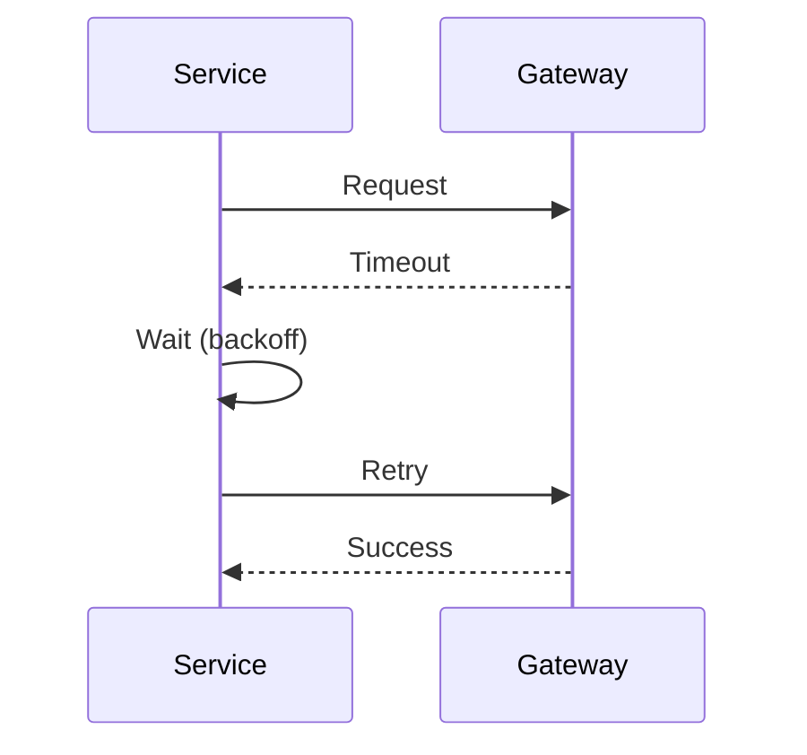

## 1. Why Retry Matters

---

In distributed systems, failures are common and often temporary.

> ❗ **A failed request does not always mean a permanent failure.**

Examples:

- network timeout
- temporary DB issue
- payment gateway latency spike

---

👉 Retrying can turn failures into success.

---

## 2. The Problem with Naive Retries

---

### ❌ Bad approach

```text
Retry immediately and infinitely
```

---

### Problems

- overloads system
- amplifies failures
- causes retry storms

---

👉 Retrying without control makes things worse.

---

## 3. What This Article Focuses On

---

We focus on:

- when to retry
- how to retry safely
- how retries interact with idempotency

---

## 4. When Should You Retry?

---

### ✅ Retry for transient failures

- network timeout
- temporary service unavailable
- gateway timeout

---

### ❌ Do NOT retry for

- validation errors
- authorization failures
- business rule violations

---

👉 Retrying permanent failures wastes resources.

---

## 5. Retry Strategy Basics

---

A good retry strategy must define:

- max retry attempts
- delay between retries
- backoff strategy

---

## 6. Exponential Backoff

---

Instead of retrying immediately, increase delay gradually.

---

### Example

```text
Attempt 1 → wait 1s
Attempt 2 → wait 2s
Attempt 3 → wait 4s
Attempt 4 → wait 8s
```

---

👉 Reduces pressure on failing systems.

---

## 7. Add Jitter (Very Important)

---

### Problem

If many clients retry at same time:

```text
All retry together → spike
```

---

### Solution

Add randomness:

```text
wait = baseDelay + random jitter
```

---

👉 Prevents synchronized retry spikes.

---

## 8. Retry Flow Example

---



---

## 9. Retry + Idempotency (Critical Combination)

---

> 🧠 **Retries must always be idempotent.**

---

Why?

- retries may execute the same request multiple times

---

### Safe Flow

```text
Retry → same idempotency key → same result
```

---

👉 Prevents duplicate payments.

---

## 10. Where to Implement Retries

---

### 1. Client Side

- retry API calls

---

### 2. Service Layer

- retry external calls (gateway)

---

### 3. Infrastructure Layer

- retry at load balancer or proxy

---

👉 Prefer retries close to failure source.

---

## 11. Retry Limits

---

Always define limits:

```text
maxAttempts = 3–5
```

---

👉 Prevents infinite loops.

---

## 12. Payment-Specific Considerations

---

### 1. Gateway Calls

- safe to retry with idempotency

---

### 2. Confirm Payment

- must not execute twice without idempotency

---

### 3. Async Recovery

- use reconciliation instead of infinite retries

---

## 13. Retry vs Reconciliation

---

### Retry

- immediate recovery

---

### Reconciliation

- delayed recovery
- background job

---

👉 Both are needed.

---

## 14. Common Mistakes

---

### ❌ Infinite retries

- system overload

---

### ❌ No backoff

- retry storm

---

### ❌ Retrying business errors

- useless work

---

### ❌ No idempotency

- duplicate execution risk

---

## 15. Design Insight

---

> 🧠 **Retries should reduce failure impact, not amplify it.**

---

A good retry system:

- retries only when useful
- uses backoff and jitter
- works with idempotency
- has strict limits

---

## Conclusion

---

Retry strategies ensure:

- higher success rate
- better resilience under failure
- controlled system behavior

---

### 🔗 What’s Next?

👉 **[Circuit Breaker & Resilience →](/learning/advanced-skills/system-design-practice/intermediate-systems/6_payment-api/11_phase-11/11_4_circuit-breaker-and-resilience)**

---

> 📝 **Takeaway**:
>
> - Retry only transient failures
> - Use exponential backoff + jitter
> - Combine retries with idempotency
> - Limit retries and use reconciliation for recovery
