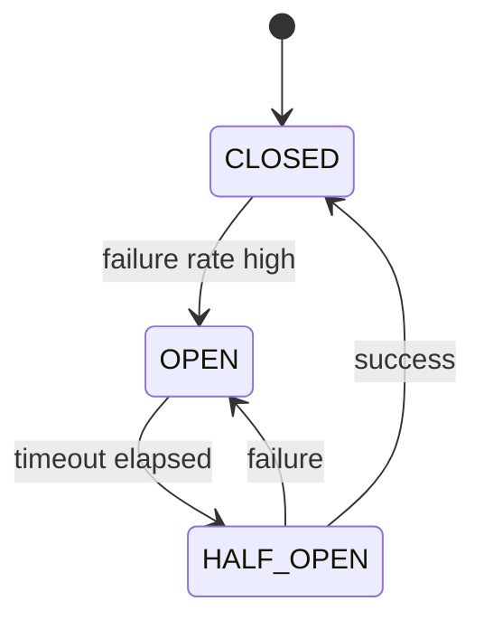
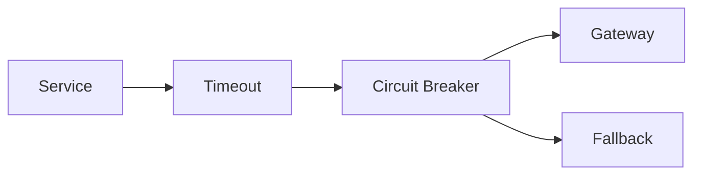

## 1. Why Resilience Matters

---

In production, dependencies fail:

- payment gateways slow down or timeout
- databases become partially unavailable
- network calls degrade under load

> ❗ **If one dependency fails, it must not bring down your entire system.**

---

## 2. What This Article Focuses On

---

We focus on practical resilience patterns:

- circuit breaker
- timeouts
- fallbacks
- bulkheads

---

## 3. Cascading Failure (The Core Problem)

---

```text
Gateway slows → requests pile up → threads blocked → service slows → entire system degrades
```

---

👉 Without protection, a single slow dependency can take down the system.

---

## 4. Circuit Breaker — Core Idea

---

> 🧠 **Stop calling a failing dependency temporarily.**

---

### States

- **CLOSED** → normal operation
- **OPEN** → calls blocked (fail fast)
- **HALF-OPEN** → trial calls to check recovery

---

## 5. State Transitions

---



---

## 6. How It Works in Payment Flow

---

```text
Confirm Payment → Call Gateway
                    ↓
           Circuit Breaker
                    ↓
       (Fail fast if OPEN)
```

---

👉 When OPEN, we **avoid wasting time and threads**.

---

## 7. Configuration Knobs

---

- failure rate threshold (e.g., 50%)
- minimum requests to evaluate
- open state duration (cool-down)
- half-open trial count

---

👉 Tune based on traffic and SLOs.

---

## 8. Timeouts (Mandatory Pair)

---

> ❗ **Never call a dependency without a timeout.**

---

```text
Gateway call timeout = 1–3s (example)
```

---

👉 Prevents threads from waiting indefinitely.

---

## 9. Fallback Strategies

---

When circuit is OPEN or call fails, define a fallback:

### Examples

- return "processing" and defer via reconciliation
- mark payment as FAILED_RETRYABLE
- queue for async retry

---

👉 Fallbacks keep the system responsive.

---

## 10. Bulkhead Isolation

---

> 🧠 **Isolate resources so one failure doesn’t exhaust everything.**

---

### Example

- separate thread pools for:
  - gateway calls
  - DB operations

---

👉 Prevents one dependency from consuming all threads.

---

## 11. Putting It Together

---



---

👉 Order matters:

1. timeout
2. circuit breaker
3. fallback

---

## 12. Interaction with Retries

---

- retries should respect circuit state
- do not retry when circuit is OPEN
- combine with exponential backoff + jitter

---

👉 Prevents retry storms against failing services.

---

## 13. Payment-Specific Guidance

---

### Confirm Payment

- if gateway unstable → fail fast + mark for reconciliation

---

### Create Payment

- usually no external call → less impact

---

### Metrics to Watch

- circuit open rate
- gateway failure rate
- fallback usage

---

## 14. Common Mistakes

---

### ❌ No timeouts

- threads block indefinitely

---

### ❌ Aggressive retries without breaker

- amplifies failure

---

### ❌ No fallback

- user-facing errors spike

---

### ❌ Single shared thread pool

- resource starvation

---

## 15. Design Insight

---

> 🧠 **Resilience is about failing gracefully, not avoiding failure.**

---

A resilient system:

- limits blast radius
- sheds load when needed
- recovers automatically

---

## Conclusion

---

Circuit breakers and resilience patterns ensure:

- system remains responsive under failure
- dependencies do not cascade failures
- recovery is controlled and observable

---

### 🔗 What’s Next?

👉 **[Reconciliation & Batch Recovery →](/learning/advanced-skills/system-design-practice/intermediate-systems/6_payment-api/11_phase-11/11_5_reconciliation-and-batch-recovery)**

---

> 📝 **Takeaway**:
>
> - Use circuit breakers to stop calling failing dependencies
> - Always set timeouts on external calls
> - Combine with retries carefully
> - Add fallbacks and bulkheads for full resilience
