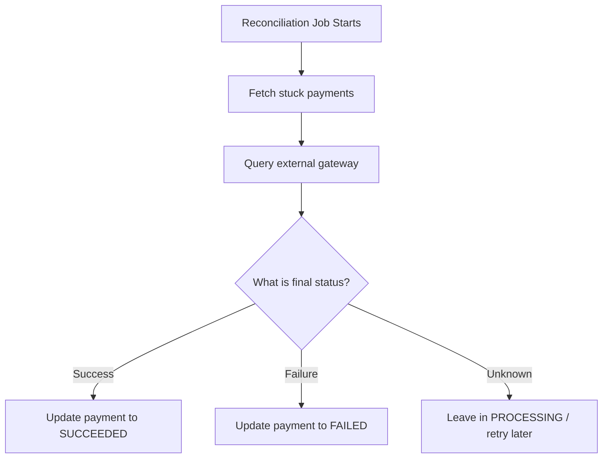

## 1. Why Reconciliation Matters

---

In real payment systems, not every flow ends cleanly.

Examples:

- gateway call times out
- database update fails after external success
- service crashes mid-processing

---

> ❗ **When the system does not know the final truth immediately, it must recover that truth later.**

---

This is the role of **reconciliation**.

---

## 2. What This Article Focuses On

---

We are NOT re-explaining:

- timeout handling basics
- idempotency basics
- retry theory

👉 This article focuses on:

- how background jobs recover inconsistent state
- how to process stuck payments safely
- how reconciliation restores eventual correctness

---

## 3. What is Reconciliation?

---

Reconciliation is the process of:

```text
Compare system state with source-of-truth state
→ detect mismatch
→ fix it safely
```

---

In our payment system, the source of truth may be:

- external payment gateway
- internal ledger / settlement record (future evolution)

---

## 4. Typical Reconciliation Scenarios

---

### 1. Gateway Success, DB Update Missing

```text
Gateway = SUCCESS
Our DB = PROCESSING
```

---

### 2. Gateway Failure, State Not Finalized

```text
Gateway = FAILED
Our DB = PROCESSING
```

---

### 3. Service Crash Mid-Flow

```text
Request started
State partially updated
No final response stored
```

---

👉 These are normal production realities.

---

## 5. Payments That Need Reconciliation

---

Typically, reconciliation scans records such as:

- payments stuck in `PROCESSING` for too long
- attempts with missing final status
- inconsistent gateway reference states

---

### Example Rule

```text
If payment.status = PROCESSING for > 5 minutes
→ eligible for reconciliation
```

---

## 6. High-Level Reconciliation Flow

---



---

## 7. Batch Recovery Job Design

---

A reconciliation job should:

- run periodically
- process payments in batches
- avoid overwhelming gateway or DB

---

### Example Batch Strategy

```text
Every 5 minutes
Pick 100 stuck payments
Process safely
```

---

👉 This is why the article includes both **reconciliation** and **batch recovery**.

---

## 8. Safe Recovery Principles

---

### 1. Re-check Current State First

Before updating, always re-read the latest DB state.

Why?

- another process may already have fixed it

---

### 2. Query External Truth Carefully

Use:

- gateway reference
- payment attempt metadata

---

### 3. Apply Idempotent Updates

Reconciliation must not create duplicate side effects.

---

### 4. Update Only Allowed Transitions

Example:

```text
PROCESSING → SUCCEEDED
PROCESSING → FAILED
```

---

## 9. Example Reconciliation Logic

---

```java
public void reconcilePayment(UUID paymentId) {

    Payment payment = paymentRepository.findById(paymentId)
            .orElseThrow();

    if (payment.getStatus() != PaymentStatus.PROCESSING) {
        return; // already resolved
    }

    GatewayStatus gatewayStatus = paymentGatewayClient.checkStatus(payment.getGatewayReference());

    if (gatewayStatus == GatewayStatus.SUCCESS) {
        payment.setStatus(PaymentStatus.SUCCEEDED);
    } else if (gatewayStatus == GatewayStatus.FAILED) {
        payment.setStatus(PaymentStatus.FAILED);
    } else {
        return; // still unknown, retry later
    }

    paymentRepository.save(payment);
}
```

---

👉 This is a recovery path, not the primary execution flow.

---

## 10. Reconciliation vs Retry

---

### Retry

- immediate or near-immediate attempt to recover
- often part of live request flow

---

### Reconciliation

- delayed background correction
- used when live flow cannot safely conclude

---

👉 Both are necessary in production systems.

---

## 11. Observability for Reconciliation

---

You should track:

- number of stuck payments
- reconciliation success count
- unresolved payments count
- reconciliation latency

---

Example metrics:

```text
payments_reconciliation_processed_total
payments_reconciliation_resolved_total
payments_stuck_processing_total
```

---

## 12. Operational Concerns

---

### 1. Avoid Large Full Scans

Use indexed queries such as:

```sql
SELECT *
FROM payments
WHERE status = 'PROCESSING'
  AND updated_at < now() - interval '5 minutes'
LIMIT 100;
```

---

### 2. Prevent Duplicate Job Execution

If multiple instances run:

- use distributed job lock OR
- partition the work safely

---

### 3. Avoid Infinite Recovery Loops

Track:

- retry count
- last reconciliation attempt

---

## 13. Common Mistakes

---

### ❌ No reconciliation path

- stuck payments remain forever

---

### ❌ Blindly updating without re-checking state

- may overwrite correct data

---

### ❌ Huge batch sizes

- causes load spikes

---

### ❌ Treating reconciliation as primary flow

- wrong design boundary

---

## 14. Design Insight

---

> 🧠 **Production systems must be designed not only to execute correctly, but also to recover correctly.**

---

Reconciliation is how systems restore truth after uncertainty.

---

## Conclusion

---

Reconciliation and batch recovery ensure that:

- temporary inconsistencies do not become permanent
- stuck payments are eventually resolved
- the system converges toward the correct final state

---

### 🔗 What’s Next?

👉 **[Scaling the System →](/learning/advanced-skills/system-design-practice/intermediate-systems/6_payment-api/11_phase-11/11_6_scaling-the-system)**

---

> 📝 **Takeaway**:
>
> - Reconciliation restores correctness after uncertain failures
> - Process stuck records in controlled batches
> - Always re-check current state before recovery
> - Recovery logic must be safe, idempotent, and observable
