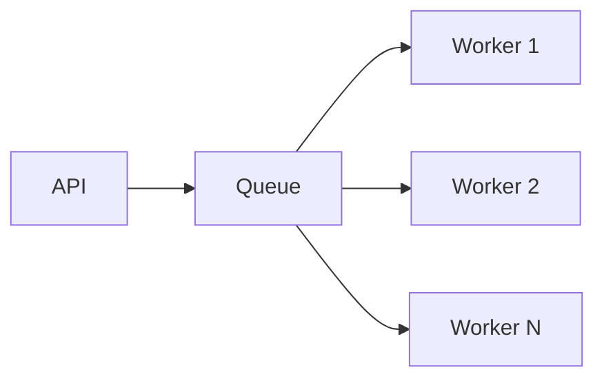

## 1. Why Scaling Matters

---

A system that works for 100 requests per minute may fail at 10,000.

> ❗ **Production systems must scale with traffic, data, and usage growth.**

---

In a payment system, scaling is critical because:

- transaction volume grows over time
- traffic can spike (sales, peak hours)
- latency must remain low under load

---

## 2. What This Article Focuses On

---

We are NOT re-explaining earlier design.

👉 This article focuses on:

- how to scale services
- how to handle database bottlenecks
- how to scale external interactions
- how to design for high throughput

---

## 3. Scaling Dimensions

---

A system must scale across multiple dimensions:

- compute (services)
- storage (database)
- communication (network, queues)

---

👉 Scaling is not just adding servers.

---

## 4. Horizontal vs Vertical Scaling

---

### Vertical Scaling

```text
Bigger machine (more CPU, RAM)
```

---

### Limitations

- hardware limits
- expensive

---

### Horizontal Scaling (Preferred)

```text
More instances of the same service
```

---

👉 This is the foundation of modern systems.

---

## 5. Stateless Service Design

---

> 🧠 **To scale horizontally, services must be stateless.**

---

### Stateless means

- no in-memory session dependency
- all state stored in DB / cache

---

### Why?

```text
Request can go to any instance
```

---

👉 Enables load balancing.

---

## 6. Load Balancing

---

```text
Client → Load Balancer → Multiple Service Instances
```

---

### Responsibilities

- distribute traffic
- handle instance failures
- improve availability

---

👉 Essential for scaling.

---

## 7. Database Scaling Challenges

---

Database is often the bottleneck.

---

### Common issues

- slow queries
- high write load
- locking contention

---

## 8. Database Scaling Strategies

---

### 1. Read Replicas

```text
Primary → writes
Replicas → reads
```

---

👉 Reduces load on primary DB.

---

### 2. Indexing

- optimize queries

---

### 3. Partitioning / Sharding

```text
Split data across multiple nodes
```

---

👉 Useful for very large datasets.

---

### 4. Connection Pooling

- reuse DB connections efficiently

---

## 9. Scaling External Calls (Gateway)

---

Gateway interactions must also scale.

---

### Techniques

- connection pooling
- async processing
- circuit breakers (already covered)

---

👉 External dependencies often limit throughput.

---

## 10. Asynchronous Processing

---

> 🧠 **Not all work needs to be done synchronously.**

---

### Example

```text
Request → enqueue task → background worker processes
```

---

### Use cases

- reconciliation jobs
- retries
- notifications

---

👉 Improves responsiveness and scalability.

---

## 11. Queue-Based Scaling

---



---

👉 Workers can scale independently.

---

## 12. Idempotency & Scaling

---

When scaling horizontally:

- multiple instances may process same request

---

👉 Idempotency ensures:

```text
duplicate execution → safe outcome
```

---

## 13. Handling Traffic Spikes

---

### Techniques

- auto-scaling (add instances dynamically)
- rate limiting (protect system)
- queue buffering (smooth spikes)

---

👉 Combine multiple strategies.

---

## 14. Caching (Optional Optimization)

---

Use caching for:

- frequently accessed data
- configuration

---

👉 Avoid overusing cache for critical transactional data.

---

## 15. Payment-Specific Considerations

---

### 1. Writes are critical

- payments are write-heavy

---

### 2. Strong consistency for core data

- avoid stale writes

---

### 3. Idempotency must scale

- shared storage (DB/Redis) required

---

## 16. Common Mistakes

---

### ❌ Stateful services

- cannot scale easily

---

### ❌ Ignoring DB bottleneck

- system slows despite scaling services

---

### ❌ Overusing synchronous calls

- limits throughput

---

### ❌ No load testing

- scaling issues discovered too late

---

## 17. Design Insight

---

> 🧠 **Scaling is about removing bottlenecks at every layer, not just adding servers.**

---

A scalable system:

- distributes load
- avoids single points of failure
- handles growth gracefully

---

## Conclusion

---

Scaling ensures that the system:

- handles increasing traffic
- maintains performance under load
- grows with business demand

---

### 🔗 What’s Next?

👉 **[Data Retention & Cleanup →](/learning/advanced-skills/system-design-practice/intermediate-systems/6_payment-api/11_phase-11/11_7_data-retention-and-cleanup)**

---

> 📝 **Takeaway**:
>
> - Design stateless services for horizontal scaling
> - Optimize and scale the database layer
> - Use async processing for heavy workloads
> - Combine multiple techniques to handle growth safely
