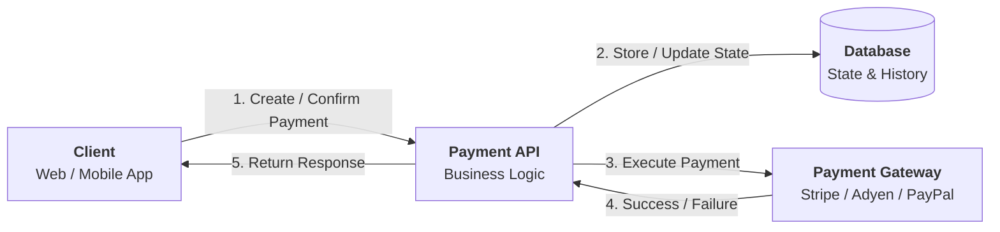

## 1. Why Start with System Overview?

---

Before diving into entities, APIs, or database design, we must first understand:

- What are the major components in the system?
- How do they interact with each other?
- What responsibilities does each component have?

> 📝 **Key Insight:**  
> High-Level Design helps us **see the system as a whole** before designing individual parts.

---

## 2. Core Components in a Payment System

---

For our Payment API system, we will focus on the following key components:

### 1. Client (Frontend / External Service)

- Initiates payment requests
- Calls APIs to create and confirm payments
- May retry requests in case of failures

---

### 2. Payment API (Our System)

- Core service we are designing
- Validates requests
- Maintains payment state
- Coordinates payment execution
- Handles retries and idempotency

> 📝 **Important:**  
> This service does **not process payments directly** — it orchestrates the flow.

---

### 3. Database

- Stores payment data
- Maintains current payment state
- Stores attempts and idempotency records

---

### 4. Payment Gateway (External System)

- Executes the actual payment transaction
- Handles card processing and bank interaction
- Returns success or failure response

Examples: Stripe, Adyen, PayPal

---

## 3. High-Level Interaction Diagram

---

---

## 4. Responsibilities Breakdown

---

| Component       | Responsibility                 |
| --------------- | ------------------------------ |
| Client          | Initiates payment requests     |
| Payment API     | Orchestrates payment lifecycle |
| Database        | Stores and maintains state     |
| Payment Gateway | Executes actual transaction    |

---

## 5. Key Design Principle

---

> ❗ Our system does not move money itself.

Instead:

- It **coordinates payment execution**
- It **tracks state reliably**
- It **ensures correctness under failure**

---

## 6. Why This Separation Matters

---

This separation of responsibilities helps us:

- keep the system modular
- handle failures independently
- scale different components separately
- integrate with multiple gateways in future

---

## Conclusion

---

Understanding system components gives us a clear picture of:

- where our Payment API fits
- what it is responsible for
- how it interacts with external systems

This forms the foundation for deeper design in the next steps.

---

### 🔗 What’s Next?

👉 **[High-Level Architecture Diagram →](/learning/advanced-skills/system-design-practice/intermediate-systems/6_payment-api/2_phase-2/2_2_high-level-architecture/)**

---

> 📝 **Takeaway**:
>
> - Always start system design by identifying **components and responsibilities**
> - The Payment API is an **orchestrator**, not a payment processor
> - Clear separation of concerns leads to scalable and reliable systems
