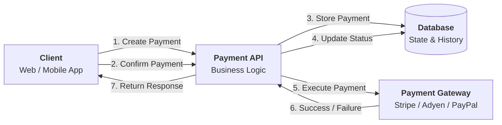
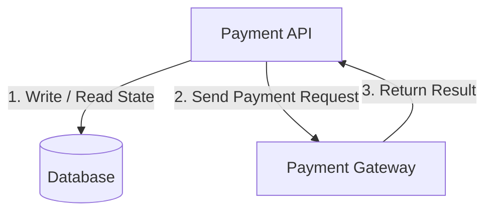
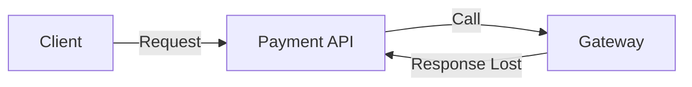

## 1. Why Architecture Diagram Matters

---

After identifying the system components, the next step is to understand:

- how these components interact
- how requests flow through the system
- where state is stored and updated

> 📝 **Key Insight:**  
> A good architecture diagram turns abstract components into a **clear, visual system flow**.

---

## 2. High-Level Architecture

---

---

## 3. Step-by-Step Request Flow

---

### 🔹 Step 1: Create Payment

1. Client calls `POST /payments`
2. Payment API:
   - validates request
   - stores payment in DB (`CREATED` state)
3. Response returned to client

---

### 🔹 Step 2: Confirm Payment

1. Client calls `POST /payments/{id}/confirm`
2. Payment API:
   - validates current state
   - updates status → `PROCESSING`
   - calls Payment Gateway

---

### 🔹 Step 3: Gateway Execution

1. Payment Gateway processes the request
2. Returns:
   - success
   - failure

---

### 🔹 Step 4: Update Final State

1. Payment API receives gateway response
2. Updates DB:
   - `SUCCEEDED` OR
   - `FAILED`

3. Response returned to client

---

## 4. Data Flow & State Ownership

---

### Key Observations

- **Database is the source of truth**
- **Payment API controls state transitions**
- **Gateway only executes payment, does not store our system state**

---

## 5. Important Design Decisions

---

### 5.1 Separate Create and Confirm

- **Create** → stores intent
- **Confirm** → triggers execution

👉 This enables:

- better retry handling
- clearer lifecycle control

---

### 5.2 External Gateway Delegation

- We do not process payments directly
- Gateway handles:
  - card processing
  - bank interaction

👉 Our system focuses on:

- orchestration
- correctness
- reliability

---

### 5.3 Synchronous Flow (for now)

Current design assumes:

- API waits for gateway response

👉 This is simpler to understand and implement

> 🔜 Async models (webhooks, queues) can be added later

---

## 6. Where Failures Can Happen

---

Failures can occur at:

- client → API (network issue)
- API → gateway (timeout)
- gateway → API (response lost)

> ❗ This is why we need idempotency, retries, and state tracking

---

## Conclusion

---

The high-level architecture gives us a **complete picture of the system**:

- how components interact
- where state lives
- how requests flow
- where failures can occur

This forms the bridge between:

👉 **Problem understanding (Phase 1)**  
👉 **Detailed design (next phases)**

---

### 🔗 What’s Next?

👉 **[End-to-End Payment Flow →](/learning/advanced-skills/system-design-practice/intermediate-systems/6_payment-api/2_phase-2/2_3_end-to-end-payment-flow/)**

---

> 📝 **Takeaway**:
>
> - Architecture diagrams help visualize system interactions
> - Payment API is an orchestrator, not a processor
> - Understanding flow is critical before designing internals
