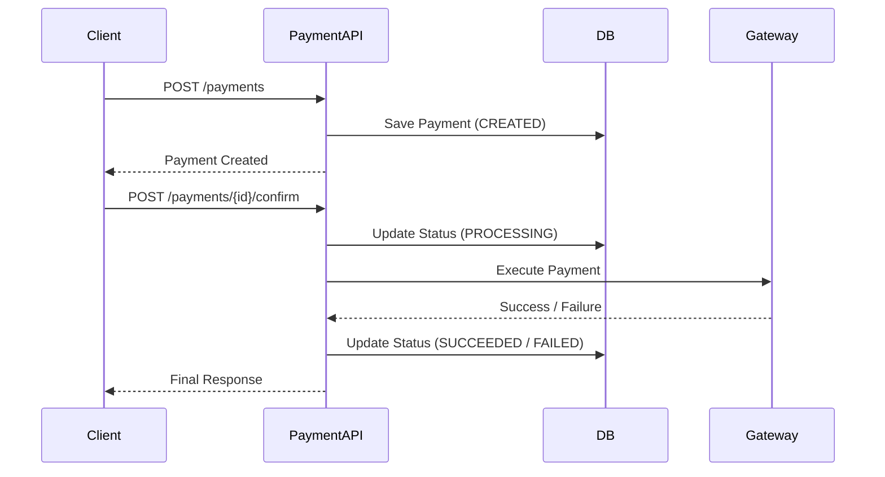
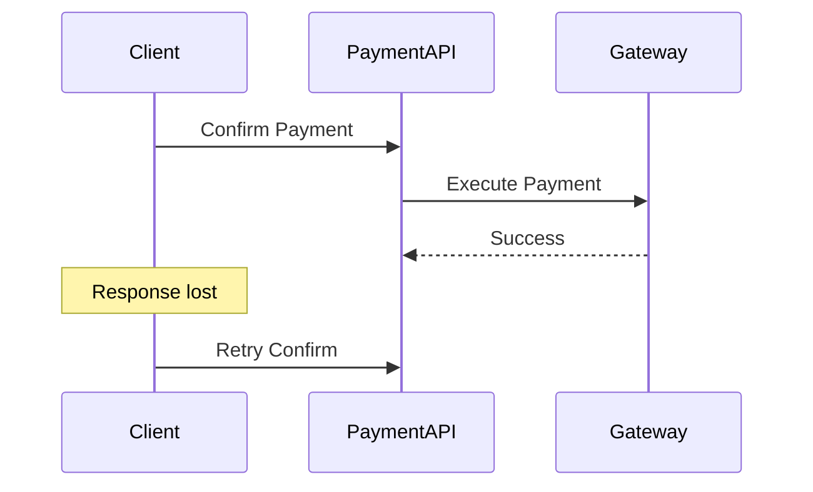
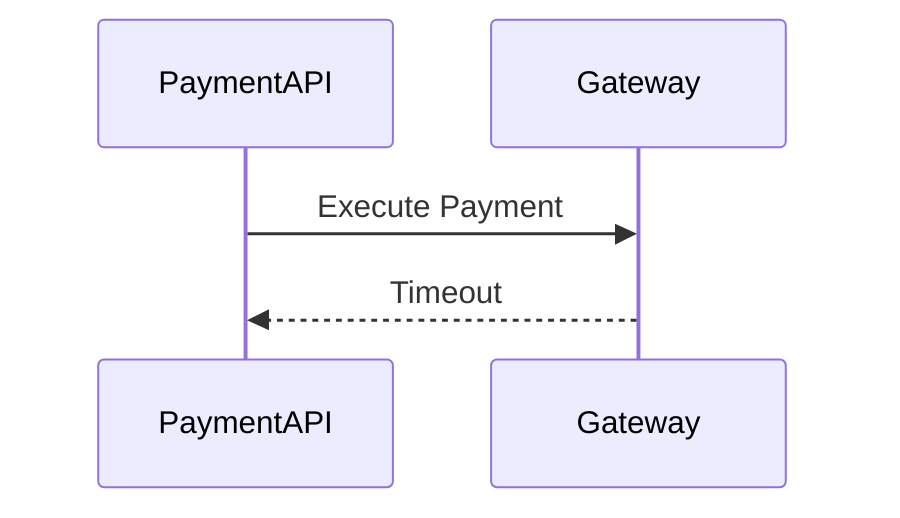
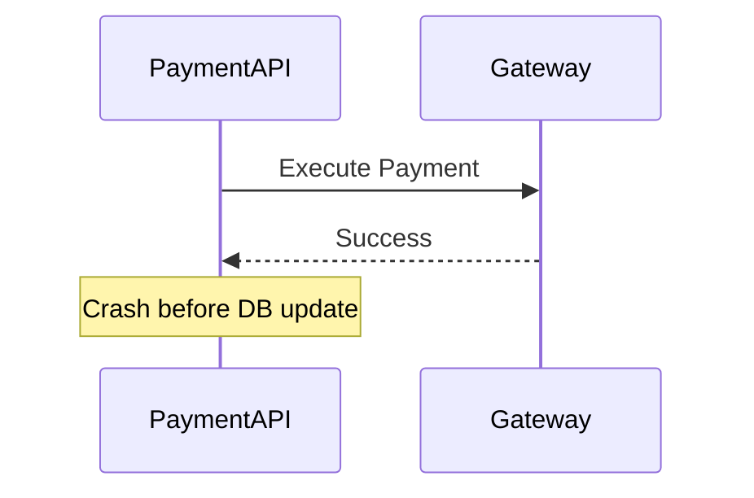

## 1. Why End-to-End Flow Matters

---

So far, we have defined:

- system components
- architecture diagram

Now we answer the most important question:

> ❓ **What actually happens when a user makes a payment?**

Understanding the flow helps us:

- visualize system behavior
- identify failure points
- design retries and idempotency

> 📝 **Key Insight:**  
> System design is about understanding **how data and control flow through the system**.

---

## 2. High-Level Payment Flow

---

At a high level, payment happens in two steps:

```text
Create Payment → Confirm Payment → Final State
```

---

## 3. End-to-End Sequence Diagram

---



---

## 4. Step-by-Step Breakdown

---

### 🔹 Step 1: Create Payment

- Client sends request to create payment
- Payment API:
  - validates request
  - stores payment with `CREATED` state
- No external call happens

---

### 🔹 Step 2: Confirm Payment

- Client sends confirm request
- Payment API:
  - checks current state
  - moves to `PROCESSING`
  - prepares for execution

---

### 🔹 Step 3: Execute Payment

- Payment API calls external gateway
- Gateway processes payment

Possible outcomes:

- success
- failure
- timeout

---

### 🔹 Step 4: Final State

- Payment API updates database:
  - `SUCCEEDED` OR
  - `FAILED`

- Response returned to client

---

## 5. Failure Scenarios (Very Important)

---

### ⚠️ Scenario 1: Client Retry



**👉 Problem:**

- Duplicate execution risk

**👉 Solution (later phases):**

- Idempotency
- State checks

---

### ⚠️ Scenario 2: Gateway Timeout



**👉 Problem:**

- Unknown payment state

**👉 Solution:**

- Retry logic
- Status reconciliation

---

### ⚠️ Scenario 3: API Crash After Gateway Success



**👉 Problem:**

- Payment succeeded externally
- But system shows incorrect state

**👉 Solution:**

- Reconciliation
- Idempotent updates

---

## 6. Key Observations

---

From this flow, we learn:

- Payment is a **multi-step process**, not a single API call
- External systems introduce **uncertainty**
- Failures can happen at multiple points
- State must always reflect reality

---

## 7. Where Design Concepts Fit

---

| Concept       | Why Needed                  |
| ------------- | --------------------------- |
| State Machine | Track lifecycle             |
| Idempotency   | Prevent duplicate execution |
| Concurrency   | Handle parallel requests    |
| Persistence   | Maintain correct state      |

---

## Conclusion

---

The end-to-end flow reveals the **true complexity of payment systems**.

Even a simple payment involves:

- multiple components
- external dependencies
- failure scenarios
- state transitions

Understanding this flow is critical before designing:

- entities
- APIs
- idempotency
- persistence

---

### 🔗 What’s Next?

👉 **[Sync vs Async Processing →](/learning/advanced-skills/system-design-practice/intermediate-systems/6_payment-api/2_phase-2/2_4_sync-vs-async-processing/)**

---

> 📝 **Takeaway**:
>
> - Always visualize system flow using sequence diagrams
> - Payments involve multiple steps and external systems
> - Designing for failure is more important than designing for success
