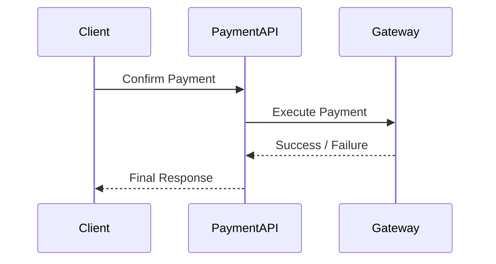
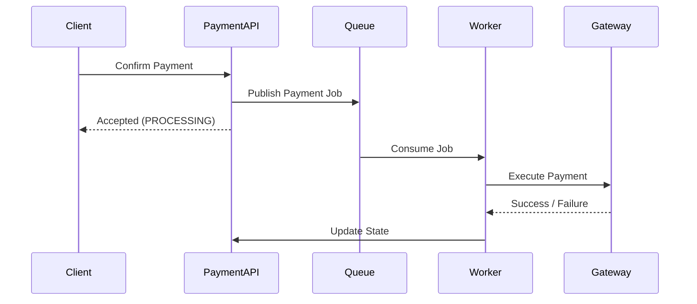

## 1. Why This Topic Matters

---

In payment systems, one of the most important design decisions is:

> ❓ Should we process payments synchronously or asynchronously?

This decision impacts:

- user experience
- system reliability
- complexity of implementation
- failure handling

> 📝 **Key Insight:**  
> There is no one-size-fits-all — the choice depends on system requirements and trade-offs.

---

## 2. Synchronous Processing

---

### What is Synchronous Processing?

In synchronous processing:

- the API waits for the payment gateway response
- the client gets the final result in the same request

---

### Flow



---

### Characteristics

- Immediate response
- Simpler design
- Easier to debug
- No need for additional systems

---

### Pros

- Simple implementation
- Real-time feedback to user
- Easier to reason about flow

---

### Cons

- Higher latency (waiting for gateway)
- Risk of timeout
- Poor handling of slow external systems
- Tight coupling with gateway response

---

## 3. Asynchronous Processing

---

### What is Asynchronous Processing?

In asynchronous processing:

- the API does not wait for gateway response
- the request is processed in the background
- result is delivered later (via webhook, polling, or event)

---

### Flow



---

### Characteristics

- Non-blocking
- More scalable
- Handles slow systems better
- Requires additional components

---

### Pros

- Better scalability
- Resilient to slow gateways
- Reduced API latency
- Supports retries naturally

---

### Cons

- More complex design
- Harder to debug
- Requires queue / worker system
- Client must poll or listen for updates

---

## 4. Key Differences

---

| Aspect           | Synchronous               | Asynchronous         |
| ---------------- | ------------------------- | -------------------- |
| Response         | Immediate                 | Delayed              |
| Complexity       | Low                       | High                 |
| Latency          | Higher (wait for gateway) | Lower (non-blocking) |
| Scalability      | Limited                   | High                 |
| Failure Handling | Harder with timeouts      | Easier with retries  |

---

## 5. Which Approach Should We Use?

---

For our **current design**, we choose:

> ✅ **Synchronous Processing**

### Why?

- Simpler to understand
- Easier to implement
- Good for learning core concepts
- Suitable for low-to-moderate scale

---

## 6. When to Use Asynchronous Processing

---

As systems scale, asynchronous becomes more useful.

### Use async when:

- gateway latency is high
- traffic volume is large
- reliability requirements are strict
- retries and resilience are critical

---

## 7. Real-World Hybrid Approach

---

Most real-world systems use a **hybrid model**:

```text
Initial Request → Quick Response → Async Processing → Final State Update
```

Example:

- API returns PROCESSING
- Background worker completes payment
- Client polls or receives webhook

---

## 8. How This Impacts Our Design

---

Even though we use synchronous flow now:

- our state machine already supports async
- `PROCESSING` state allows delayed completion
- retry logic can be extended later

> 📝 **Key Insight:**  
> Good system design keeps the door open for future evolution.

---

## Conclusion

---

Both synchronous and asynchronous approaches have their place.

For this system:

- we start with **synchronous design**
- we understand **async as an extension**

This gives us the best balance between:

- simplicity
- correctness
- extensibility

---

### 🔗 What’s Next?

👉 **[System Boundaries & Responsibilities →](/learning/advanced-skills/system-design-practice/intermediate-systems/6_payment-api/2_phase-2/2_5_system-boundries-and-responsibilities/)**

---

> 📝 **Takeaway**:
>
> - Sync = simple but blocking
> - Async = scalable but complex
> - Real systems often use a **hybrid approach**
