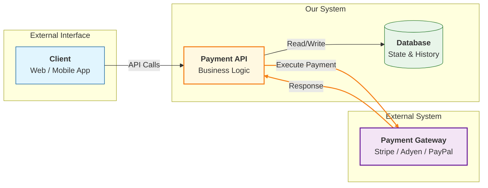

## 1. Why System Boundaries Matter

---

One of the most common mistakes in system design is **unclear ownership**.

Without clear boundaries:

- responsibilities overlap
- logic gets duplicated
- systems become tightly coupled
- debugging becomes difficult

> 📝 **Key Insight:**  
> Good system design clearly answers:  
> 👉 _Who is responsible for what?_

---

## 2. Defining System Boundaries

---

In our Payment API design, we define clear boundaries between:

- Client
- Payment API (our system)
- Database
- Payment Gateway (external system)

Each component has a **well-defined responsibility**.

---

## 3. Component Responsibilities

---

### 🔹 1. Client

- Initiates payment requests
- Calls APIs (`create`, `confirm`, `get`)
- Handles user interaction
- May retry requests

👉 Does NOT:

- manage payment state
- interact with gateway directly

---

### 🔹 2. Payment API (Our System)

This is the **core system we are designing**.

Responsible for:

- validating requests
- maintaining payment state
- enforcing state transitions
- handling idempotency
- coordinating payment execution
- handling retries and failures

> 📝 **Important:**  
> This service **does not process payments directly** — it orchestrates the flow.

---

### 🔹 3. Database

- stores payment records
- maintains current state
- stores attempts and idempotency data

👉 Acts as the **source of truth**

---

### 🔹 4. Payment Gateway (External System)

- executes actual payment transaction
- interacts with card networks / banks
- returns success or failure

Examples:

- Stripe
- Adyen
- PayPal

👉 We treat this as a **black box**

---

## 4. Boundary Diagram

---

---

## 5. Key Boundary Rules

---

### 1. Client should not call Gateway directly

👉 Keeps:

- security intact
- business logic centralized

---

### 2. Payment API owns the state

👉 Only this service can:

- create payment
- update status
- enforce transitions

---

### 3. Gateway is execution-only

👉 Gateway:

- does not know our business logic
- does not maintain our state

---

### 4. Database is the source of truth

👉 Never rely on:

- client memory
- gateway response alone

---

## 6. Why This Separation is Critical

---

### 1. Scalability

- each component can scale independently

---

### 2. Maintainability

- changes are localized
- easier to evolve system

---

### 3. Fault Isolation

- gateway failures do not break entire system
- retries can be handled safely

---

### 4. Extensibility

- easy to add:
  - multiple gateways
  - fraud systems
  - reconciliation flows

---

## 7. Common Mistakes to Avoid

---

### ❌ Client directly calling gateway

- breaks control
- bypasses validation

---

### ❌ Mixing state logic in multiple places

- leads to inconsistency

---

### ❌ Treating gateway as source of truth

- dangerous under failure

---

### ❌ Tight coupling between components

- reduces flexibility

---

## Conclusion

---

Clear system boundaries ensure that:

- each component has a **single responsibility**
- the system remains **modular and scalable**
- failures can be handled effectively

This clarity is essential before moving into deeper design layers.

---

### 🔗 What’s Next?

👉 **[Key Design Decisions →](/learning/advanced-skills/system-design-practice/intermediate-systems/6_payment-api/2_phase-2/2_6_key-decision-discussion/)**

---

> 📝 **Takeaway**:
>
> - Clearly define **who owns what**
> - Payment API is the **orchestrator**
> - Gateway is **execution-only**
> - Database is the **source of truth**
