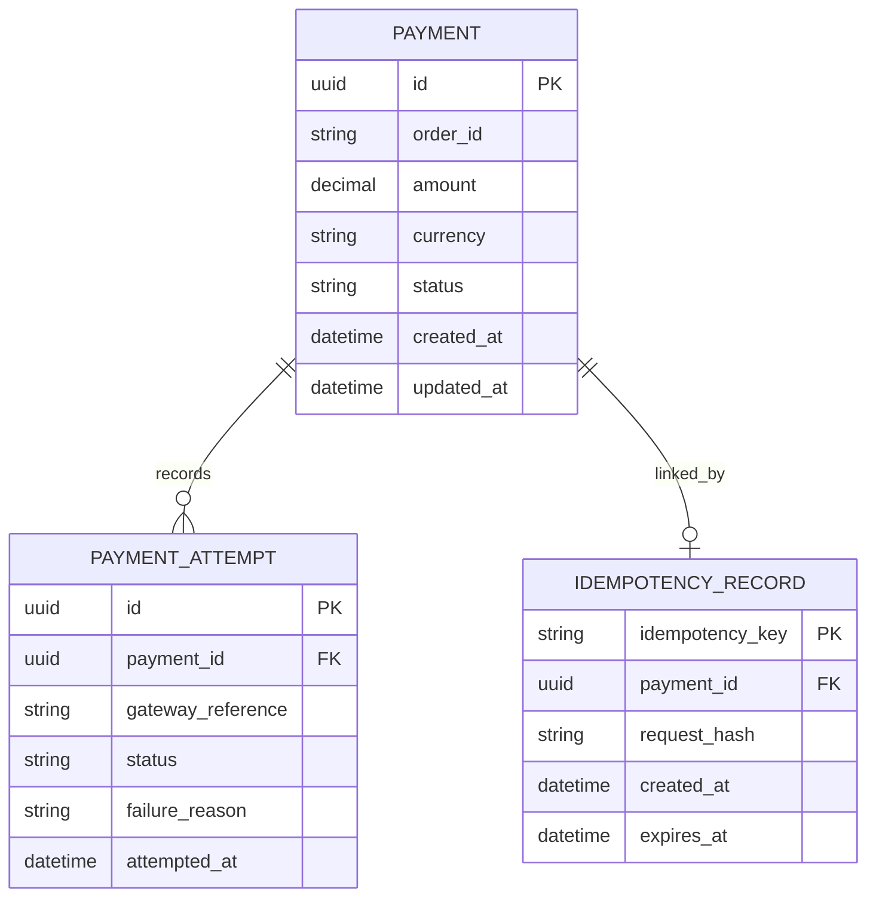

## 1. Why Start with Entities?

---

In the previous phase, we defined the high-level architecture of the payment system. Now we zoom into the **Payment API service** and design its internal model, lifecycle, and rules.

To do that, we start by identifying the core entities of the system.

Before designing APIs or databases, we must first understand **what entities exist in the system** and what responsibilities they carry.

In system design, entities help us:

- model real-world concepts
- define boundaries and responsibilities
- reason about state and transitions

> 📝 **Key Point:**  
> Good design starts with a clear **domain model**, not endpoints.

---

## 2. How to Identify Entities in System Design

---

When solving a system design problem, a common question is:

> ❓ _How do we decide what entities to create?_

A practical approach is to derive entities from:

---

### 2.1 Business Concepts (Nouns)

Start by identifying key nouns in the problem:

- payment
- transaction
- request
- attempt

👉 These often become core entities.

---

### 2.2 State & Lifecycle Requirements

If something has a lifecycle, it should usually be an entity.

In our case:

- a payment moves through states (CREATED → PROCESSING → SUCCEEDED)

👉 This tells us:

> **Payment must be an entity**

---

### 2.3 Failure & Retry Scenarios

From Phase 1, we identified:

- retries
- duplicate requests
- partial failures

👉 This leads to new entities:

- **PaymentAttempt** → track retries
- **IdempotencyRecord** → prevent duplicates

---

### 2.4 External Interactions

Whenever your system interacts with external systems:

- gateway calls
- API requests

👉 You may need entities to track those interactions.

---

### 2.5 Data You Need to Persist

Ask:

> ❓ What data must survive system restarts?

Examples:

- payment status
- attempt history
- idempotency keys

👉 These require persistent entities.

---

### 🎯 Simple Rule of Thumb

```text
Entities = Business Objects + State + Failure Handling
```

---

## 3. Core Entities in a Payment System

---

For our Payment API, we will start with three core entities:

1. **Payment**
2. **PaymentAttempt**
3. **IdempotencyRecord**

Each of these solves a specific problem we identified in Phase 1.

---

## 3. Payment Entity

---

The **Payment** entity represents the logical payment requested by the client.

### Responsibilities

- stores basic payment details (amount, currency, order reference)
- tracks the current **payment state**
- acts as the **source of truth** for the payment lifecycle

### Key Attributes

- `paymentId`
- `orderId` / `customerId`
- `amount`
- `currency`
- `status` (CREATED, PROCESSING, SUCCEEDED, FAILED)
- `createdAt`
- `updatedAt`

### Key Insight

> 📝 A **Payment** is not a single action — it is a **stateful entity** that evolves over time.

---

## 4. PaymentAttempt Entity

---

A **PaymentAttempt** represents an attempt to execute the payment via the external gateway.

### Why do we need this?

From Phase 1, we saw:

- retries can happen
- gateway calls may fail
- multiple attempts may be needed

### Responsibilities

- track each attempt made to process a payment
- store gateway request/response details
- record success or failure of each attempt

### Key Attributes

- `attemptId`
- `paymentId` (reference)
- `gatewayRequestId`
- `status` (SUCCESS, FAILURE)
- `failureReason`
- `attemptedAt`

### Key Insight

> 📝 A single **Payment** can have **multiple attempts**, but only one should result in a final successful state.

---

## 5. IdempotencyRecord Entity

---

The **IdempotencyRecord** ensures that duplicate requests do not result in duplicate processing.

### Why do we need this?

From Phase 1:

- clients retry requests
- duplicate requests may arrive

Without protection:

> ❗ Same request may be executed multiple times

### Responsibilities

- store idempotency key provided by client
- map the key to a processed request
- store the response for replay

### Key Attributes

- `idempotencyKey`
- `requestHash`
- `paymentId`
- `responseSnapshot`
- `createdAt`

### Key Insight

> 📝 Idempotency ensures that **repeated requests produce the same result**, not repeated side effects.

---

## 6. Relationships Between Entities

---

These entities are connected as follows:

- One **Payment** → Many **PaymentAttempts**
- One **Payment** → At most one **IdempotencyRecord**
- One **IdempotencyRecord** → Maps to exactly one Payment request

### 6.1 High-Level Relationship



In this model:

- Payment is the core entity and source of truth for state
- PaymentAttempt captures each execution attempt against the gateway
- IdempotencyRecord ensures duplicate requests do not create duplicate side effects

#### 🔍 How to Read This Diagram

- **PAYMENT ||--o{ PAYMENT_ATTEMPT**  
  → One Payment can have multiple PaymentAttempts  
  → Each PaymentAttempt belongs to exactly one Payment
- **PAYMENT ||--o| IDEMPOTENCY_RECORD**  
  → A Payment may have zero or one IdempotencyRecord  
  → Each IdempotencyRecord is associated with exactly one Payment

#### Relationship Symbols Explained

| Symbol | Meaning                      |
| ------ | ---------------------------- |
| `\|`   | Exactly one                  |
| `\|\|` | One and only one (mandatory) |
| `o`    | Optional (zero allowed)      |
| `{`    | Many                         |

#### Common Combinations

| Notation     | Meaning                           |
| ------------ | --------------------------------- |
| `\|\|--\|\|` | One-to-one (mandatory both sides) |
| `\|\|--o\|`  | One-to-zero-or-one                |
| `\|\|--o{`   | One-to-many                       |
| `o\|--o{`    | Zero-or-one to many               |

---

## 7. Why This Model Works

---

This entity design directly addresses the challenges we identified earlier:

| Challenge          | Solution Entity   |
| ------------------ | ----------------- |
| Duplicate requests | IdempotencyRecord |
| Retry handling     | PaymentAttempt    |
| State consistency  | Payment           |

> 📝 Good design maps **problems → entities → responsibilities**.

---

## 8. What We Are NOT Adding Yet

---

To keep the design focused, we are not introducing:

- Refund entities
- Ledger / accounting models
- Fraud detection components
- Multi-gateway routing models

These will be added in advanced phases.

---

## Conclusion

---

Identifying the right entities is the foundation of system design.

For our Payment API:

- **Payment** represents the core business object
- **PaymentAttempt** captures execution attempts
- **IdempotencyRecord** protects against duplicate processing

Together, they form a clean and extensible domain model.

---

### 🔗 What’s Next?

👉 **[Designing Payment States →](/learning/advanced-skills/system-design-practice/intermediate-systems/6_payment-api/2_phase-2/2_2_design-payment-states/)**

---

> 📝 **Takeaway**:
>
> - Start system design with **domain modelling**
> - Separate logical entities from execution attempts
> - Use idempotency as a first-class design concept
