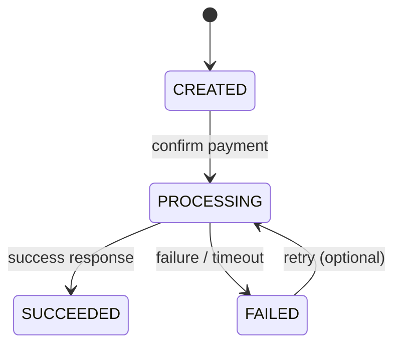

## 1. Why Do We Need Payment States?

---

A payment is not a one-time action — it is a **process that evolves over time**.

If we treat it as a simple request-response operation, we will fail to handle:

- retries
- failures
- partial processing
- asynchronous responses

> 📝 **Key Insight:**  
> Payments must be modeled as a **state machine**, not a single operation.

---

## 2. Core Payment States

---

For our intermediate design, we will use the following states:

### 2.1 CREATED

- Payment is created but not yet processed
- No interaction with gateway has happened

👉 Entry point for every payment

---

### 2.2 PROCESSING

- Payment request has been sent to the gateway
- System is waiting for response

👉 Represents in-progress execution

---

### 2.3 SUCCEEDED

- Payment has been successfully processed by gateway
- Final successful state

👉 No further processing should happen

---

### 2.4 FAILED

- Payment attempt failed
- Could be due to gateway rejection, timeout, or error

👉 May allow retry depending on design

> 🎯 These states represent the **minimum viable lifecycle** for a payment system.

---

## 3. Optional States (Advanced)

---

In real systems, additional states may exist:

- CANCELLED
- PENDING_REVIEW
- REQUIRES_ACTION (e.g., 3D Secure)
- REFUNDED

For now, we keep the model simple and focused.

---

## 4. State Transition Diagram

---

---

## 5. Valid vs Invalid Transitions

---

### Valid Transitions

- CREATED → PROCESSING
- PROCESSING → SUCCEEDED
- PROCESSING → FAILED
- FAILED → PROCESSING (retry)

---

### Invalid Transitions

- SUCCEEDED → PROCESSING ❌
- SUCCEEDED → FAILED ❌
- FAILED → SUCCEEDED (without retry) ❌

> 📝 **Key Point:**  
> Once a payment reaches a terminal state (**SUCCEEDED or FAILED**), transitions must be controlled carefully.

---

## 6. Why State Modeling Matters

---

State modeling solves multiple problems:

### 1. Prevents Duplicate Processing

- Only allow processing when state = CREATED or FAILED

### 2. Enables Retry Logic

- FAILED → PROCESSING allows controlled retries

### 3. Ensures Data Consistency

- System always knows the current state

### 4. Simplifies Debugging

- Clear lifecycle makes issues easier to trace

---

## 7. Mapping States to Real Problems

---

| Problem                | State Solution      |
| ---------------------- | ------------------- |
| Unknown progress       | PROCESSING          |
| Duplicate execution    | State checks        |
| Retry handling         | FAILED → PROCESSING |
| Final outcome tracking | SUCCEEDED / FAILED  |

---

## Conclusion

---

Designing payment states transforms the system from a simple API into a **reliable, stateful system**.

A well-defined state machine ensures:

- correct processing flow
- safe retries
- predictable behavior

---

### 🔗 What’s Next?

👉 **[State Transitions & Rules →](/learning/advanced-skills/system-design-practice/intermediate-systems/6_payment-api/2_phase-2/2_3_state-transitions-and-rules/)**

---

> 📝 **Takeaway**:
>
> - Payments are **stateful processes**, not one-time actions
> - State machines help enforce **correct and predictable behavior**
> - Proper state design is key to handling failures and retries safely
