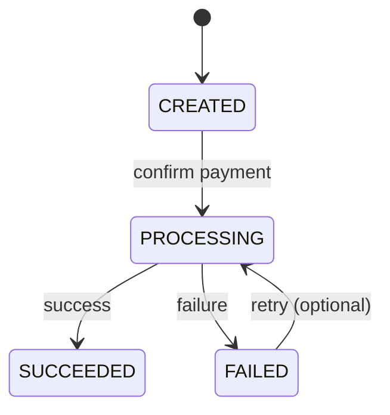

## 1. Why State Transitions Matter

---

Defining states is only half the design. The real challenge is **controlling how the system moves between those states**.

Without strict transition rules, the system can:

- process the same payment multiple times
- enter inconsistent states
- behave unpredictably under concurrent requests

> 📝 **Key Insight:**  
> A state machine is only as strong as its **transition rules**.

---

## 2. Valid State Transitions

---

Based on our defined states, the allowed transitions are:



### Key Rules

- A payment starts in **CREATED**
- It can move to **PROCESSING** only once per attempt
- **PROCESSING** leads to either **SUCCEEDED** or **FAILED**
- **FAILED** may allow retry depending on business logic

---

## 3. Terminal States

---

Some states are **terminal**, meaning no further transitions should happen.

### Terminal States

- SUCCEEDED
- FAILED (sometimes retryable, but treated carefully)

### Important Constraint

> ❗ Once a payment is **SUCCEEDED**, it must never transition again

This prevents:

- duplicate charges
- inconsistent records

---

## 4. Invalid Transitions (Must Be Prevented)

---

Examples of invalid transitions:

- SUCCEEDED → PROCESSING ❌
- SUCCEEDED → FAILED ❌
- CREATED → SUCCEEDED (skipping processing) ❌
- FAILED → SUCCEEDED (without retry) ❌

> 📝 **Key Point:**  
> Invalid transitions should be rejected at the service layer.

---

## 5. Enforcing Transitions in Code

---

State transitions must be enforced explicitly in your backend logic.

### Example Logic

```java
if (payment.getStatus() != CREATED && payment.getStatus() != FAILED) {
    throw new InvalidStateException("Payment cannot be processed again");
}
```

### Principle

- Always check **current state before transitioning**
- Reject invalid transitions early

---

## 6. Handling Concurrency (Critical)

---

One of the biggest risks is **multiple requests modifying state simultaneously**.

### Example Scenario

- Two confirm requests arrive at the same time
- Both see state = CREATED
- Both move to PROCESSING

> ❗ Result: Duplicate processing

---

## 7. Solutions for Concurrency Control

---

### 1. Optimistic Locking (Recommended)

- Add a version field
- Update only if version matches

```sql
UPDATE payment
SET status = 'PROCESSING', version = version + 1
WHERE payment_id = ? AND version = ?;
```

👉 Only one request succeeds

---

### 2. Atomic State Update

```sql
UPDATE payment
SET status = 'PROCESSING'
WHERE payment_id = ? AND status = 'CREATED';
```

👉 Ensures only valid transitions happen

---

### 3. Database Transactions

- Wrap read + update in transaction
- Prevent partial updates

---

## 8. Idempotency + State = Strong Guarantee

---

State checks alone are not enough.

We combine:

- **State Machine** → controls valid transitions
- **Idempotency** → prevents duplicate execution

Together they ensure:

> ✔ Payment is processed **exactly once** (logically)

---

## 9. Design Principles

---

Follow these rules in your design:

- Never trust incoming requests blindly
- Always validate current state
- Treat terminal states as immutable
- Make transitions atomic
- Design for concurrent execution

---

## Conclusion

---

State transitions define the **correctness boundary** of your system.

Without strict transition rules, even a well-designed API can fail under real-world conditions.

A robust system ensures:

- valid transitions only
- safe concurrency handling
- predictable outcomes

---

### 🔗 What’s Next?

👉 **[Phase 3: API Design →](/learning/advanced-skills/system-design-practice/intermediate-systems/6_payment-api/3_phase-3/3_1_api-endpoints)**

---

> 📝 **Takeaway**:
>
> - State transitions enforce **system correctness**
> - Invalid transitions must be strictly blocked
> - Concurrency control is essential to prevent duplicate processing
