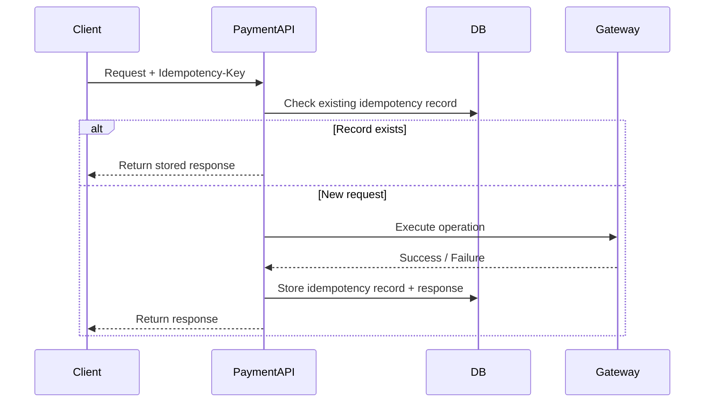

## 1. Why This Phase Matters

---

In the previous phase, we designed the external contract of the Payment API:

- endpoints
- request models
- response models
- status codes
- API best practices

That gave us a clean and predictable API surface.

But in real-world systems, a clean API is not enough.

> 📝 **Key Insight:**  
> In payment systems, retries are inevitable, and duplicate execution is dangerous.

This phase focuses on how we protect the system when requests are repeated, responses are lost, or external dependencies fail.

---

## 2. Why Retries Happen in Real Systems

---

Retries are not edge cases — they are part of normal distributed system behavior.

Common reasons include:

- user clicks the payment button multiple times
- frontend automatically retries after timeout
- client never receives the response
- network failure occurs between services
- payment gateway responds slowly

In all of these cases, the same logical operation may be sent multiple times.

---

## 3. Why Payment Systems Are Especially Sensitive

---

In many systems, duplicate requests are inconvenient.

In payment systems, duplicate requests can be catastrophic.

Examples:

- the same order is charged twice
- multiple payment records are created for one payment intent
- the gateway is called more than once for the same confirmation
- system state becomes inconsistent under partial failure

> ❗ A payment system must be designed to behave safely even when the same request arrives more than once.

---

## 4. What is Idempotency?

---

Idempotency means:

> Repeating the same request should produce the same result, without creating additional side effects.

For example:

- first `POST /payments` request creates payment `pay_001`
- repeated request with the same idempotency key should return `pay_001`
- it should **not** create `pay_002`

This is one of the most important correctness guarantees in payment systems.

---

## 5. Safe Retries vs Unsafe Retries

---

Not every retry is dangerous.

### Safe Retry

A retry is safe when:

- the system recognizes it as the same logical request
- no duplicate side effect is triggered
- the same response can be returned

### Unsafe Retry

A retry is unsafe when:

- the system treats the request as brand new
- a second payment or second gateway execution happens

---

## 6. Where We Need Idempotency in Our Design

---

In our Payment API, idempotency is critical for:

### 1. Create Payment

Without protection:

- duplicate `POST /payments` may create multiple payment entries for the same business intent

### 2. Confirm Payment

Without protection:

- duplicate `POST /payments/{id}/confirm` may trigger multiple gateway calls
- this is even more dangerous because it can lead to multiple actual charges

---

## 7. High-Level View of Safe Retry Handling

---

This is the central idea of the phase:

- identify repeated requests
- avoid duplicate side effects
- return a consistent result

---

## 8. Key Questions We Will Answer in This Phase

---

In the upcoming articles, we will answer:

- What should an idempotency key look like?
- Where should idempotency records be stored?
- How do we handle duplicate create requests?
- How do we prevent duplicate confirm execution?
- What happens under timeout, crash, or partial failure?
- What is the difference between idempotency and exactly-once execution?

---

## 9. Why This Matters in Interviews

---

Many candidates say:

> “We should use idempotency.”

Strong candidates go further and explain:

- where idempotency is applied
- how duplicate requests are detected
- what is stored and returned
- what happens during failures

This phase helps you move from **knowing the term** to **designing the mechanism**.

---

## Conclusion

---

Retries are normal in distributed systems. In payment systems, they are also dangerous.

That is why reliable payment APIs must support:

- idempotency
- safe retries
- predictable behavior under failure

This phase focuses on turning those ideas into practical design mechanisms.

---

### 🔗 What’s Next?

👉 **[Idempotency Key Design →](/learning/advanced-skills/system-design-practice/intermediate-systems/6_payment-api/5_phase-5/5_2_idempotency-key-design/)**

---

> 📝 **Takeaway**:
>
> - Retries are inevitable in distributed systems
> - Payment systems must prevent duplicate side effects
> - Idempotency is the foundation of safe retry handling
